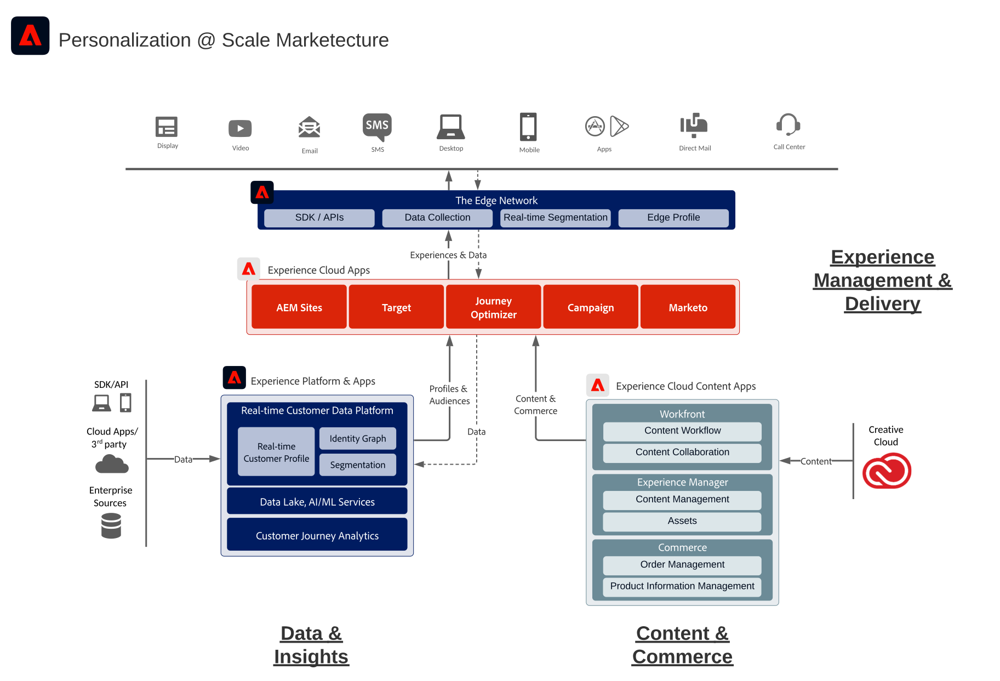

# Adobe Experience Cloud 架构图

以下架构图说明了 Adobe Experience Platform 如何连接到 Adobe Experience Cloud 应用程序并与之集成，以便在投放数据、内容和体验时实现大规模个性化。

 
下面的架构图说明了 Adobe Experience Cloud 应用程序和 Adobe Experience Platform 是如何融入企业客户体验架构中的。

