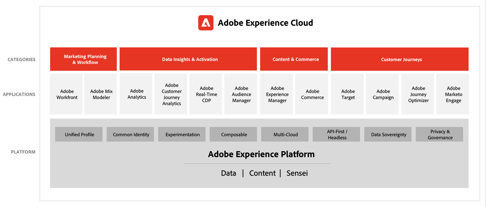
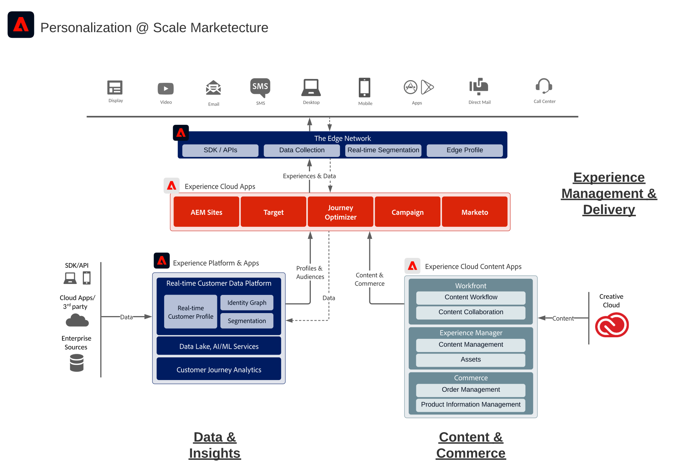
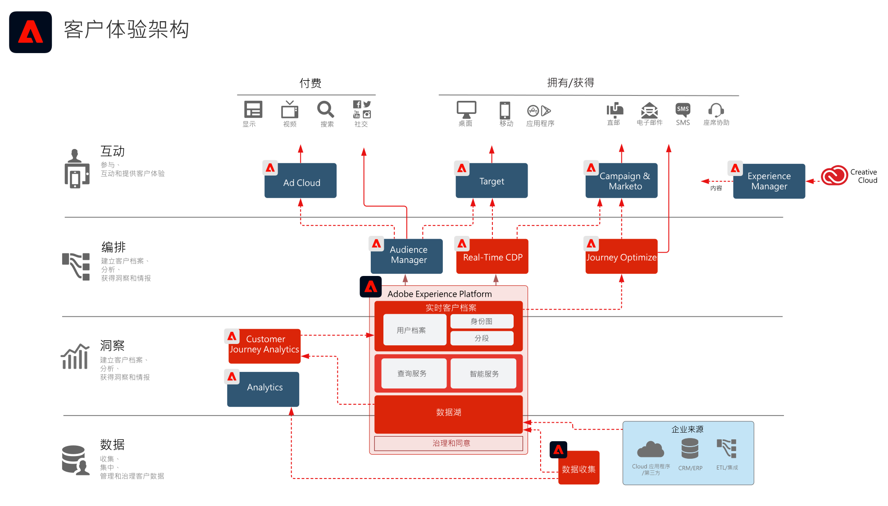

# Adobe Experience Cloud 架构图

这些图显示了Experience Cloud应用程序、应用程序服务和Experience Platform如何适应企业营销架构。

## Adobe Experience Cloud 营销架构

下图展示了基于 Adobe Experience Platform 构建和集成的 Adobe Experience Cloud 组件，涵盖数据洞察与受众、内容与商务、客户历程、营销工作流。

## 数据和见解、内容和商务以及体验交付的集成架构

以下架构图说明了 Adobe Experience Cloud 各个组件如何进行连接和集成，以便在数据、内容和体验投放中实现大规模个性化。

## 企业大环境中的 Adobe Experience Cloud

以下架构图说明了 Adobe Experience Cloud 应用程序和 Adobe Experience Platform 如何整合到涵盖数据、洞察、编排和参与这四个类别的企业客户体验架构中。

