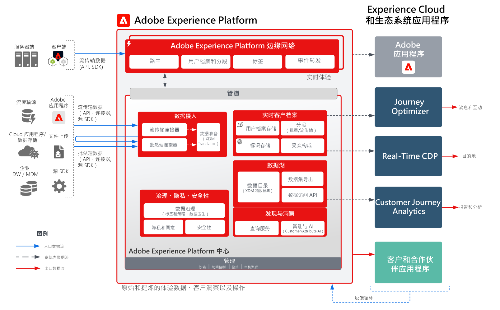

# Adobe Experience Platform和应用程序架构图

这些架构图显示了Experience Platform (AEP)与其他Experience Cloud应用程序和应用程序服务的关联方式。

>[!MORELIKETHIS]
>
>Experience Cloud应用程序集成的[集成配置](https://experienceleague.adobe.com/docs/integrations-learn/experience-cloud/overview.html?lang=zh-Hans)。

## 架构图

此架构图展示了 Adobe Experience Platform 与 Adobe Experience Cloud 应用程序和应用程序服务之间的关系。

## 详细的架构图

