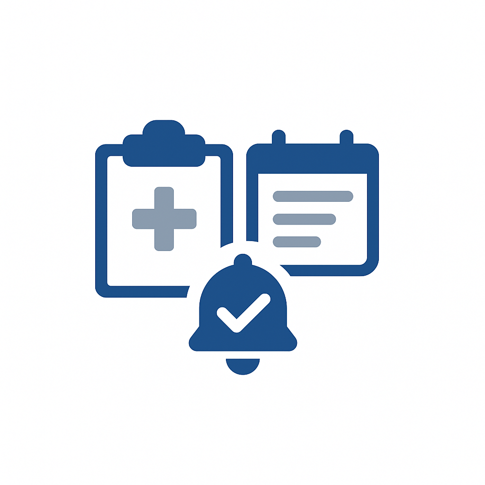
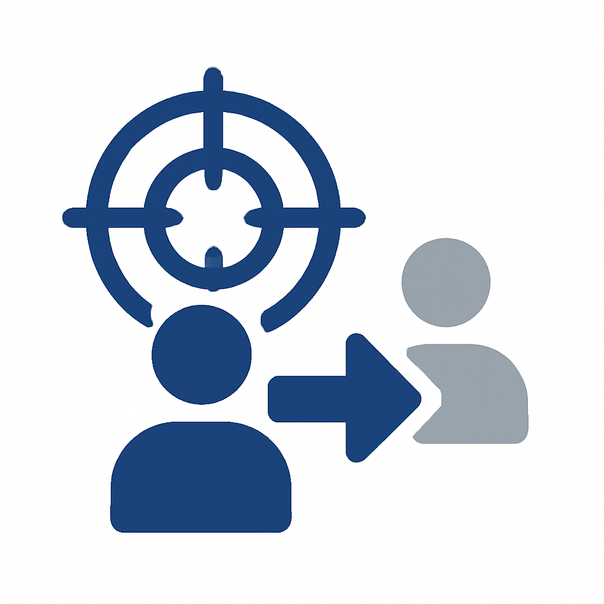

# 用例目录

探索跨行业的经验证用例以加快您的[!DNL Adobe Experience Platform]实施。 按垂直行业浏览，查找与您的业务相关的用例，按成熟度级别浏览以匹配贵组织的准备情况，或按实施模式浏览，以了解技术方法。

## 按行业浏览

>[!BEGINTABS]

>[!TAB 零售]

| | 用例 | 描述 | 成熟度 | 图案 |
| --- | --- | --- | --- | --- |
|  | [放弃的购物车电子邮件恢复](retail/retail-overview.md#abandoned-cart-email-recovery) | 为已放弃的购物车发送个性化提醒 | [!BADGE 基础]{type=Neutral} | [事件触发的消息传送](/help/blueprints/use-case-patterns/campaign-management-orchestration/event-triggered-messaging.md) |
|  | [基于清单的紧急活动](retail/retail-overview.md#inventory-based-urgency-campaigns) | 产品库存不足时触发实时警报 | [!BADGE 基础]{type=Neutral} | [事件触发的消息传送](/help/blueprints/use-case-patterns/campaign-management-orchestration/event-triggered-messaging.md) |
|  | [价格下降警报](retail/retail-overview.md#price-drop-alerts) | 当愿望清单或查看过的商品降价时通知客户 | [!BADGE 基础]{type=Neutral} | [事件触发的消息传送](/help/blueprints/use-case-patterns/campaign-management-orchestration/event-triggered-messaging.md) |
| | [缺货通知](retail/retail-overview.md#out-of-stock-notifications) | 在缺货产品可用时通知客户 | [!BADGE 基础]{type=Neutral} | [事件触发的消息传送](/help/blueprints/use-case-patterns/campaign-management-orchestration/event-triggered-messaging.md) |
|  | [个性化产品推荐](retail/retail-overview.md#personalized-product-recommendations) | 根据浏览和购买历史记录显示个性化产品 | [!BADGE 新兴]{type=Informative} | [行为推荐](/help/blueprints/use-case-patterns/personalization/behavioral-recommendation.md) |
|  | [个性化类别页面](retail/retail-overview.md#personalized-category-pages) | 根据客户首选项动态重新排序类别页面 | [!BADGE 新兴]{type=Informative} | [行为推荐](/help/blueprints/use-case-patterns/personalization/behavioral-recommendation.md) |
|  | [新客户欢迎系列](retail/retail-overview.md#new-customer-welcome-series) | 通过个性化推荐自动执行多电子邮件欢迎系列 | [!BADGE 新兴]{type=Informative} | [多步骤编排历程](/help/blueprints/use-case-patterns/campaign-management-orchestration/multi-step-orchestrated-journey.md) |
|  | [补货提醒](retail/retail-overview.md#replenishment-reminders) | 发送定期购买消耗性产品的自动提醒 | [!BADGE 新兴]{type=Informative} | [多步骤编排历程](/help/blueprints/use-case-patterns/campaign-management-orchestration/multi-step-orchestrated-journey.md) |
|  | [购买后跟进活动](retail/retail-overview.md#post-purchase-follow-up-campaigns) | 发送关怀提示、审核请求和相关产品建议 | [!BADGE 新兴]{type=Informative} | [多步骤编排历程](/help/blueprints/use-case-patterns/campaign-management-orchestration/multi-step-orchestrated-journey.md) |
| | [社交校对Personalization](retail/retail-overview.md#social-proof-personalization) | 根据客户个人资料显示个性化的评论和评级 | [!BADGE 新兴]{type=Informative} | [已知访客Web/应用程序Personalization](/help/blueprints/use-case-patterns/personalization/known-visitor-web-app-personalization.md) |
|  | [交叉销售和追加销售推荐](retail/retail-overview.md#cross-sell-and-upsell-recommendations) | 在结账时和电子邮件中显示相关的交叉销售和追加销售产品 | [!BADGE 高级]{type=Caution} | [Offer Decisioning](/help/blueprints/use-case-patterns/personalization/offer-decisioning.md) |
| | [VIP客户独家优惠](retail/retail-overview.md#vip-customer-exclusive-offers) | 提供独家优惠并抢先接触高价值客户 | [!BADGE 高级]{type=Caution} | 使用Decisioning [跨渠道历程](/help/blueprints/use-case-patterns/campaign-management-orchestration/cross-channel-journey-with-decisioning.md) |

>[!TAB 汽车]

| | 用例 | 描述 | 成熟度 | 图案 |
| --- | --- | --- | --- | --- |
|  | [服务约会提醒](automotive/automotive-overview.md#service-appointment-reminders) | 根据车辆里程和服务历史记录发送个性化服务提醒 | [!BADGE 基础]{type=Neutral} | [事件触发的消息传送](/help/blueprints/use-case-patterns/campaign-management-orchestration/event-triggered-messaging.md) |
|  | [车辆召回通知](automotive/automotive-overview.md#vehicle-recall-notifications) | 使用服务计划选项发送个性化召回通知 | [!BADGE 基础]{type=Neutral} | [事件触发的消息传送](/help/blueprints/use-case-patterns/campaign-management-orchestration/event-triggered-messaging.md) |
|  | [试用计划](automotive/automotive-overview.md#test-drive-scheduling) | 使用经销商推荐启用个性化的测试驱动计划 | [!BADGE 基础]{type=Neutral} | [事件触发的消息传送](/help/blueprints/use-case-patterns/campaign-management-orchestration/event-triggered-messaging.md) |
|  | [新模型启动促销活动](automotive/automotive-overview.md#new-model-launch-campaigns) | 根据当前车辆和偏好定位对新车型感兴趣的客户 | [!BADGE 基础]{type=Neutral} | [批出站消息激活](/help/blueprints/use-case-patterns/campaign-management-orchestration/batch-outbound-message-activation.md) |
|  | [折价促销活动](automotive/automotive-overview.md#trade-in-value-campaigns) | 主动为准备升级的客户提供以旧换新价值评估 | [!BADGE 新兴]{type=Informative} | [多步骤编排历程](/help/blueprints/use-case-patterns/campaign-management-orchestration/multi-step-orchestrated-journey.md) |
|  | [部件和附件推荐](automotive/automotive-overview.md#parts-and-accessories-recommendations) | 根据车辆型号和保有期限推荐部件和附件 | [!BADGE 新兴]{type=Informative} | [行为推荐](/help/blueprints/use-case-patterns/personalization/behavioral-recommendation.md) |
|  | [保修和延长服务计划](automotive/automotive-overview.md#warranty-and-extended-service-plans) | 根据车辆使用时间，在最佳时间建议保修和服务计划 | [!BADGE 新兴]{type=Informative} | [多步骤编排历程](/help/blueprints/use-case-patterns/campaign-management-orchestration/multi-step-orchestrated-journey.md) |
|  | [连接的汽车功能激活](automotive/automotive-overview.md#connected-car-feature-activation) | 根据车辆功能提供个性化的互联汽车功能推荐 | [!BADGE 新兴]{type=Informative} | [多步骤编排历程](/help/blueprints/use-case-patterns/campaign-management-orchestration/multi-step-orchestrated-journey.md) |
|  | [经销商网络协调](automotive/automotive-overview.md#dealer-network-coordination) | 根据位置和偏好启用个性化的经销商推荐 | [!BADGE 新兴]{type=Informative} | [已知访客Web/应用程序Personalization](/help/blueprints/use-case-patterns/personalization/known-visitor-web-app-personalization.md) |
|  | [车辆购买Personalization](automotive/automotive-overview.md#vehicle-purchase-journey-personalization) | 使从研究到购买的车辆购买历程个性化 | [!BADGE 高级]{type=Caution} | 使用Decisioning [跨渠道历程](/help/blueprints/use-case-patterns/campaign-management-orchestration/cross-channel-journey-with-decisioning.md) |
|  | [融资和保险优惠](automotive/automotive-overview.md#financing-and-insurance-offers) | 根据信用状况提供个性化的融资和保险优惠 | [!BADGE 高级]{type=Caution} | [Offer Decisioning](/help/blueprints/use-case-patterns/personalization/offer-decisioning.md) |
|  | [所有者忠诚度计划](automotive/automotive-overview.md#owner-loyalty-programs) | 根据所有权历史记录个性化忠诚度沟通、奖励和独家优惠 | [!BADGE 高级]{type=Caution} | 使用Decisioning [跨渠道历程](/help/blueprints/use-case-patterns/campaign-management-orchestration/cross-channel-journey-with-decisioning.md) |

>[!TAB 金融服务]

| | 用例 | 描述 | 成熟度 | 图案 |
| --- | --- | --- | --- | --- |
| | [基于事务的警报和建议](financial-services/financial-services-overview.md#transaction-based-alerts-and-recommendations) | 发送交易和个性化推荐的实时警报 | [!BADGE 基础]{type=Neutral} | [事件触发的消息传送](/help/blueprints/use-case-patterns/campaign-management-orchestration/event-triggered-messaging.md) |
| | [信用卡申请放弃恢复](financial-services/financial-services-overview.md#credit-card-application-abandonment-recovery) | 重新吸引已开始但未完成信用卡申请的客户 | [!BADGE 基础]{type=Neutral} | [事件触发的消息传送](/help/blueprints/use-case-patterns/campaign-management-orchestration/event-triggered-messaging.md) |
| | [欺诈警报Personalization](financial-services/financial-services-overview.md#fraud-alert-personalization) | 根据客户喜好将欺诈警报和安全通信个性化 | [!BADGE 基础]{type=Neutral} | [事件触发的消息传送](/help/blueprints/use-case-patterns/campaign-management-orchestration/event-triggered-messaging.md) |
|  | [高价值潜在客户培养](financial-services/financial-services-overview.md#high-value-lead-nurturing) | 识别高价值潜在客户，并通过个性化的内容和优惠培养 | [!BADGE 新兴]{type=Informative} | [多步骤编排历程](/help/blueprints/use-case-patterns/campaign-management-orchestration/multi-step-orchestrated-journey.md) |
|  | [个性化帐户信息板](financial-services/financial-services-overview.md#personalized-account-dashboard) | 根据帐户活动和财务目标个性化在线银行仪表板 | [!BADGE 新兴]{type=Informative} | [已知访客Web/应用程序Personalization](/help/blueprints/use-case-patterns/personalization/known-visitor-web-app-personalization.md) |
| | [投资Portfolio推荐](financial-services/financial-services-overview.md#investment-portfolio-recommendations) | 根据风险状况和目标提供个性化的投资推荐 | [!BADGE 新兴]{type=Informative} | [行为推荐](/help/blueprints/use-case-patterns/personalization/behavioral-recommendation.md) |
| | [抵押贷款预批准促销活动](financial-services/financial-services-overview.md#mortgage-pre-approval-campaigns) | 根据配置文件和人生阶段定位可能进入抵押贷款市场的客户 | [!BADGE 新兴]{type=Informative} | [多步骤编排历程](/help/blueprints/use-case-patterns/campaign-management-orchestration/multi-step-orchestrated-journey.md) |
|  | 针对现有客户的[产品推荐](financial-services/financial-services-overview.md#product-recommendation-for-existing-customers) | 根据用户档案、交易和存留期推荐相关金融产品 | [!BADGE 高级]{type=Caution} | [Offer Decisioning](/help/blueprints/use-case-patterns/personalization/offer-decisioning.md) |
|  | [流失预防营销活动](financial-services/financial-services-overview.md#churn-prevention-campaigns) | 识别具有AI支持的预测的高风险客户，并参与保留期优惠 | [!BADGE 高级]{type=Caution} | 使用Decisioning [跨渠道历程](/help/blueprints/use-case-patterns/campaign-management-orchestration/cross-channel-journey-with-decisioning.md) |
|  | [基于生命周期阶段的产品优惠](financial-services/financial-services-overview.md#life-stage-based-product-offers) | 识别进入新生命阶段的客户并提供相关金融产品 | [!BADGE 高级]{type=Caution} | 使用Decisioning [跨渠道历程](/help/blueprints/use-case-patterns/campaign-management-orchestration/cross-channel-journey-with-decisioning.md) |
| | [忠诚度计划参与度](financial-services/financial-services-overview.md#loyalty-program-engagement) | 按层级和历史记录个性化忠诚度沟通、奖励和优惠 | [!BADGE 高级]{type=Caution} | 使用Decisioning [跨渠道历程](/help/blueprints/use-case-patterns/campaign-management-orchestration/cross-channel-journey-with-decisioning.md) |
| | [个性化的金融教育内容](financial-services/financial-services-overview.md#personalized-financial-education-content) | 根据客户的用户档案和兴趣提供个性化的金融教育 | [!BADGE 高级]{type=Caution} | 使用Decisioning [跨渠道历程](/help/blueprints/use-case-patterns/campaign-management-orchestration/cross-channel-journey-with-decisioning.md) |

>[!TAB 医疗保健]

| | 用例 | 描述 | 成熟度 | 图案 |
| --- | --- | --- | --- | --- |
|  | [约会提醒自动化](healthcare/healthcare-overview.md#appointment-reminder-automation) | 通过首选通信渠道发送个性化约会提醒 | [!BADGE 基础]{type=Neutral} | [事件触发的消息传送](/help/blueprints/use-case-patterns/campaign-management-orchestration/event-triggered-messaging.md) |
|  | [访问后跟进活动](healthcare/healthcare-overview.md#post-visit-follow-up-campaigns) | 发送访问后调查、护理指示和跟进预约提醒 | [!BADGE 基础]{type=Neutral} | [事件触发的消息传送](/help/blueprints/use-case-patterns/campaign-management-orchestration/event-triggered-messaging.md) |
| | [实验室结果通知](healthcare/healthcare-overview.md#lab-results-notification) | 当通过首选渠道获得实验室结果时通知患者 | [!BADGE 基础]{type=Neutral} | [事件触发的消息传送](/help/blueprints/use-case-patterns/campaign-management-orchestration/event-triggered-messaging.md) |
| | [保险范围验证](healthcare/healthcare-overview.md#insurance-coverage-verification) | 在预约之前主动确认和传达保险范围 | [!BADGE 基础]{type=Neutral} | [事件触发的消息传送](/help/blueprints/use-case-patterns/campaign-management-orchestration/event-triggered-messaging.md) |
| | [远程保健约会提醒](healthcare/healthcare-overview.md#telehealth-appointment-reminders) | 为远程医疗预约发送个性化提醒，并附上连接说明 | [!BADGE 基础]{type=Neutral} | [事件触发的消息传送](/help/blueprints/use-case-patterns/campaign-management-orchestration/event-triggered-messaging.md) |
|  | [预防性护理提醒](healthcare/healthcare-overview.md#preventive-care-reminders) | 提醒患者根据年龄和病史推荐的预防性护理 | [!BADGE 基础]{type=Neutral} | [批出站消息激活](/help/blueprints/use-case-patterns/campaign-management-orchestration/batch-outbound-message-activation.md) |
|  | [药物遵守活动](healthcare/healthcare-overview.md#medication-adherence-campaigns) | 发送个性化提醒，帮助患者按计划服用药物 | [!BADGE 新兴]{type=Informative} | [多步骤编排历程](/help/blueprints/use-case-patterns/campaign-management-orchestration/multi-step-orchestrated-journey.md) |
| | [慢性病管理计划](healthcare/healthcare-overview.md#chronic-disease-management-programs) | 个性化慢性疾病管理沟通和监测提醒 | [!BADGE 新兴]{type=Informative} | [多步骤编排历程](/help/blueprints/use-case-patterns/campaign-management-orchestration/multi-step-orchestrated-journey.md) |
| | [新患者入门历程](healthcare/healthcare-overview.md#new-patient-onboarding-journey) | 通过欢迎信息、门户访问和计划自动执行多步骤上线 | [!BADGE 新兴]{type=Informative} | [多步骤编排历程](/help/blueprints/use-case-patterns/campaign-management-orchestration/multi-step-orchestrated-journey.md) |
| | [健康计划参与度](healthcare/healthcare-overview.md#wellness-program-engagement) | 使健康计划的沟通、挑战和奖励个性化 | [!BADGE 新兴]{type=Informative} | [多步骤编排历程](/help/blueprints/use-case-patterns/campaign-management-orchestration/multi-step-orchestrated-journey.md) |
| | [关怀团队协调](healthcare/healthcare-overview.md#care-team-coordination) | 在患者及其护理团队之间实现个性化通信 | [!BADGE 新兴]{type=Informative} | [多步骤编排历程](/help/blueprints/use-case-patterns/campaign-management-orchestration/multi-step-orchestrated-journey.md) |
| | [个性化健康内容交付](healthcare/healthcare-overview.md#personalized-health-content-delivery) | 根据患者情况提供个性化的健康教育内容 | [!BADGE 高级]{type=Caution} | 使用Decisioning [跨渠道历程](/help/blueprints/use-case-patterns/campaign-management-orchestration/cross-channel-journey-with-decisioning.md) |

>[!TAB 保险]

| | 用例 | 描述 | 成熟度 | 图案 |
| --- | --- | --- | --- | --- |
|  | [策略续订营销活动](insurance/insurance-overview.md#policy-renewal-campaigns) | 发送个性化的保单续订提醒和优惠 | [!BADGE 基础]{type=Neutral} | [事件触发的消息传送](/help/blueprints/use-case-patterns/campaign-management-orchestration/event-triggered-messaging.md) |
| | [策略更改通知](insurance/insurance-overview.md#policy-change-notifications) | 发送有关策略更改和覆盖范围更新的个性化通知 | [!BADGE 基础]{type=Neutral} | [事件触发的消息传送](/help/blueprints/use-case-patterns/campaign-management-orchestration/event-triggered-messaging.md) |
| | [报价单放弃恢复](insurance/insurance-overview.md#quote-abandonment-recovery) | 重新吸引已开始但未完成保险报价的客户 | [!BADGE 基础]{type=Neutral} | [事件触发的消息传送](/help/blueprints/use-case-patterns/campaign-management-orchestration/event-triggered-messaging.md) |
| | [防止欺诈索赔](insurance/insurance-overview.md#claims-fraud-prevention) | 使用智能欺诈检测来识别可疑的索赔模式 | [!BADGE 基础]{type=Neutral} | [事件触发的消息传送](/help/blueprints/use-case-patterns/campaign-management-orchestration/event-triggered-messaging.md) |
| | [灾难性事件响应](insurance/insurance-overview.md#catastrophic-event-response) | 在自然灾害期间主动与受影响地区的客户沟通 | [!BADGE 基础]{type=Neutral} | [事件触发的消息传送](/help/blueprints/use-case-patterns/campaign-management-orchestration/event-triggered-messaging.md) |
| | [代理和代理协调](insurance/insurance-overview.md#agent-and-broker-coordination) | 在客户和分配的代理之间启用个性化通信 | [!BADGE 基础]{type=Neutral} | [批出站消息激活](/help/blueprints/use-case-patterns/campaign-management-orchestration/batch-outbound-message-activation.md) |
|  | [索赔流程Personalization](insurance/insurance-overview.md#claims-process-personalization) | 个性化理赔流程通信、状态更新和支持资源 | [!BADGE 新兴]{type=Informative} | [多步骤编排历程](/help/blueprints/use-case-patterns/campaign-management-orchestration/multi-step-orchestrated-journey.md) |
| | [风险评估与预防](insurance/insurance-overview.md#risk-assessment-and-prevention) | 提供个性化的风险评估信息和预防提示 | [!BADGE 新兴]{type=Informative} | [多步骤编排历程](/help/blueprints/use-case-patterns/campaign-management-orchestration/multi-step-orchestrated-journey.md) |
| | [健康和预防计划](insurance/insurance-overview.md#wellness-and-prevention-programs) | 为保险客户提供个性化的健康计划沟通和奖励 | [!BADGE 新兴]{type=Informative} | [多步骤编排历程](/help/blueprints/use-case-patterns/campaign-management-orchestration/multi-step-orchestrated-journey.md) |
|  | [交叉销售产品推荐](insurance/insurance-overview.md#cross-sell-product-recommendations) | 根据现有保单和寿险阶段建议额外的保险产品 | [!BADGE 高级]{type=Caution} | [Offer Decisioning](/help/blueprints/use-case-patterns/personalization/offer-decisioning.md) |
| | [基于生命周期阶段的产品优惠](insurance/insurance-overview.md#life-stage-based-product-offers) | 识别进入新寿险阶段的客户并提供相关保险产品 | [!BADGE 高级]{type=Caution} | 使用Decisioning [跨渠道历程](/help/blueprints/use-case-patterns/campaign-management-orchestration/cross-channel-journey-with-decisioning.md) |
| | [折扣和节省机会](insurance/insurance-overview.md#discount-and-savings-opportunities) | 识别并传递个性化的折扣机会 | [!BADGE 高级]{type=Caution} | [Offer Decisioning](/help/blueprints/use-case-patterns/personalization/offer-decisioning.md) |

>[!TAB 媒体和娱乐]

| | 用例 | 描述 | 成熟度 | 图案 |
| --- | --- | --- | --- | --- |
|  | [新内容发布通知](media-entertainment/media-entertainment-overview.md#new-content-release-notifications) | 通知订阅者与其首选项匹配的新内容 | [!BADGE 基础]{type=Neutral} | [事件触发的消息传送](/help/blueprints/use-case-patterns/campaign-management-orchestration/event-triggered-messaging.md) |
| | [监视列表和收藏夹提醒](media-entertainment/media-entertainment-overview.md#watchlist-and-favorites-reminders) | 在监视列表中发送有关未观看内容的提醒 | [!BADGE 基础]{type=Neutral} | [事件触发的消息传送](/help/blueprints/use-case-patterns/campaign-management-orchestration/event-triggered-messaging.md) |
| | [实时活动查看提醒](media-entertainment/media-entertainment-overview.md#live-event-viewing-reminders) | 通知用户与其兴趣相匹配的即将举行的实时活动 | [!BADGE 基础]{type=Neutral} | [事件触发的消息传送](/help/blueprints/use-case-patterns/campaign-management-orchestration/event-triggered-messaging.md) |
| | [内容完成营销活动](media-entertainment/media-entertainment-overview.md#content-completion-campaigns) | 提醒用户完成他们已开始但未完成的内容 | [!BADGE 基础]{type=Neutral} | [事件触发的消息传送](/help/blueprints/use-case-patterns/campaign-management-orchestration/event-triggered-messaging.md) |
|  | [内容推荐引擎](media-entertainment/media-entertainment-overview.md#content-recommendation-engine) | 根据查看历史记录提供个性化的内容推荐 | [!BADGE 新兴]{type=Informative} | [行为推荐](/help/blueprints/use-case-patterns/personalization/behavioral-recommendation.md) |
| | [个性化主页体验](media-entertainment/media-entertainment-overview.md#personalized-homepage-experience) | 动态地个性化主页，以便首先显示最相关的内容 | [!BADGE 新兴]{type=Informative} | [行为推荐](/help/blueprints/use-case-patterns/personalization/behavioral-recommendation.md) |
| | [个性化播放列表生成](media-entertainment/media-entertainment-overview.md#personalized-playlist-generation) | 根据收听历史记录和首选项自动生成播放列表 | [!BADGE 新兴]{type=Informative} | [行为推荐](/help/blueprints/use-case-patterns/personalization/behavioral-recommendation.md) |
| | [免费试用转化促销活动](media-entertainment/media-entertainment-overview.md#free-trial-conversion-campaigns) | 吸引包含个性化内容的免费试用用户以鼓励转化 | [!BADGE 新兴]{type=Informative} | [多步骤编排历程](/help/blueprints/use-case-patterns/campaign-management-orchestration/multi-step-orchestrated-journey.md) |
| | [跨平台内容同步](media-entertainment/media-entertainment-overview.md#cross-platform-content-sync) | 通过同步的首选项提供跨设备的无缝内容体验 | [!BADGE 新兴]{type=Informative} | [已知访客Web/应用程序Personalization](/help/blueprints/use-case-patterns/personalization/known-visitor-web-app-personalization.md) |
| | [社交共享Personalization](media-entertainment/media-entertainment-overview.md#social-sharing-personalization) | 根据内容首选项个性化社交共享提示 | [!BADGE 新兴]{type=Informative} | [已知访客Web/应用程序Personalization](/help/blueprints/use-case-patterns/personalization/known-visitor-web-app-personalization.md) |
|  | [订阅流失预防](media-entertainment/media-entertainment-overview.md#subscription-churn-prevention) | 识别有风险的订阅者并参与维系服务 | [!BADGE 高级]{type=Caution} | 使用Decisioning [跨渠道历程](/help/blueprints/use-case-patterns/campaign-management-orchestration/cross-channel-journey-with-decisioning.md) |
| | [高级功能追加销售](media-entertainment/media-entertainment-overview.md#premium-feature-upsell) | 确定将从个性化优惠的高级功能中受益的用户 | [!BADGE 高级]{type=Caution} | [Offer Decisioning](/help/blueprints/use-case-patterns/personalization/offer-decisioning.md) |

>[!TAB 电信]

| | 用例 | 描述 | 成熟度 | 图案 |
| --- | --- | --- | --- | --- |
| | [数据使用情况警报和建议](telecommunications/telecommunications-overview.md#data-usage-alerts-and-recommendations) | 当客户达到数据限制时发送个性化警报 | [!BADGE 基础]{type=Neutral} | [事件触发的消息传送](/help/blueprints/use-case-patterns/campaign-management-orchestration/event-triggered-messaging.md) |
| | [服务中断通知](telecommunications/telecommunications-overview.md#service-outage-notifications) | 主动通知客户其所在地区的服务中断 | [!BADGE 基础]{type=Neutral} | [事件触发的消息传送](/help/blueprints/use-case-patterns/campaign-management-orchestration/event-triggered-messaging.md) |
| | [帐单付款提醒](telecommunications/telecommunications-overview.md#bill-payment-reminders) | 发送带有付款选项的个性化账单付款提醒 | [!BADGE 基础]{type=Neutral} | [事件触发的消息传送](/help/blueprints/use-case-patterns/campaign-management-orchestration/event-triggered-messaging.md) |
| | [5G升级促销活动](telecommunications/telecommunications-overview.md#5g-upgrade-campaigns) | 符合资格获得个性化优惠的5G升级的目标客户 | [!BADGE 基础]{type=Neutral} | [批出站消息激活](/help/blueprints/use-case-patterns/campaign-management-orchestration/batch-outbound-message-activation.md) |
|  | [计划优化营销活动](telecommunications/telecommunications-overview.md#plan-optimization-campaigns) | 分析使用模式并建议最佳计划更改 | [!BADGE 新兴]{type=Informative} | [多步骤编排历程](/help/blueprints/use-case-patterns/campaign-management-orchestration/multi-step-orchestrated-journey.md) |
| | [新客户入门培训历程](telecommunications/telecommunications-overview.md#new-customer-onboarding-journey) | 使用欢迎信息和功能教程自动进行个性化载入 | [!BADGE 新兴]{type=Informative} | [多步骤编排历程](/help/blueprints/use-case-patterns/campaign-management-orchestration/multi-step-orchestrated-journey.md) |
| | [网络性能Personalization](telecommunications/telecommunications-overview.md#network-performance-personalization) | 根据位置和设备个性化网络性能信息 | [!BADGE 新兴]{type=Informative} | [已知访客Web/应用程序Personalization](/help/blueprints/use-case-patterns/personalization/known-visitor-web-app-personalization.md) |
|  | [设备升级建议](telecommunications/telecommunications-overview.md#device-upgrade-recommendations) | 识别符合条件的客户并提供个性化的设备推荐 | [!BADGE 高级]{type=Caution} | 使用Decisioning [跨渠道历程](/help/blueprints/use-case-patterns/campaign-management-orchestration/cross-channel-journey-with-decisioning.md) |
|  | [高价值客户的流失预防](telecommunications/telecommunications-overview.md#churn-prevention-for-high-value-customers) | 识别高价值风险客户，并提供维系服务 | [!BADGE 高级]{type=Caution} | 使用Decisioning [跨渠道历程](/help/blueprints/use-case-patterns/campaign-management-orchestration/cross-channel-journey-with-decisioning.md) |
| | [家庭计划管理](telecommunications/telecommunications-overview.md#family-plan-management) | 按家庭使用情况为家庭计划管理员提供个性化通信 | [!BADGE 高级]{type=Caution} | 使用Decisioning [跨渠道历程](/help/blueprints/use-case-patterns/campaign-management-orchestration/cross-channel-journey-with-decisioning.md) |
| | [加载项服务建议](telecommunications/telecommunications-overview.md#add-on-service-recommendations) | 根据计划、使用和偏好推荐相关的附加服务 | [!BADGE 高级]{type=Caution} | [Offer Decisioning](/help/blueprints/use-case-patterns/personalization/offer-decisioning.md) |
| | [忠诚度计划参与度](telecommunications/telecommunications-overview.md#loyalty-program-engagement) | 按层级和历史记录个性化忠诚度沟通、奖励和优惠 | [!BADGE 高级]{type=Caution} | 使用Decisioning [跨渠道历程](/help/blueprints/use-case-patterns/campaign-management-orchestration/cross-channel-journey-with-decisioning.md) |

>[!TAB 旅游和酒店业]

| | 用例 | 描述 | 成熟度 | 图案 |
| --- | --- | --- | --- | --- |
|  | [购物车放弃恢复历程](travel-hospitality/travel-hospitality-overview.md#cart-abandonment-recovery-journey) | 检测放弃的预订购物车并触发个性化电子邮件历程 | [!BADGE 基础]{type=Neutral} | [事件触发的消息传送](/help/blueprints/use-case-patterns/campaign-management-orchestration/event-triggered-messaging.md) |
|  | [多渠道预订提醒](travel-hospitality/travel-hospitality-overview.md#multi-channel-booking-reminders) | 通过电子邮件、文本和推送发送个性化预订提醒 | [!BADGE 基础]{type=Neutral} | [事件触发的消息传送](/help/blueprints/use-case-patterns/campaign-management-orchestration/event-triggered-messaging.md) |
|  | [季节性促销活动Personalization](travel-hospitality/travel-hospitality-overview.md#seasonal-campaign-personalization) | 根据季节性偏好和过去的预订，个性化营销活动 | [!BADGE 基础]{type=Neutral} | [批出站消息激活](/help/blueprints/use-case-patterns/campaign-management-orchestration/batch-outbound-message-activation.md) |
|  | [新访客的个性化主页](travel-hospitality/travel-hospitality-overview.md#personalized-homepage-for-new-visitors) | 根据位置和浏览行为显示个性化推荐 | [!BADGE 新兴]{type=Informative} | [匿名访客Web Personalization](/help/blueprints/use-case-patterns/personalization/anonymous-visitor-web-personalization.md) |
|  | [高意图访客定位](travel-hospitality/travel-hospitality-overview.md#high-intent-visitor-targeting) | 通过AI评分识别高意图访客，并通过个性化优惠进行定位 | [!BADGE 新兴]{type=Informative} | [已知访客Web/应用程序Personalization](/help/blueprints/use-case-patterns/personalization/known-visitor-web-app-personalization.md) |
|  | [后期预订追加销售活动](travel-hospitality/travel-hospitality-overview.md#post-booking-upsell-campaigns) | 在预订后触发升级、偏移和包追加销售促销活动 | [!BADGE 新兴]{type=Informative} | [多步骤编排历程](/help/blueprints/use-case-patterns/campaign-management-orchestration/multi-step-orchestrated-journey.md) |
|  | [失效客户的回馈促销活动](travel-hospitality/travel-hospitality-overview.md#win-back-campaigns-for-lapsed-customers) | 通过个性化的回馈优惠吸引失效客户 | [!BADGE 新兴]{type=Informative} | [多步骤编排历程](/help/blueprints/use-case-patterns/campaign-management-orchestration/multi-step-orchestrated-journey.md) |
|  | [动态行程推荐](travel-hospitality/travel-hospitality-overview.md#dynamic-itinerary-recommendations) | 根据过去的预订和偏好设置显示个性化路线 | [!BADGE 新兴]{type=Informative} | [已知访客Web/应用程序Personalization](/help/blueprints/use-case-patterns/personalization/known-visitor-web-app-personalization.md) |
|  | 首页上[最近浏览的产品](travel-hospitality/travel-hospitality-overview.md#recently-browsed-products-on-homepage) | 显示最近查看的目标以鼓励回访 | [!BADGE 新兴]{type=Informative} | [已知访客Web/应用程序Personalization](/help/blueprints/use-case-patterns/personalization/known-visitor-web-app-personalization.md) |
|  | [组预订推荐](travel-hospitality/travel-hospitality-overview.md#group-booking-recommendations) | 向频繁进行团体预订的人推荐团体包和家庭友好选项 | [!BADGE 新兴]{type=Informative} | [行为推荐](/help/blueprints/use-case-patterns/personalization/behavioral-recommendation.md) |
|  | [具有目标优惠的退出意图模式](travel-hospitality/travel-hospitality-overview.md#exit-intent-modal-with-targeted-offers) | 当访客显示退出意图时，使用相关选件显示个性化模式窗口 | [!BADGE 高级]{type=Caution} | [Offer Decisioning](/help/blueprints/use-case-patterns/personalization/offer-decisioning.md) |
|  | [忠诚度计划Personalization](travel-hospitality/travel-hospitality-overview.md#loyalty-program-personalization) | 按忠诚度级别和积分平衡个性化网站、优惠和通信 | [!BADGE 高级]{type=Caution} | 使用Decisioning [跨渠道历程](/help/blueprints/use-case-patterns/campaign-management-orchestration/cross-channel-journey-with-decisioning.md) |

>[!TAB B2B]

| | 用例 | 描述 | 成熟度 | 图案 |
| --- | --- | --- | --- | --- |
|  | [网络研讨会和演示计划](b2b/b2b-overview.md#webinar-and-demo-scheduling) | 根据潜在客户兴趣个性化网络研讨会邀请和演示计划 | [!BADGE 基础]{type=Neutral} | [事件触发的消息传送](/help/blueprints/use-case-patterns/campaign-management-orchestration/event-triggered-messaging.md) |
|  | [Account-Based Marketing Personalization](b2b/b2b-overview.md#account-based-marketing-personalization) | 根据购买信号为目标客户个性化营销通信 | [!BADGE 新兴]{type=Informative} | [B2B 受众激活](/help/blueprints/use-case-patterns/audience-building-activation/b2b-audience-activation.md) |
|  | [潜在客户评分和培养](b2b/b2b-overview.md#lead-scoring-and-nurturing) | 通过培养活动自动对潜在客户进行评分，并将高分客户引向销售 | [!BADGE 新兴]{type=Informative} | [多步骤编排历程](/help/blueprints/use-case-patterns/campaign-management-orchestration/multi-step-orchestrated-journey.md) |
|  | [面向潜在客户的Personalization内容](b2b/b2b-overview.md#content-personalization-for-prospects) | 根据潜在客户行业、角色和参与情况使网站内容和资源个性化 | [!BADGE 新兴]{type=Informative} | [已知访客Web/应用程序Personalization](/help/blueprints/use-case-patterns/personalization/known-visitor-web-app-personalization.md) |
|  | [活动注册和跟进](b2b/b2b-overview.md#event-registration-and-follow-up) | 自动化个性化的事件注册确认、提醒和跟进 | [!BADGE 新兴]{type=Informative} | [多步骤编排历程](/help/blueprints/use-case-patterns/campaign-management-orchestration/multi-step-orchestrated-journey.md) |
|  | [产品试用转换促销活动](b2b/b2b-overview.md#product-trial-conversion-campaigns) | 通过个性化的推荐吸引试用用户，以鼓励付费转化 | [!BADGE 新兴]{type=Informative} | [多步骤编排历程](/help/blueprints/use-case-patterns/campaign-management-orchestration/multi-step-orchestrated-journey.md) |
|  | [客户成功和入门](b2b/b2b-overview.md#customer-success-and-onboarding) | 通过相关培训和资源使入门历程个性化 | [!BADGE 新兴]{type=Informative} | [多步骤编排历程](/help/blueprints/use-case-patterns/campaign-management-orchestration/multi-step-orchestrated-journey.md) |
|  | [竞争替换促销活动](b2b/b2b-overview.md#competitive-replacement-campaigns) | 使用具有个性化迁移优惠的竞争对手产品定位潜在客户 | [!BADGE 新兴]{type=Informative} | [多步骤编排历程](/help/blueprints/use-case-patterns/campaign-management-orchestration/multi-step-orchestrated-journey.md) |
|  | [案例研究和ROI Personalization](b2b/b2b-overview.md#case-study-and-roi-personalization) | 根据潜在客户的行业提供个性化的案例分析和ROI计算器 | [!BADGE 新兴]{type=Informative} | [已知访客Web/应用程序Personalization](/help/blueprints/use-case-patterns/personalization/known-visitor-web-app-personalization.md) |
| | [客户宣传计划](b2b/b2b-overview.md#customer-advocacy-programs) | 寻找并吸引满意的客户提供参考和证明 | [!BADGE 新兴]{type=Informative} | [多步骤编排历程](/help/blueprints/use-case-patterns/campaign-management-orchestration/multi-step-orchestrated-journey.md) |
|  | [合同续订活动](b2b/b2b-overview.md#contract-renewal-campaigns) | 主动与通过个性化优惠寻求续订的客户接洽 | [!BADGE 高级]{type=Caution} | 使用Decisioning [跨渠道历程](/help/blueprints/use-case-patterns/campaign-management-orchestration/cross-channel-journey-with-decisioning.md) |
|  | [追加销售和扩展机会](b2b/b2b-overview.md#upsell-and-expansion-opportunities) | 根据使用模式和增长指标确定准备好升级的客户 | [!BADGE 高级]{type=Caution} | 使用Decisioning [跨渠道历程](/help/blueprints/use-case-patterns/campaign-management-orchestration/cross-channel-journey-with-decisioning.md) |

>[!ENDTABS]

## 按成熟度级别浏览

>[!BEGINTABS]

>[!TAB 基础]

| | 用例 | 行业 | 商业影响 | 图案 |
| --- | --- | --- | --- | --- |
|  | [放弃的购物车电子邮件恢复](retail/retail-overview.md#abandoned-cart-email-recovery) | 零售 | 购物车回收率25-35% | [事件触发的消息传送](/help/blueprints/use-case-patterns/campaign-management-orchestration/event-triggered-messaging.md) |
|  | [基于清单的紧急活动](retail/retail-overview.md#inventory-based-urgency-campaigns) | 零售 | 转化率增加30-40% | [事件触发的消息传送](/help/blueprints/use-case-patterns/campaign-management-orchestration/event-triggered-messaging.md) |
|  | [价格下降警报](retail/retail-overview.md#price-drop-alerts) | 零售 | 20-30%转化率 | [事件触发的消息传送](/help/blueprints/use-case-patterns/campaign-management-orchestration/event-triggered-messaging.md) |
| | [缺货通知](retail/retail-overview.md#out-of-stock-notifications) | 零售 | 转化率40-50% | [事件触发的消息传送](/help/blueprints/use-case-patterns/campaign-management-orchestration/event-triggered-messaging.md) |
|  | [服务约会提醒](automotive/automotive-overview.md#service-appointment-reminders) | 汽车 | 节目播放率增加40-50% | [事件触发的消息传送](/help/blueprints/use-case-patterns/campaign-management-orchestration/event-triggered-messaging.md) |
|  | [车辆召回通知](automotive/automotive-overview.md#vehicle-recall-notifications) | 汽车 | 召回响应率提高60-70% | [事件触发的消息传送](/help/blueprints/use-case-patterns/campaign-management-orchestration/event-triggered-messaging.md) |
|  | [试用计划](automotive/automotive-overview.md#test-drive-scheduling) | 汽车 | 试运行完成率提高50-60% | [事件触发的消息传送](/help/blueprints/use-case-patterns/campaign-management-orchestration/event-triggered-messaging.md) |
|  | [新模型启动促销活动](automotive/automotive-overview.md#new-model-launch-campaigns) | 汽车 | 启动促销活动参与度提高35-45% | [批出站消息激活](/help/blueprints/use-case-patterns/campaign-management-orchestration/batch-outbound-message-activation.md) |
| | [基于事务的警报和建议](financial-services/financial-services-overview.md#transaction-based-alerts-and-recommendations) | 金融服务 | 50-60%的参与率 | [事件触发的消息传送](/help/blueprints/use-case-patterns/campaign-management-orchestration/event-triggered-messaging.md) |
| | [信用卡申请放弃恢复](financial-services/financial-services-overview.md#credit-card-application-abandonment-recovery) | 金融服务 | 申请完成率提高20-30% | [事件触发的消息传送](/help/blueprints/use-case-patterns/campaign-management-orchestration/event-triggered-messaging.md) |
| | [欺诈警报Personalization](financial-services/financial-services-overview.md#fraud-alert-personalization) | 金融服务 | 警报响应率提高40-50% | [事件触发的消息传送](/help/blueprints/use-case-patterns/campaign-management-orchestration/event-triggered-messaging.md) |
|  | [约会提醒自动化](healthcare/healthcare-overview.md#appointment-reminder-automation) | 医疗保健 | 节目播放率提高30-40% | [事件触发的消息传送](/help/blueprints/use-case-patterns/campaign-management-orchestration/event-triggered-messaging.md) |
|  | [访问后跟进活动](healthcare/healthcare-overview.md#post-visit-follow-up-campaigns) | 医疗保健 | 调查答复提高40-50% | [事件触发的消息传送](/help/blueprints/use-case-patterns/campaign-management-orchestration/event-triggered-messaging.md) |
| | [实验室结果通知](healthcare/healthcare-overview.md#lab-results-notification) | 医疗保健 | 结果查看率提高60-70% | [事件触发的消息传送](/help/blueprints/use-case-patterns/campaign-management-orchestration/event-triggered-messaging.md) |
| | [保险范围验证](healthcare/healthcare-overview.md#insurance-coverage-verification) | 医疗保健 | 访问前覆盖确认提高25-35% | [事件触发的消息传送](/help/blueprints/use-case-patterns/campaign-management-orchestration/event-triggered-messaging.md) |
| | [远程保健约会提醒](healthcare/healthcare-overview.md#telehealth-appointment-reminders) | 医疗保健 | 虚拟访问展示率提升了40-50% | [事件触发的消息传送](/help/blueprints/use-case-patterns/campaign-management-orchestration/event-triggered-messaging.md) |
|  | [预防性护理提醒](healthcare/healthcare-overview.md#preventive-care-reminders) | 医疗保健 | 完成预防性护理的工作增加25-35% | [批出站消息激活](/help/blueprints/use-case-patterns/campaign-management-orchestration/batch-outbound-message-activation.md) |
|  | [策略续订营销活动](insurance/insurance-overview.md#policy-renewal-campaigns) | 保险 | 更新率提高25%至35% | [事件触发的消息传送](/help/blueprints/use-case-patterns/campaign-management-orchestration/event-triggered-messaging.md) |
| | [策略更改通知](insurance/insurance-overview.md#policy-change-notifications) | 保险 | 通知确认率提高了50-60% | [事件触发的消息传送](/help/blueprints/use-case-patterns/campaign-management-orchestration/event-triggered-messaging.md) |
| | [报价单放弃恢复](insurance/insurance-overview.md#quote-abandonment-recovery) | 保险 | 报价完成率提高20-30% | [事件触发的消息传送](/help/blueprints/use-case-patterns/campaign-management-orchestration/event-triggered-messaging.md) |
| | [防止欺诈索赔](insurance/insurance-overview.md#claims-fraud-prevention) | 保险 | 欺诈侦查工作提高15-25% | [事件触发的消息传送](/help/blueprints/use-case-patterns/campaign-management-orchestration/event-triggered-messaging.md) |
| | [灾难性事件响应](insurance/insurance-overview.md#catastrophic-event-response) | 保险 | 沟通率提高60-70% | [事件触发的消息传送](/help/blueprints/use-case-patterns/campaign-management-orchestration/event-triggered-messaging.md) |
| | [代理和代理协调](insurance/insurance-overview.md#agent-and-broker-coordination) | 保险 | 代理参与率提高了35-45% | [批出站消息激活](/help/blueprints/use-case-patterns/campaign-management-orchestration/batch-outbound-message-activation.md) |
|  | [新内容发布通知](media-entertainment/media-entertainment-overview.md#new-content-release-notifications) | 媒体和娱乐 | 第一周内新内容参与度增加40-50% | [事件触发的消息传送](/help/blueprints/use-case-patterns/campaign-management-orchestration/event-triggered-messaging.md) |
| | [监视列表和收藏夹提醒](media-entertainment/media-entertainment-overview.md#watchlist-and-favorites-reminders) | 媒体和娱乐 | 完成关注名单的人数增加30-40% | [事件触发的消息传送](/help/blueprints/use-case-patterns/campaign-management-orchestration/event-triggered-messaging.md) |
| | [实时活动查看提醒](media-entertainment/media-entertainment-overview.md#live-event-viewing-reminders) | 媒体和娱乐 | 现场活动收视率提高50-60% | [事件触发的消息传送](/help/blueprints/use-case-patterns/campaign-management-orchestration/event-triggered-messaging.md) |
| | [内容完成营销活动](media-entertainment/media-entertainment-overview.md#content-completion-campaigns) | 媒体和娱乐 | 内容完成率提高35-45% | [事件触发的消息传送](/help/blueprints/use-case-patterns/campaign-management-orchestration/event-triggered-messaging.md) |
| | [数据使用情况警报和建议](telecommunications/telecommunications-overview.md#data-usage-alerts-and-recommendations) | 电信 | 数据附加购买量增加40-50% | [事件触发的消息传送](/help/blueprints/use-case-patterns/campaign-management-orchestration/event-triggered-messaging.md) |
| | [服务中断通知](telecommunications/telecommunications-overview.md#service-outage-notifications) | 电信 | 60-70%通知确认率 | [事件触发的消息传送](/help/blueprints/use-case-patterns/campaign-management-orchestration/event-triggered-messaging.md) |
| | [帐单付款提醒](telecommunications/telecommunications-overview.md#bill-payment-reminders) | 电信 | 按时付款提高20%至30% | [事件触发的消息传送](/help/blueprints/use-case-patterns/campaign-management-orchestration/event-triggered-messaging.md) |
| | [5G升级促销活动](telecommunications/telecommunications-overview.md#5g-upgrade-campaigns) | 电信 | 5G采用率提高25-35% | [批出站消息激活](/help/blueprints/use-case-patterns/campaign-management-orchestration/batch-outbound-message-activation.md) |
|  | [购物车放弃恢复历程](travel-hospitality/travel-hospitality-overview.md#cart-abandonment-recovery-journey) | 旅游和酒店业 | 购物车回收率25-35% | [事件触发的消息传送](/help/blueprints/use-case-patterns/campaign-management-orchestration/event-triggered-messaging.md) |
|  | [多渠道预订提醒](travel-hospitality/travel-hospitality-overview.md#multi-channel-booking-reminders) | 旅游和酒店业 | 预订完成率提高20-30% | [事件触发的消息传送](/help/blueprints/use-case-patterns/campaign-management-orchestration/event-triggered-messaging.md) |
|  | [季节性促销活动Personalization](travel-hospitality/travel-hospitality-overview.md#seasonal-campaign-personalization) | 旅游和酒店业 | 季节性预订转化提升15-25% | [批出站消息激活](/help/blueprints/use-case-patterns/campaign-management-orchestration/batch-outbound-message-activation.md) |
|  | [网络研讨会和演示计划](b2b/b2b-overview.md#webinar-and-demo-scheduling) | B2B | 网络研讨会出席人数增加35-45% | [事件触发的消息传送](/help/blueprints/use-case-patterns/campaign-management-orchestration/event-triggered-messaging.md) |

>[!TAB 新兴]

| | 用例 | 行业 | 商业影响 | 图案 |
| --- | --- | --- | --- | --- |
|  | [个性化产品推荐](retail/retail-overview.md#personalized-product-recommendations) | 零售 | CTR增加20-30%，转化提升15-25% | [行为推荐](/help/blueprints/use-case-patterns/personalization/behavioral-recommendation.md) |
|  | [个性化类别页面](retail/retail-overview.md#personalized-category-pages) | 零售 | 参与增加25-35% | [行为推荐](/help/blueprints/use-case-patterns/personalization/behavioral-recommendation.md) |
|  | [新客户欢迎系列](retail/retail-overview.md#new-customer-welcome-series) | 零售 | 40-50%的参与率 | [多步骤编排历程](/help/blueprints/use-case-patterns/campaign-management-orchestration/multi-step-orchestrated-journey.md) |
|  | [补货提醒](retail/retail-overview.md#replenishment-reminders) | 零售 | 30-40%重复购买率 | [多步骤编排历程](/help/blueprints/use-case-patterns/campaign-management-orchestration/multi-step-orchestrated-journey.md) |
|  | [购买后跟进活动](retail/retail-overview.md#post-purchase-follow-up-campaigns) | 零售 | 15-20%的审阅率，10-15%的重复购买率 | [多步骤编排历程](/help/blueprints/use-case-patterns/campaign-management-orchestration/multi-step-orchestrated-journey.md) |
| | [社交校对Personalization](retail/retail-overview.md#social-proof-personalization) | 零售 | 转化率提高10-15% | [已知访客Web/应用程序Personalization](/help/blueprints/use-case-patterns/personalization/known-visitor-web-app-personalization.md) |
|  | [折价促销活动](automotive/automotive-overview.md#trade-in-value-campaigns) | 汽车 | 贸易往来增加25-35% | [多步骤编排历程](/help/blueprints/use-case-patterns/campaign-management-orchestration/multi-step-orchestrated-journey.md) |
|  | [部件和附件推荐](automotive/automotive-overview.md#parts-and-accessories-recommendations) | 汽车 | 部件/附件购买量增加30-40% | [行为推荐](/help/blueprints/use-case-patterns/personalization/behavioral-recommendation.md) |
|  | [保修和延长服务计划](automotive/automotive-overview.md#warranty-and-extended-service-plans) | 汽车 | 延长保修采用率提高20-30% | [多步骤编排历程](/help/blueprints/use-case-patterns/campaign-management-orchestration/multi-step-orchestrated-journey.md) |
|  | [连接的汽车功能激活](automotive/automotive-overview.md#connected-car-feature-activation) | 汽车 | 功能激活率提高35-45% | [多步骤编排历程](/help/blueprints/use-case-patterns/campaign-management-orchestration/multi-step-orchestrated-journey.md) |
|  | [经销商网络协调](automotive/automotive-overview.md#dealer-network-coordination) | 汽车 | 经销商参与增加30-40% | [已知访客Web/应用程序Personalization](/help/blueprints/use-case-patterns/personalization/known-visitor-web-app-personalization.md) |
|  | [高价值潜在客户培养](financial-services/financial-services-overview.md#high-value-lead-nurturing) | 金融服务 | 商机向客户转化率提高25-35% | [多步骤编排历程](/help/blueprints/use-case-patterns/campaign-management-orchestration/multi-step-orchestrated-journey.md) |
|  | [个性化帐户信息板](financial-services/financial-services-overview.md#personalized-account-dashboard) | 金融服务 | 参与率提高30-40% | [已知访客Web/应用程序Personalization](/help/blueprints/use-case-patterns/personalization/known-visitor-web-app-personalization.md) |
| | [投资Portfolio推荐](financial-services/financial-services-overview.md#investment-portfolio-recommendations) | 金融服务 | 采用投资产品增加25-35% | [行为推荐](/help/blueprints/use-case-patterns/personalization/behavioral-recommendation.md) |
| | [抵押贷款预批准促销活动](financial-services/financial-services-overview.md#mortgage-pre-approval-campaigns) | 金融服务 | 申请率提高20-30% | [多步骤编排历程](/help/blueprints/use-case-patterns/campaign-management-orchestration/multi-step-orchestrated-journey.md) |
|  | [药物遵守活动](healthcare/healthcare-overview.md#medication-adherence-campaigns) | 医疗保健 | 加入率提高20-30% | [多步骤编排历程](/help/blueprints/use-case-patterns/campaign-management-orchestration/multi-step-orchestrated-journey.md) |
| | [慢性病管理计划](healthcare/healthcare-overview.md#chronic-disease-management-programs) | 医疗保健 | 方案参与增加30-40% | [多步骤编排历程](/help/blueprints/use-case-patterns/campaign-management-orchestration/multi-step-orchestrated-journey.md) |
| | [新患者入门历程](healthcare/healthcare-overview.md#new-patient-onboarding-journey) | 医疗保健 | 门户激活率提高50-60% | [多步骤编排历程](/help/blueprints/use-case-patterns/campaign-management-orchestration/multi-step-orchestrated-journey.md) |
| | [健康计划参与度](healthcare/healthcare-overview.md#wellness-program-engagement) | 医疗保健 | 方案参与率增加30-40% | [多步骤编排历程](/help/blueprints/use-case-patterns/campaign-management-orchestration/multi-step-orchestrated-journey.md) |
| | [关怀团队协调](healthcare/healthcare-overview.md#care-team-coordination) | 医疗保健 | 护理团队参与度提高35-45% | [多步骤编排历程](/help/blueprints/use-case-patterns/campaign-management-orchestration/multi-step-orchestrated-journey.md) |
|  | [索赔流程Personalization](insurance/insurance-overview.md#claims-process-personalization) | 保险 | 索赔满意度提高40-50% | [多步骤编排历程](/help/blueprints/use-case-patterns/campaign-management-orchestration/multi-step-orchestrated-journey.md) |
| | [风险评估与预防](insurance/insurance-overview.md#risk-assessment-and-prevention) | 保险 | 预防参与率提高30-40% | [多步骤编排历程](/help/blueprints/use-case-patterns/campaign-management-orchestration/multi-step-orchestrated-journey.md) |
| | [健康和预防计划](insurance/insurance-overview.md#wellness-and-prevention-programs) | 保险 | 方案参与率提高30-40% | [多步骤编排历程](/help/blueprints/use-case-patterns/campaign-management-orchestration/multi-step-orchestrated-journey.md) |
|  | [内容推荐引擎](media-entertainment/media-entertainment-overview.md#content-recommendation-engine) | 媒体和娱乐 | 内容参与度提高30-40% | [行为推荐](/help/blueprints/use-case-patterns/personalization/behavioral-recommendation.md) |
| | [个性化主页体验](media-entertainment/media-entertainment-overview.md#personalized-homepage-experience) | 媒体和娱乐 | 主页参与度增加25-35% | [行为推荐](/help/blueprints/use-case-patterns/personalization/behavioral-recommendation.md) |
| | [个性化播放列表生成](media-entertainment/media-entertainment-overview.md#personalized-playlist-generation) | 媒体和娱乐 | 播放列表参与度提高40-50% | [行为推荐](/help/blueprints/use-case-patterns/personalization/behavioral-recommendation.md) |
| | [免费试用转化促销活动](media-entertainment/media-entertainment-overview.md#free-trial-conversion-campaigns) | 媒体和娱乐 | 试用到付费转换率提高25-35% | [多步骤编排历程](/help/blueprints/use-case-patterns/campaign-management-orchestration/multi-step-orchestrated-journey.md) |
| | [跨平台内容同步](media-entertainment/media-entertainment-overview.md#cross-platform-content-sync) | 媒体和娱乐 | 跨设备参与度提高30-40% | [已知访客Web/应用程序Personalization](/help/blueprints/use-case-patterns/personalization/known-visitor-web-app-personalization.md) |
| | [社交共享Personalization](media-entertainment/media-entertainment-overview.md#social-sharing-personalization) | 媒体和娱乐 | 社会分享率提高20-30% | [已知访客Web/应用程序Personalization](/help/blueprints/use-case-patterns/personalization/known-visitor-web-app-personalization.md) |
|  | [计划优化营销活动](telecommunications/telecommunications-overview.md#plan-optimization-campaigns) | 电信 | 计划变动率增加25%至35% | [多步骤编排历程](/help/blueprints/use-case-patterns/campaign-management-orchestration/multi-step-orchestrated-journey.md) |
| | [新客户入门培训历程](telecommunications/telecommunications-overview.md#new-customer-onboarding-journey) | 电信 | 功能激活量增加50-60% | [多步骤编排历程](/help/blueprints/use-case-patterns/campaign-management-orchestration/multi-step-orchestrated-journey.md) |
| | [网络性能Personalization](telecommunications/telecommunications-overview.md#network-performance-personalization) | 电信 | 应用程序参与度提高35-45% | [已知访客Web/应用程序Personalization](/help/blueprints/use-case-patterns/personalization/known-visitor-web-app-personalization.md) |
|  | [新访客的个性化主页](travel-hospitality/travel-hospitality-overview.md#personalized-homepage-for-new-visitors) | 旅游和酒店业 | 转化率提高15-20% | [匿名访客Web Personalization](/help/blueprints/use-case-patterns/personalization/anonymous-visitor-web-personalization.md) |
|  | [高意图访客定位](travel-hospitality/travel-hospitality-overview.md#high-intent-visitor-targeting) | 旅游和酒店业 | 转化率增加30-40% | [已知访客Web/应用程序Personalization](/help/blueprints/use-case-patterns/personalization/known-visitor-web-app-personalization.md) |
|  | [后期预订追加销售活动](travel-hospitality/travel-hospitality-overview.md#post-booking-upsell-campaigns) | 旅游和酒店业 | 辅助收入增长15-25% | [多步骤编排历程](/help/blueprints/use-case-patterns/campaign-management-orchestration/multi-step-orchestrated-journey.md) |
|  | [失效客户的回馈促销活动](travel-hospitality/travel-hospitality-overview.md#win-back-campaigns-for-lapsed-customers) | 旅游和酒店业 | 10-15%再激活率 | [多步骤编排历程](/help/blueprints/use-case-patterns/campaign-management-orchestration/multi-step-orchestrated-journey.md) |
|  | [动态行程推荐](travel-hospitality/travel-hospitality-overview.md#dynamic-itinerary-recommendations) | 旅游和酒店业 | 行程页面参与度提高20-30% | [已知访客Web/应用程序Personalization](/help/blueprints/use-case-patterns/personalization/known-visitor-web-app-personalization.md) |
|  | 首页上[最近浏览的产品](travel-hospitality/travel-hospitality-overview.md#recently-browsed-products-on-homepage) | 旅游和酒店业 | 回访参与度提高15-20% | [已知访客Web/应用程序Personalization](/help/blueprints/use-case-patterns/personalization/known-visitor-web-app-personalization.md) |
|  | [组预订推荐](travel-hospitality/travel-hospitality-overview.md#group-booking-recommendations) | 旅游和酒店业 | AOV增加1,000至3,000美元 | [行为推荐](/help/blueprints/use-case-patterns/personalization/behavioral-recommendation.md) |
|  | [Account-Based Marketing Personalization](b2b/b2b-overview.md#account-based-marketing-personalization) | B2B | 客户参与度提高30-40% | [B2B 受众激活](/help/blueprints/use-case-patterns/audience-building-activation/b2b-audience-activation.md) |
|  | [潜在客户评分和培养](b2b/b2b-overview.md#lead-scoring-and-nurturing) | B2B | 商机转化率提高25-35% | [多步骤编排历程](/help/blueprints/use-case-patterns/campaign-management-orchestration/multi-step-orchestrated-journey.md) |
|  | [面向潜在客户的Personalization内容](b2b/b2b-overview.md#content-personalization-for-prospects) | B2B | 内容参与度提高20-30% | [已知访客Web/应用程序Personalization](/help/blueprints/use-case-patterns/personalization/known-visitor-web-app-personalization.md) |
|  | [活动注册和跟进](b2b/b2b-overview.md#event-registration-and-follow-up) | B2B | 活动出席率增加40-50% | [多步骤编排历程](/help/blueprints/use-case-patterns/campaign-management-orchestration/multi-step-orchestrated-journey.md) |
|  | [产品试用转换促销活动](b2b/b2b-overview.md#product-trial-conversion-campaigns) | B2B | 试付转换率增加25%至35% | [多步骤编排历程](/help/blueprints/use-case-patterns/campaign-management-orchestration/multi-step-orchestrated-journey.md) |
|  | [客户成功和入门](b2b/b2b-overview.md#customer-success-and-onboarding) | B2B | 功能采用率在90天内增长了50-60% | [多步骤编排历程](/help/blueprints/use-case-patterns/campaign-management-orchestration/multi-step-orchestrated-journey.md) |
|  | [竞争替换促销活动](b2b/b2b-overview.md#competitive-replacement-campaigns) | B2B | 竞争获胜率提高15-25% | [多步骤编排历程](/help/blueprints/use-case-patterns/campaign-management-orchestration/multi-step-orchestrated-journey.md) |
|  | [案例研究和ROI Personalization](b2b/b2b-overview.md#case-study-and-roi-personalization) | B2B | 案例研究参与增加25-35% | [已知访客Web/应用程序Personalization](/help/blueprints/use-case-patterns/personalization/known-visitor-web-app-personalization.md) |
| | [客户宣传计划](b2b/b2b-overview.md#customer-advocacy-programs) | B2B | 宣传参与率增加20-30% | [多步骤编排历程](/help/blueprints/use-case-patterns/campaign-management-orchestration/multi-step-orchestrated-journey.md) |

>[!TAB 高级]

| | 用例 | 行业 | 商业影响 | 图案 |
| --- | --- | --- | --- | --- |
|  | [交叉销售和追加销售推荐](retail/retail-overview.md#cross-sell-and-upsell-recommendations) | 零售 | AOV增加25至75美元，收入提升10%至15% | [Offer Decisioning](/help/blueprints/use-case-patterns/personalization/offer-decisioning.md) |
| | [VIP客户独家优惠](retail/retail-overview.md#vip-customer-exclusive-offers) | 零售 | 来自VIP的参与率为50-70% | 使用Decisioning [跨渠道历程](/help/blueprints/use-case-patterns/campaign-management-orchestration/cross-channel-journey-with-decisioning.md) |
|  | [车辆购买Personalization](automotive/automotive-overview.md#vehicle-purchase-journey-personalization) | 汽车 | 商机 — 购买转化率提高20-30% | 使用Decisioning [跨渠道历程](/help/blueprints/use-case-patterns/campaign-management-orchestration/cross-channel-journey-with-decisioning.md) |
|  | [融资和保险优惠](automotive/automotive-overview.md#financing-and-insurance-offers) | 汽车 | 融资接受率提高25-35% | [Offer Decisioning](/help/blueprints/use-case-patterns/personalization/offer-decisioning.md) |
|  | [所有者忠诚度计划](automotive/automotive-overview.md#owner-loyalty-programs) | 汽车 | 忠诚度计划参与度提高40-50% | 使用Decisioning [跨渠道历程](/help/blueprints/use-case-patterns/campaign-management-orchestration/cross-channel-journey-with-decisioning.md) |
|  | 针对现有客户的[产品推荐](financial-services/financial-services-overview.md#product-recommendation-for-existing-customers) | 金融服务 | 产品采用率提高20-30% | [Offer Decisioning](/help/blueprints/use-case-patterns/personalization/offer-decisioning.md) |
|  | [流失预防营销活动](financial-services/financial-services-overview.md#churn-prevention-campaigns) | 金融服务 | 客户流失减少15-25% | 使用Decisioning [跨渠道历程](/help/blueprints/use-case-patterns/campaign-management-orchestration/cross-channel-journey-with-decisioning.md) |
|  | [基于生命周期阶段的产品优惠](financial-services/financial-services-overview.md#life-stage-based-product-offers) | 金融服务 | 35-45%的产品采用率 | 使用Decisioning [跨渠道历程](/help/blueprints/use-case-patterns/campaign-management-orchestration/cross-channel-journey-with-decisioning.md) |
| | [忠诚度计划参与度](financial-services/financial-services-overview.md#loyalty-program-engagement) | 金融服务 | 方案参与率增加30-40% | 使用Decisioning [跨渠道历程](/help/blueprints/use-case-patterns/campaign-management-orchestration/cross-channel-journey-with-decisioning.md) |
| | [个性化的金融教育内容](financial-services/financial-services-overview.md#personalized-financial-education-content) | 金融服务 | 内容参与度增加25-35% | 使用Decisioning [跨渠道历程](/help/blueprints/use-case-patterns/campaign-management-orchestration/cross-channel-journey-with-decisioning.md) |
| | [个性化健康内容交付](healthcare/healthcare-overview.md#personalized-health-content-delivery) | 医疗保健 | 内容参与度提高35-45% | 使用Decisioning [跨渠道历程](/help/blueprints/use-case-patterns/campaign-management-orchestration/cross-channel-journey-with-decisioning.md) |
|  | [交叉销售产品推荐](insurance/insurance-overview.md#cross-sell-product-recommendations) | 保险 | 交叉销售转化率提高20-30% | [Offer Decisioning](/help/blueprints/use-case-patterns/personalization/offer-decisioning.md) |
| | [基于生命周期阶段的产品优惠](insurance/insurance-overview.md#life-stage-based-product-offers) | 保险 | 寿命阶段产品采用率提高了35-45% | 使用Decisioning [跨渠道历程](/help/blueprints/use-case-patterns/campaign-management-orchestration/cross-channel-journey-with-decisioning.md) |
| | [折扣和节省机会](insurance/insurance-overview.md#discount-and-savings-opportunities) | 保险 | 折扣利用率提高25-35% | [Offer Decisioning](/help/blueprints/use-case-patterns/personalization/offer-decisioning.md) |
|  | [订阅流失预防](media-entertainment/media-entertainment-overview.md#subscription-churn-prevention) | 媒体和娱乐 | 订阅者流失减少20-30% | 使用Decisioning [跨渠道历程](/help/blueprints/use-case-patterns/campaign-management-orchestration/cross-channel-journey-with-decisioning.md) |
| | [高级功能追加销售](media-entertainment/media-entertainment-overview.md#premium-feature-upsell) | 媒体和娱乐 | 高级功能采用率提高15-25% | [Offer Decisioning](/help/blueprints/use-case-patterns/personalization/offer-decisioning.md) |
|  | [设备升级建议](telecommunications/telecommunications-overview.md#device-upgrade-recommendations) | 电信 | 升级转化率提高30-40% | 使用Decisioning [跨渠道历程](/help/blueprints/use-case-patterns/campaign-management-orchestration/cross-channel-journey-with-decisioning.md) |
|  | [高价值客户的流失预防](telecommunications/telecommunications-overview.md#churn-prevention-for-high-value-customers) | 电信 | 流失率减少20-30% | 使用Decisioning [跨渠道历程](/help/blueprints/use-case-patterns/campaign-management-orchestration/cross-channel-journey-with-decisioning.md) |
| | [家庭计划管理](telecommunications/telecommunications-overview.md#family-plan-management) | 电信 | 参加家庭计划的人员增加30-40% | 使用Decisioning [跨渠道历程](/help/blueprints/use-case-patterns/campaign-management-orchestration/cross-channel-journey-with-decisioning.md) |
| | [加载项服务建议](telecommunications/telecommunications-overview.md#add-on-service-recommendations) | 电信 | 附加收养增加15-25% | [Offer Decisioning](/help/blueprints/use-case-patterns/personalization/offer-decisioning.md) |
| | [忠诚度计划参与度](telecommunications/telecommunications-overview.md#loyalty-program-engagement) | 电信 | 方案参与率增加30-40% | 使用Decisioning [跨渠道历程](/help/blueprints/use-case-patterns/campaign-management-orchestration/cross-channel-journey-with-decisioning.md) |
|  | [具有目标优惠的退出意图模式](travel-hospitality/travel-hospitality-overview.md#exit-intent-modal-with-targeted-offers) | 旅游和酒店业 | 现有访客中的转化率为5-10% | [Offer Decisioning](/help/blueprints/use-case-patterns/personalization/offer-decisioning.md) |
|  | [忠诚度计划Personalization](travel-hospitality/travel-hospitality-overview.md#loyalty-program-personalization) | 旅游和酒店业 | 忠诚会员的参与度提高25-35% | 使用Decisioning [跨渠道历程](/help/blueprints/use-case-patterns/campaign-management-orchestration/cross-channel-journey-with-decisioning.md) |
|  | [合同续订活动](b2b/b2b-overview.md#contract-renewal-campaigns) | B2B | 更新率提高30-40% | 使用Decisioning [跨渠道历程](/help/blueprints/use-case-patterns/campaign-management-orchestration/cross-channel-journey-with-decisioning.md) |
|  | [追加销售和扩展机会](b2b/b2b-overview.md#upsell-and-expansion-opportunities) | B2B | 扩展收入增加20%至30% | 使用Decisioning [跨渠道历程](/help/blueprints/use-case-patterns/campaign-management-orchestration/cross-channel-journey-with-decisioning.md) |

>[!ENDTABS]

## 按实施模式浏览

>[!BEGINTABS]

>[!TAB 营销活动管理和编排]

### 事件触发的消息传递

| | 用例 | 行业 | 成熟度 | 商业影响 |
| --- | --- | --- | --- | --- |
|  | [放弃的购物车电子邮件恢复](retail/retail-overview.md#abandoned-cart-email-recovery) | 零售 | [!BADGE 基础]{type=Neutral} | 购物车回收率25-35% |
|  | [基于清单的紧急活动](retail/retail-overview.md#inventory-based-urgency-campaigns) | 零售 | [!BADGE 基础]{type=Neutral} | 转化率增加30-40% |
|  | [价格下降警报](retail/retail-overview.md#price-drop-alerts) | 零售 | [!BADGE 基础]{type=Neutral} | 20-30%转化率 |
| | [缺货通知](retail/retail-overview.md#out-of-stock-notifications) | 零售 | [!BADGE 基础]{type=Neutral} | 转化率40-50% |
|  | [服务约会提醒](automotive/automotive-overview.md#service-appointment-reminders) | 汽车 | [!BADGE 基础]{type=Neutral} | 节目播放率增加40-50% |
|  | [车辆召回通知](automotive/automotive-overview.md#vehicle-recall-notifications) | 汽车 | [!BADGE 基础]{type=Neutral} | 召回响应率提高60-70% |
|  | [试用计划](automotive/automotive-overview.md#test-drive-scheduling) | 汽车 | [!BADGE 基础]{type=Neutral} | 试运行完成率提高50-60% |
| | [基于事务的警报和建议](financial-services/financial-services-overview.md#transaction-based-alerts-and-recommendations) | 金融服务 | [!BADGE 基础]{type=Neutral} | 50-60%的参与率 |
| | [信用卡申请放弃恢复](financial-services/financial-services-overview.md#credit-card-application-abandonment-recovery) | 金融服务 | [!BADGE 基础]{type=Neutral} | 申请完成率提高20-30% |
| | [欺诈警报Personalization](financial-services/financial-services-overview.md#fraud-alert-personalization) | 金融服务 | [!BADGE 基础]{type=Neutral} | 警报响应率提高40-50% |
|  | [约会提醒自动化](healthcare/healthcare-overview.md#appointment-reminder-automation) | 医疗保健 | [!BADGE 基础]{type=Neutral} | 节目播放率提高30-40% |
|  | [访问后跟进活动](healthcare/healthcare-overview.md#post-visit-follow-up-campaigns) | 医疗保健 | [!BADGE 基础]{type=Neutral} | 调查答复提高40-50% |
| | [实验室结果通知](healthcare/healthcare-overview.md#lab-results-notification) | 医疗保健 | [!BADGE 基础]{type=Neutral} | 结果查看率提高60-70% |
| | [保险范围验证](healthcare/healthcare-overview.md#insurance-coverage-verification) | 医疗保健 | [!BADGE 基础]{type=Neutral} | 访问前覆盖确认提高25-35% |
| | [远程保健约会提醒](healthcare/healthcare-overview.md#telehealth-appointment-reminders) | 医疗保健 | [!BADGE 基础]{type=Neutral} | 虚拟访问展示率提升了40-50% |
|  | [策略续订营销活动](insurance/insurance-overview.md#policy-renewal-campaigns) | 保险 | [!BADGE 基础]{type=Neutral} | 更新率提高25%至35% |
| | [策略更改通知](insurance/insurance-overview.md#policy-change-notifications) | 保险 | [!BADGE 基础]{type=Neutral} | 通知确认率提高了50-60% |
| | [报价单放弃恢复](insurance/insurance-overview.md#quote-abandonment-recovery) | 保险 | [!BADGE 基础]{type=Neutral} | 报价完成率提高20-30% |
| | [防止欺诈索赔](insurance/insurance-overview.md#claims-fraud-prevention) | 保险 | [!BADGE 基础]{type=Neutral} | 欺诈侦查工作提高15-25% |
| | [灾难性事件响应](insurance/insurance-overview.md#catastrophic-event-response) | 保险 | [!BADGE 基础]{type=Neutral} | 沟通率提高60-70% |
|  | [新内容发布通知](media-entertainment/media-entertainment-overview.md#new-content-release-notifications) | 媒体和娱乐 | [!BADGE 基础]{type=Neutral} | 第一周内新内容参与度增加40-50% |
| | [监视列表和收藏夹提醒](media-entertainment/media-entertainment-overview.md#watchlist-and-favorites-reminders) | 媒体和娱乐 | [!BADGE 基础]{type=Neutral} | 完成关注名单的人数增加30-40% |
| | [实时活动查看提醒](media-entertainment/media-entertainment-overview.md#live-event-viewing-reminders) | 媒体和娱乐 | [!BADGE 基础]{type=Neutral} | 现场活动收视率提高50-60% |
| | [内容完成营销活动](media-entertainment/media-entertainment-overview.md#content-completion-campaigns) | 媒体和娱乐 | [!BADGE 基础]{type=Neutral} | 内容完成率提高35-45% |
| | [数据使用情况警报和建议](telecommunications/telecommunications-overview.md#data-usage-alerts-and-recommendations) | 电信 | [!BADGE 基础]{type=Neutral} | 数据附加购买量增加40-50% |
| | [服务中断通知](telecommunications/telecommunications-overview.md#service-outage-notifications) | 电信 | [!BADGE 基础]{type=Neutral} | 60-70%通知确认率 |
| | [帐单付款提醒](telecommunications/telecommunications-overview.md#bill-payment-reminders) | 电信 | [!BADGE 基础]{type=Neutral} | 按时付款提高20%至30% |
|  | [购物车放弃恢复历程](travel-hospitality/travel-hospitality-overview.md#cart-abandonment-recovery-journey) | 旅游和酒店业 | [!BADGE 基础]{type=Neutral} | 购物车回收率25-35% |
|  | [多渠道预订提醒](travel-hospitality/travel-hospitality-overview.md#multi-channel-booking-reminders) | 旅游和酒店业 | [!BADGE 基础]{type=Neutral} | 预订完成率提高20-30% |
|  | [网络研讨会和演示计划](b2b/b2b-overview.md#webinar-and-demo-scheduling) | B2B | [!BADGE 基础]{type=Neutral} | 网络研讨会出席人数增加35-45% |

### 批量出站消息激活

| | 用例 | 行业 | 成熟度 | 商业影响 |
| --- | --- | --- | --- | --- |
|  | [新模型启动促销活动](automotive/automotive-overview.md#new-model-launch-campaigns) | 汽车 | [!BADGE 基础]{type=Neutral} | 启动促销活动参与度提高35-45% |
|  | [预防性护理提醒](healthcare/healthcare-overview.md#preventive-care-reminders) | 医疗保健 | [!BADGE 基础]{type=Neutral} | 完成预防性护理的工作增加25-35% |
| | [代理和代理协调](insurance/insurance-overview.md#agent-and-broker-coordination) | 保险 | [!BADGE 基础]{type=Neutral} | 代理参与率提高了35-45% |
| | [5G升级促销活动](telecommunications/telecommunications-overview.md#5g-upgrade-campaigns) | 电信 | [!BADGE 基础]{type=Neutral} | 5G采用率提高25-35% |
|  | [季节性促销活动Personalization](travel-hospitality/travel-hospitality-overview.md#seasonal-campaign-personalization) | 旅游和酒店业 | [!BADGE 基础]{type=Neutral} | 季节性预订转化提升15-25% |

### 多步协调历程

| | 用例 | 行业 | 成熟度 | 商业影响 |
| --- | --- | --- | --- | --- |
|  | [新客户欢迎系列](retail/retail-overview.md#new-customer-welcome-series) | 零售 | [!BADGE 新兴]{type=Informative} | 40-50%的参与率 |
|  | [补货提醒](retail/retail-overview.md#replenishment-reminders) | 零售 | [!BADGE 新兴]{type=Informative} | 30-40%重复购买率 |
|  | [购买后跟进活动](retail/retail-overview.md#post-purchase-follow-up-campaigns) | 零售 | [!BADGE 新兴]{type=Informative} | 15-20%的审阅率，10-15%的重复购买率 |
|  | [折价促销活动](automotive/automotive-overview.md#trade-in-value-campaigns) | 汽车 | [!BADGE 新兴]{type=Informative} | 贸易往来增加25-35% |
|  | [保修和延长服务计划](automotive/automotive-overview.md#warranty-and-extended-service-plans) | 汽车 | [!BADGE 新兴]{type=Informative} | 延长保修采用率提高20-30% |
|  | [连接的汽车功能激活](automotive/automotive-overview.md#connected-car-feature-activation) | 汽车 | [!BADGE 新兴]{type=Informative} | 功能激活率提高35-45% |
|  | [高价值潜在客户培养](financial-services/financial-services-overview.md#high-value-lead-nurturing) | 金融服务 | [!BADGE 新兴]{type=Informative} | 商机向客户转化率提高25-35% |
| | [抵押贷款预批准促销活动](financial-services/financial-services-overview.md#mortgage-pre-approval-campaigns) | 金融服务 | [!BADGE 新兴]{type=Informative} | 申请率提高20-30% |
|  | [药物遵守活动](healthcare/healthcare-overview.md#medication-adherence-campaigns) | 医疗保健 | [!BADGE 新兴]{type=Informative} | 加入率提高20-30% |
| | [慢性病管理计划](healthcare/healthcare-overview.md#chronic-disease-management-programs) | 医疗保健 | [!BADGE 新兴]{type=Informative} | 方案参与增加30-40% |
| | [新患者入门历程](healthcare/healthcare-overview.md#new-patient-onboarding-journey) | 医疗保健 | [!BADGE 新兴]{type=Informative} | 门户激活率提高50-60% |
| | [健康计划参与度](healthcare/healthcare-overview.md#wellness-program-engagement) | 医疗保健 | [!BADGE 新兴]{type=Informative} | 方案参与率增加30-40% |
| | [关怀团队协调](healthcare/healthcare-overview.md#care-team-coordination) | 医疗保健 | [!BADGE 新兴]{type=Informative} | 护理团队参与度提高35-45% |
|  | [索赔流程Personalization](insurance/insurance-overview.md#claims-process-personalization) | 保险 | [!BADGE 新兴]{type=Informative} | 索赔满意度提高40-50% |
| | [风险评估与预防](insurance/insurance-overview.md#risk-assessment-and-prevention) | 保险 | [!BADGE 新兴]{type=Informative} | 预防参与率提高30-40% |
| | [健康和预防计划](insurance/insurance-overview.md#wellness-and-prevention-programs) | 保险 | [!BADGE 新兴]{type=Informative} | 方案参与率提高30-40% |
| | [免费试用转化促销活动](media-entertainment/media-entertainment-overview.md#free-trial-conversion-campaigns) | 媒体和娱乐 | [!BADGE 新兴]{type=Informative} | 试用到付费转换率提高25-35% |
|  | [计划优化营销活动](telecommunications/telecommunications-overview.md#plan-optimization-campaigns) | 电信 | [!BADGE 新兴]{type=Informative} | 计划变动率增加25%至35% |
| | [新客户入门培训历程](telecommunications/telecommunications-overview.md#new-customer-onboarding-journey) | 电信 | [!BADGE 新兴]{type=Informative} | 功能激活量增加50-60% |
|  | [后期预订追加销售活动](travel-hospitality/travel-hospitality-overview.md#post-booking-upsell-campaigns) | 旅游和酒店业 | [!BADGE 新兴]{type=Informative} | 辅助收入增长15-25% |
|  | [失效客户的回馈促销活动](travel-hospitality/travel-hospitality-overview.md#win-back-campaigns-for-lapsed-customers) | 旅游和酒店业 | [!BADGE 新兴]{type=Informative} | 10-15%再激活率 |
|  | [潜在客户评分和培养](b2b/b2b-overview.md#lead-scoring-and-nurturing) | B2B | [!BADGE 新兴]{type=Informative} | 商机转化率提高25-35% |
|  | [活动注册和跟进](b2b/b2b-overview.md#event-registration-and-follow-up) | B2B | [!BADGE 新兴]{type=Informative} | 活动出席率增加40-50% |
|  | [产品试用转换促销活动](b2b/b2b-overview.md#product-trial-conversion-campaigns) | B2B | [!BADGE 新兴]{type=Informative} | 试付转换率增加25%至35% |
|  | [客户成功和入门](b2b/b2b-overview.md#customer-success-and-onboarding) | B2B | [!BADGE 新兴]{type=Informative} | 功能采用率在90天内增长了50-60% |
|  | [竞争替换促销活动](b2b/b2b-overview.md#competitive-replacement-campaigns) | B2B | [!BADGE 新兴]{type=Informative} | 竞争获胜率提高15-25% |
| | [客户宣传计划](b2b/b2b-overview.md#customer-advocacy-programs) | B2B | [!BADGE 新兴]{type=Informative} | 宣传参与率增加20-30% |

### 使用Decisioning进行跨渠道历程

| | 用例 | 行业 | 成熟度 | 商业影响 |
| --- | --- | --- | --- | --- |
| | [VIP客户独家优惠](retail/retail-overview.md#vip-customer-exclusive-offers) | 零售 | [!BADGE 高级]{type=Caution} | 来自VIP的参与率为50-70% |
|  | [车辆购买Personalization](automotive/automotive-overview.md#vehicle-purchase-journey-personalization) | 汽车 | [!BADGE 高级]{type=Caution} | 商机 — 购买转化率提高20-30% |
|  | [所有者忠诚度计划](automotive/automotive-overview.md#owner-loyalty-programs) | 汽车 | [!BADGE 高级]{type=Caution} | 忠诚度计划参与度提高40-50% |
|  | [流失预防营销活动](financial-services/financial-services-overview.md#churn-prevention-campaigns) | 金融服务 | [!BADGE 高级]{type=Caution} | 客户流失减少15-25% |
|  | [基于生命周期阶段的产品优惠](financial-services/financial-services-overview.md#life-stage-based-product-offers) | 金融服务 | [!BADGE 高级]{type=Caution} | 35-45%的产品采用率 |
| | [忠诚度计划参与度](financial-services/financial-services-overview.md#loyalty-program-engagement) | 金融服务 | [!BADGE 高级]{type=Caution} | 方案参与率增加30-40% |
| | [个性化的金融教育内容](financial-services/financial-services-overview.md#personalized-financial-education-content) | 金融服务 | [!BADGE 高级]{type=Caution} | 内容参与度增加25-35% |
| | [个性化健康内容交付](healthcare/healthcare-overview.md#personalized-health-content-delivery) | 医疗保健 | [!BADGE 高级]{type=Caution} | 内容参与度提高35-45% |
| | [基于生命周期阶段的产品优惠](insurance/insurance-overview.md#life-stage-based-product-offers) | 保险 | [!BADGE 高级]{type=Caution} | 寿命阶段产品采用率提高了35-45% |
|  | [订阅流失预防](media-entertainment/media-entertainment-overview.md#subscription-churn-prevention) | 媒体和娱乐 | [!BADGE 高级]{type=Caution} | 订阅者流失减少20-30% |
|  | [设备升级建议](telecommunications/telecommunications-overview.md#device-upgrade-recommendations) | 电信 | [!BADGE 高级]{type=Caution} | 升级转化率提高30-40% |
|  | [高价值客户的流失预防](telecommunications/telecommunications-overview.md#churn-prevention-for-high-value-customers) | 电信 | [!BADGE 高级]{type=Caution} | 流失率减少20-30% |
| | [家庭计划管理](telecommunications/telecommunications-overview.md#family-plan-management) | 电信 | [!BADGE 高级]{type=Caution} | 参加家庭计划的人员增加30-40% |
| | [忠诚度计划参与度](telecommunications/telecommunications-overview.md#loyalty-program-engagement) | 电信 | [!BADGE 高级]{type=Caution} | 方案参与率增加30-40% |
|  | [忠诚度计划Personalization](travel-hospitality/travel-hospitality-overview.md#loyalty-program-personalization) | 旅游和酒店业 | [!BADGE 高级]{type=Caution} | 忠诚会员的参与度提高25-35% |
|  | [合同续订活动](b2b/b2b-overview.md#contract-renewal-campaigns) | B2B | [!BADGE 高级]{type=Caution} | 更新率提高30-40% |
|  | [追加销售和扩展机会](b2b/b2b-overview.md#upsell-and-expansion-opportunities) | B2B | [!BADGE 高级]{type=Caution} | 扩展收入增加20%至30% |

>[!TAB Personalization]

### 行为推荐

| | 用例 | 行业 | 成熟度 | 商业影响 |
| --- | --- | --- | --- | --- |
|  | [个性化产品推荐](retail/retail-overview.md#personalized-product-recommendations) | 零售 | [!BADGE 新兴]{type=Informative} | CTR增加20-30%，转化提升15-25% |
|  | [个性化类别页面](retail/retail-overview.md#personalized-category-pages) | 零售 | [!BADGE 新兴]{type=Informative} | 参与增加25-35% |
|  | [部件和附件推荐](automotive/automotive-overview.md#parts-and-accessories-recommendations) | 汽车 | [!BADGE 新兴]{type=Informative} | 部件/附件购买量增加30-40% |
| | [投资Portfolio推荐](financial-services/financial-services-overview.md#investment-portfolio-recommendations) | 金融服务 | [!BADGE 新兴]{type=Informative} | 采用投资产品增加25-35% |
|  | [内容推荐引擎](media-entertainment/media-entertainment-overview.md#content-recommendation-engine) | 媒体和娱乐 | [!BADGE 新兴]{type=Informative} | 内容参与度提高30-40% |
| | [个性化主页体验](media-entertainment/media-entertainment-overview.md#personalized-homepage-experience) | 媒体和娱乐 | [!BADGE 新兴]{type=Informative} | 主页参与度增加25-35% |
| | [个性化播放列表生成](media-entertainment/media-entertainment-overview.md#personalized-playlist-generation) | 媒体和娱乐 | [!BADGE 新兴]{type=Informative} | 播放列表参与度提高40-50% |
|  | [组预订推荐](travel-hospitality/travel-hospitality-overview.md#group-booking-recommendations) | 旅游和酒店业 | [!BADGE 新兴]{type=Informative} | AOV增加1,000至3,000美元 |

### Offer Decisioning

| | 用例 | 行业 | 成熟度 | 商业影响 |
| --- | --- | --- | --- | --- |
|  | [交叉销售和追加销售推荐](retail/retail-overview.md#cross-sell-and-upsell-recommendations) | 零售 | [!BADGE 高级]{type=Caution} | AOV增加25至75美元，收入提升10%至15% |
|  | [融资和保险优惠](automotive/automotive-overview.md#financing-and-insurance-offers) | 汽车 | [!BADGE 高级]{type=Caution} | 融资接受率提高25-35% |
|  | 针对现有客户的[产品推荐](financial-services/financial-services-overview.md#product-recommendation-for-existing-customers) | 金融服务 | [!BADGE 高级]{type=Caution} | 产品采用率提高20-30% |
|  | [交叉销售产品推荐](insurance/insurance-overview.md#cross-sell-product-recommendations) | 保险 | [!BADGE 高级]{type=Caution} | 交叉销售转化率提高20-30% |
| | [折扣和节省机会](insurance/insurance-overview.md#discount-and-savings-opportunities) | 保险 | [!BADGE 高级]{type=Caution} | 折扣利用率提高25-35% |
| | [高级功能追加销售](media-entertainment/media-entertainment-overview.md#premium-feature-upsell) | 媒体和娱乐 | [!BADGE 高级]{type=Caution} | 高级功能采用率提高15-25% |
| | [加载项服务建议](telecommunications/telecommunications-overview.md#add-on-service-recommendations) | 电信 | [!BADGE 高级]{type=Caution} | 附加收养增加15-25% |
|  | [具有目标优惠的退出意图模式](travel-hospitality/travel-hospitality-overview.md#exit-intent-modal-with-targeted-offers) | 旅游和酒店业 | [!BADGE 高级]{type=Caution} | 现有访客中的转化率为5-10% |

### 已知访客Web/应用程序Personalization

| | 用例 | 行业 | 成熟度 | 商业影响 |
| --- | --- | --- | --- | --- |
| | [社交校对Personalization](retail/retail-overview.md#social-proof-personalization) | 零售 | [!BADGE 新兴]{type=Informative} | 转化率提高10-15% |
|  | [经销商网络协调](automotive/automotive-overview.md#dealer-network-coordination) | 汽车 | [!BADGE 新兴]{type=Informative} | 经销商参与增加30-40% |
|  | [个性化帐户信息板](financial-services/financial-services-overview.md#personalized-account-dashboard) | 金融服务 | [!BADGE 新兴]{type=Informative} | 参与率提高30-40% |
| | [跨平台内容同步](media-entertainment/media-entertainment-overview.md#cross-platform-content-sync) | 媒体和娱乐 | [!BADGE 新兴]{type=Informative} | 跨设备参与度提高30-40% |
| | [社交共享Personalization](media-entertainment/media-entertainment-overview.md#social-sharing-personalization) | 媒体和娱乐 | [!BADGE 新兴]{type=Informative} | 社会分享率提高20-30% |
| | [网络性能Personalization](telecommunications/telecommunications-overview.md#network-performance-personalization) | 电信 | [!BADGE 新兴]{type=Informative} | 应用程序参与度提高35-45% |
|  | [高意图访客定位](travel-hospitality/travel-hospitality-overview.md#high-intent-visitor-targeting) | 旅游和酒店业 | [!BADGE 新兴]{type=Informative} | 转化率增加30-40% |
|  | [动态行程推荐](travel-hospitality/travel-hospitality-overview.md#dynamic-itinerary-recommendations) | 旅游和酒店业 | [!BADGE 新兴]{type=Informative} | 行程页面参与度提高20-30% |
|  | 首页上[最近浏览的产品](travel-hospitality/travel-hospitality-overview.md#recently-browsed-products-on-homepage) | 旅游和酒店业 | [!BADGE 新兴]{type=Informative} | 回访参与度提高15-20% |
|  | [面向潜在客户的Personalization内容](b2b/b2b-overview.md#content-personalization-for-prospects) | B2B | [!BADGE 新兴]{type=Informative} | 内容参与度提高20-30% |
|  | [案例研究和ROI Personalization](b2b/b2b-overview.md#case-study-and-roi-personalization) | B2B | [!BADGE 新兴]{type=Informative} | 案例研究参与增加25-35% |

### 匿名访客Web Personalization

| | 用例 | 行业 | 成熟度 | 商业影响 |
| --- | --- | --- | --- | --- |
|  | [新访客的个性化主页](travel-hospitality/travel-hospitality-overview.md#personalized-homepage-for-new-visitors) | 旅游和酒店业 | [!BADGE 新兴]{type=Informative} | 转化率提高15-20% |

>[!TAB Audience Building &amp; Activation]

### B2B Audience Activation

| | 用例 | 行业 | 成熟度 | 商业影响 |
| --- | --- | --- | --- | --- |
|  | [Account-Based Marketing Personalization](b2b/b2b-overview.md#account-based-marketing-personalization) | B2B | [!BADGE 新兴]{type=Informative} | 客户参与度提高30-40% |

>[!ENDTABS]
