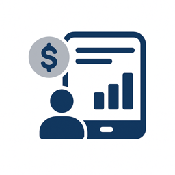
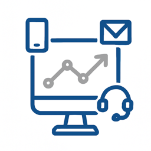
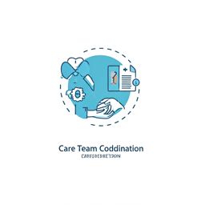
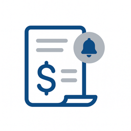
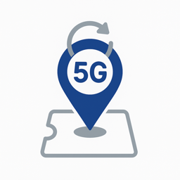
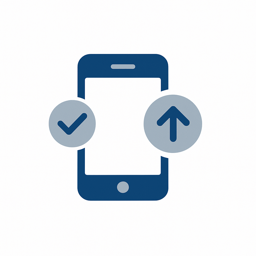
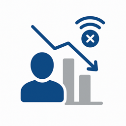

# 用例目录

行业用例展示了特定行业中的公司如何应用Adobe Experience Platform和应用程序来实现可衡量的业务成果。 每个用例描述一个具体的业务场景、其预期影响，以及指向提供详细实施指导的[用例模式](/help/blueprints/use-case-patterns/overview.md)的链接。

按行业浏览以查找与您的组织相关的用例，然后按照模式链接获取实施参考，包括决策指导、功能链和Experience League文档。

| 行业 | 关键主题 |
| --- | --- |
| [汽车](automotive/automotive-overview.md) | 车辆购买历程，服务生命周期，互联车辆体验，车主忠诚度 |
| [B2B](b2b/b2b-overview.md) | 基于帐户的营销、潜在客户评分、管道加速、客户扩展 |
| [金融服务](financial-services/financial-services-overview.md) | 产品推荐、客户流失预防、生命周期选件、欺诈个性化 |
| [医疗保健](healthcare/healthcare-overview.md) | 预约管理、药物遵守、患者入门、护理协调 |
| [保险](insurance/insurance-overview.md) | 政策更新、索赔体验、风险预防、交叉销售优化 |
| [媒体和娱乐](media-entertainment/media-entertainment-overview.md) | 内容推荐、订阅保留、试用转化、跨平台参与 |
| [零售](retail/retail-overview.md) | 产品个性化、购物车恢复、交叉销售优化、忠诚度参与 |
| [电信](telecommunications/telecommunications-overview.md) | 设备升级、防止流失、规划优化、网络参与 |
| [旅游和酒店业](travel-hospitality/travel-hospitality-overview.md) | 预订个性化、放弃恢复、忠诚度计划、季节性活动 |
| [技术](technology/technology-overview.md) | 事件收集、实时数据转发、Analytics集成、Edge部署 |

## 用例如何连接到实施指南

每个用例都链接到&#x200B;**用例模式** — 一种可重复的实施方法，用于描述实现用例所需的功能链、决策点和配置步骤。 用例模式依次与[关键业务目标](/help/blueprints/business-objectives/overview.md)相关联，帮助您使实施工作与战略成果保持一致。

```
Industry Use Case → Use Case Pattern → Key Business Objective
```

## 按行业浏览

>[!BEGINTABS]

>[!TAB 零售]

| | 用例 | 描述 | 成熟度 | 图案 |
| --- | --- | --- | --- | --- |
|  | [放弃的购物车电子邮件恢复](retail/retail-overview.md#abandoned-cart-email-recovery) | 自动向放弃购物车的客户发送个性化电子邮件提醒，包括购物车内容和相关优惠。 | [!BADGE 基础]{type=Neutral} | [事件触发的消息传送](/help/blueprints/use-case-patterns/campaign-management-orchestration/event-triggered-messaging.md) |
|  | [基于清单的紧急活动](retail/retail-overview.md#inventory-based-urgency-campaigns) | 在产品库存较低时触发实时警报和营销活动，这会产生紧迫感并鼓励立即购买。 | [!BADGE 基础]{type=Neutral} | [事件触发的消息传送](/help/blueprints/use-case-patterns/campaign-management-orchestration/event-triggered-messaging.md) |
|  | [价格下降警报](retail/retail-overview.md#price-drop-alerts) | 当客户愿望清单中的产品或以前查看过的产品降价时，通过电子邮件或推送通知客户。 | [!BADGE 基础]{type=Neutral} | [事件触发的消息传送](/help/blueprints/use-case-patterns/campaign-management-orchestration/event-triggered-messaging.md) |
|  | [缺货通知](retail/retail-overview.md#out-of-stock-notifications) | 允许客户在缺货产品可用时注册通知，然后通过电子邮件或短信自动通知他们。 | [!BADGE 基础]{type=Neutral} | [事件触发的消息传送](/help/blueprints/use-case-patterns/campaign-management-orchestration/event-triggered-messaging.md) |
|  | 客户获取促销活动的[客户抑制](retail/retail-overview.md#customer-suppression-for-acquisition-campaigns) | 通过将排除受众激活到付费媒体目标，抑制现有客户和最近转换的客户在客户获取广告中的支出，从而减少浪费的支出。 | [!BADGE 基础]{type=Neutral} | [Audience Activation到目标](/help/blueprints/use-case-patterns/audience-building-activation/audience-activation-to-destinations.md) |
|  | [使用应用程序下载CTA签入提醒](retail/retail-overview.md#check-in-reminder-with-app-download-cta) | 提醒来宾签入，并鼓励他们下载应用程序以便轻松访问信息。 | [!BADGE 基础]{type=Neutral} | [事件触发的消息传送](/help/blueprints/use-case-patterns/campaign-management-orchestration/event-triggered-messaging.md) |
|  | [个性化产品推荐](retail/retail-overview.md#personalized-product-recommendations) | 根据浏览历史记录、购买历史记录和类似的客户行为，在主页、类别页面和产品详细信息页面上显示个性化的产品推荐。 | [!BADGE 新兴]{type=Informative} | [行为推荐](/help/blueprints/use-case-patterns/personalization/behavioral-recommendation.md) |
|  | [个性化类别页面](retail/retail-overview.md#personalized-category-pages) | 动态地个性化类别页面，以首先根据客户偏好、过去的购买和浏览行为显示最相关的产品。 | [!BADGE 新兴]{type=Informative} | [行为推荐](/help/blueprints/use-case-patterns/personalization/behavioral-recommendation.md) |
|  | [新客户欢迎系列](retail/retail-overview.md#new-customer-welcome-series) | 通过个性化的产品推荐、品牌故事和特别优惠，为新客户自动制作多电子邮件欢迎系列。 | [!BADGE 新兴]{type=Informative} | [多步骤编排历程](/help/blueprints/use-case-patterns/campaign-management-orchestration/multi-step-orchestrated-journey.md) |
|  | [补货提醒](retail/retail-overview.md#replenishment-reminders) | 向客户发送他们定期购买的产品（订阅项目、消耗品）的自动提醒，以鼓励重复购买。 | [!BADGE 新兴]{type=Informative} | [多步骤编排历程](/help/blueprints/use-case-patterns/campaign-management-orchestration/multi-step-orchestrated-journey.md) |
|  | [购买后跟进活动](retail/retail-overview.md#post-purchase-follow-up-campaigns) | 发送包含产品关怀提示、相关产品、审核请求和忠诚度计划信息的购买后电子邮件。 | [!BADGE 新兴]{type=Informative} | [多步骤编排历程](/help/blueprints/use-case-patterns/campaign-management-orchestration/multi-step-orchestrated-journey.md) |
|  | [社交校对Personalization](retail/retail-overview.md#social-proof-personalization) | 根据客户个人资料和偏好显示个性化的社交证明。 | [!BADGE 新兴]{type=Informative} | [已知访客Web/应用程序Personalization](/help/blueprints/use-case-patterns/personalization/known-visitor-web-app-personalization.md) |
|  | [付费媒体的受众分段和激活](retail/retail-overview.md#audience-segmentation--activation-for-paid-media) | 从统一的客户配置文件构建高价值受众区段，并在付费媒体目标（如Google Ads、Meta和贸易中心）中激活这些区段，以进行客户获取和重新定位活动。 | [!BADGE 新兴]{type=Informative} | [Audience Activation到目标](/help/blueprints/use-case-patterns/audience-building-activation/audience-activation-to-destinations.md) |
|  | [匿名访客Web Personalization](retail/retail-overview.md#anonymous-visitor-web-personalization) | 使用会话中行为信号（例如已查看页面、已浏览产品类别和反向链接来源），为未识别的网站访客个性化内容。 | [!BADGE 新兴]{type=Informative} | [匿名访客Web Personalization](/help/blueprints/use-case-patterns/personalization/anonymous-visitor-web-personalization.md) |
|  | [欢迎系列历程](retail/retail-overview.md#welcome-series-journey) | 为新注册客户策划多步骤欢迎历程，跨电子邮件和推送渠道提供入门内容、产品教育和首次购买奖励。 | [!BADGE 新兴]{type=Informative} | [多步骤编排历程](/help/blueprints/use-case-patterns/campaign-management-orchestration/multi-step-orchestrated-journey.md) |
|  | [购物车放弃恢复](retail/retail-overview.md#cart-abandonment-recovery) | 当客户放弃购物车时，触发实时电子邮件和推送通知，并提供个性化的产品提醒和限时激励以完成购买。 | [!BADGE 新兴]{type=Informative} | [事件触发的消息传送](/help/blueprints/use-case-patterns/campaign-management-orchestration/event-triggered-messaging.md) |
|  | [购买后参与历程](retail/retail-overview.md#post-purchase-engagement-journey) | 通过精心安排的多步历程，交付包括订单确认、发货更新、交叉销售推荐和审查请求在内的购买后通信。 | [!BADGE 新兴]{type=Informative} | [多步骤编排历程](/help/blueprints/use-case-patterns/campaign-management-orchestration/multi-step-orchestrated-journey.md) |
|  | [粉丝生日营销活动](retail/retail-overview.md#birthday-campaigns-for-fans) | 通过个性化的生日消息和独家优惠，定位生日当天的“粉丝”。 | [!BADGE 新兴]{type=Informative} | [事件触发的消息传送](/help/blueprints/use-case-patterns/campaign-management-orchestration/event-triggered-messaging.md) |
|  | [购物者的生日促销活动](retail/retail-overview.md#birthday-campaigns-for-shoppers) | 通过个性化的生日消息和独家优惠，在购物者生日当天为其定位。 | [!BADGE 新兴]{type=Informative} | [事件触发的消息传送](/help/blueprints/use-case-patterns/campaign-management-orchestration/event-triggered-messaging.md) |
|  | [游戏日促销活动](retail/retail-overview.md#game-day-promotion-campaigns) | 为即将举行的具有个性化促销和优惠的游戏购买门票的目标粉丝。 | [!BADGE 新兴]{type=Informative} | [批出站消息激活](/help/blueprints/use-case-patterns/campaign-management-orchestration/batch-outbound-message-activation.md) |
|  | [产品促销活动](retail/retail-overview.md#product-promotion-campaigns) | 在持续的产品促销活动中定位购买者，以购买产品。 | [!BADGE 新兴]{type=Informative} | [批出站消息激活](/help/blueprints/use-case-patterns/campaign-management-orchestration/batch-outbound-message-activation.md) |
|  | [购物车放弃](retail/retail-overview.md#shopping-cart-abandon) | 通过个性化的提醒和激励措施，重新吸引放弃购物车的客户，以完成购买。 | [!BADGE 新兴]{type=Informative} | [事件触发的消息传送](/help/blueprints/use-case-patterns/campaign-management-orchestration/event-triggered-messaging.md) |
|  | [交叉销售和追加销售推荐](retail/retail-overview.md#cross-sell-and-upsell-recommendations) | 在结账时、电子邮件中以及产品页面上根据购买模式和产品关系显示相关的交叉销售和追加销售产品。 | [!BADGE 高级]{type=Caution} | [Offer Decisioning](/help/blueprints/use-case-patterns/personalization/offer-decisioning.md) |
|  | [VIP客户独家优惠](retail/retail-overview.md#vip-customer-exclusive-offers) | 识别高价值客户，并提供独家优惠、抢先体验销售和个性化购物体验。 | [!BADGE 高级]{type=Caution} | 使用Decisioning [跨渠道历程](/help/blueprints/use-case-patterns/campaign-management-orchestration/cross-channel-journey-with-decisioning.md) |
|  | [AI产品顾问](retail/retail-overview.md#ai-product-advisor) | 部署一个对话式人工智能顾问，引导购物者使用自然对话、实时库存和个性化的配置文件数据完成产品发现。 | [!BADGE 高级]{type=Caution} | [Brand Concierge对话体验](/help/blueprints/use-case-patterns/conversational-experience/brand-concierge-conversational-experience.md) |
|  | [跨渠道归因分析](retail/retail-overview.md#cross-channel-attribution-analysis) | 使用多点接触归因模型测量电子邮件、付费和店内接触点对购买转化率的贡献情况。 | [!BADGE 高级]{type=Caution} | [Customer Analytics和Insight生成](/help/blueprints/use-case-patterns/analysis/customer-analytics-insight-generation.md) |
|  | [已知访客的个性化Web体验](retail/retail-overview.md#personalized-web-experiences-for-known-visitors) | 根据网站访客的实时资料、区段会员资格和行为历史记录，为其提供个性化的主页横幅、产品推荐和促销内容。 | [!BADGE 高级]{type=Caution} | [已知访客Web/应用程序Personalization](/help/blueprints/use-case-patterns/personalization/known-visitor-web-app-personalization.md) |
|  | [忠诚度级别升级促销活动](retail/retail-overview.md#loyalty-tier-upgrade-campaign) | 识别接近忠诚度等级阈值的客户，并提供有针对性的促销活动，鼓励他们根据购买历史记录和偏好提供个性化优惠，从而实现更高等级。 | [!BADGE 高级]{type=Caution} | [多步骤编排历程](/help/blueprints/use-case-patterns/campaign-management-orchestration/multi-step-orchestrated-journey.md) |
|  | [跨渠道营销活动编排](retail/retail-overview.md#cross-channel-campaign-orchestration) | 通过历程分支、等待步骤和频率封顶，跨电子邮件、短信、推送和Web渠道编排协调的营销活动，以最大限度地提高参与度而不会疲劳。 | [!BADGE 高级]{type=Caution} | 使用Decisioning [跨渠道历程](/help/blueprints/use-case-patterns/campaign-management-orchestration/cross-channel-journey-with-decisioning.md) |
|  | [Brand Concierge对话体验](retail/retail-overview.md#brand-concierge-conversational-experience) | 跨数字资产部署AI支持的品牌安全对话代理，以提供个性化的产品指导、网站导航帮助以及到实时代理的无缝切换。 | [!BADGE 高级]{type=Caution} | [Brand Concierge对话体验](/help/blueprints/use-case-patterns/conversational-experience/brand-concierge-conversational-experience.md) |

>[!TAB 汽车]

| | 用例 | 描述 | 成熟度 | 图案 |
| --- | --- | --- | --- | --- |
|  | [服务约会提醒](automotive/automotive-overview.md#service-appointment-reminders) | 根据车辆里程数、服务历史记录和客户偏好发送个性化服务预约提醒。 | [!BADGE 基础]{type=Neutral} | [事件触发的消息传送](/help/blueprints/use-case-patterns/campaign-management-orchestration/event-triggered-messaging.md) |
|  | [车辆召回通知](automotive/automotive-overview.md#vehicle-recall-notifications) | 根据客户的车辆和位置，发送带有服务计划选项和安全信息的个性化召回通知。 | [!BADGE 基础]{type=Neutral} | [事件触发的消息传送](/help/blueprints/use-case-patterns/campaign-management-orchestration/event-triggered-messaging.md) |
|  | [试用计划](automotive/automotive-overview.md#test-drive-scheduling) | 根据客户偏好和位置，通过经销商推荐和车辆可用性实现个性化的试驾计划。 | [!BADGE 基础]{type=Neutral} | [事件触发的消息传送](/help/blueprints/use-case-patterns/campaign-management-orchestration/event-triggered-messaging.md) |
|  | [新模型启动促销活动](automotive/automotive-overview.md#new-model-launch-campaigns) | 根据当前车辆、偏好和购买历史记录，定位可能对新车型发布感兴趣的客户。 | [!BADGE 基础]{type=Neutral} | [批出站消息激活](/help/blueprints/use-case-patterns/campaign-management-orchestration/batch-outbound-message-activation.md) |
|  | [折价促销活动](automotive/automotive-overview.md#trade-in-value-campaigns) | 主动为准备好升级车辆的客户提供以旧换新价值评估和促销活动。 | [!BADGE 新兴]{type=Informative} | [多步骤编排历程](/help/blueprints/use-case-patterns/campaign-management-orchestration/multi-step-orchestrated-journey.md) |
|  | [部件和附件推荐](automotive/automotive-overview.md#parts-and-accessories-recommendations) | 根据车辆型号、所有权持续时间和客户偏好推荐相关部件、附件和升级。 | [!BADGE 新兴]{type=Informative} | [行为推荐](/help/blueprints/use-case-patterns/personalization/behavioral-recommendation.md) |
|  | [保修和延长服务计划](automotive/automotive-overview.md#warranty-and-extended-service-plans) | 根据车辆使用时间、里程和客户购买模式，在最佳时间建议保修和延长服务计划。 | [!BADGE 新兴]{type=Informative} | [多步骤编排历程](/help/blueprints/use-case-patterns/campaign-management-orchestration/multi-step-orchestrated-journey.md) |
|  | [连接的汽车功能激活](automotive/automotive-overview.md#connected-car-feature-activation) | 根据车辆功能和客户技术偏好对联网车辆进行个性化推荐和激活活动。 | [!BADGE 新兴]{type=Informative} | [多步骤编排历程](/help/blueprints/use-case-patterns/campaign-management-orchestration/multi-step-orchestrated-journey.md) |
|  | [经销商网络协调](automotive/automotive-overview.md#dealer-network-coordination) | 根据客户位置、偏好和经销商库存，启用个性化的经销商推荐和协调。 | [!BADGE 新兴]{type=Informative} | [已知访客Web/应用程序Personalization](/help/blueprints/use-case-patterns/personalization/known-visitor-web-app-personalization.md) |
|  | [车辆购买Personalization](automotive/automotive-overview.md#vehicle-purchase-journey-personalization) | 利用相关的车辆推荐、融资选项和经销商信息，将车辆购买历程（从研究到购买）个性化。 | [!BADGE 高级]{type=Caution} | 使用Decisioning [跨渠道历程](/help/blueprints/use-case-patterns/campaign-management-orchestration/cross-channel-journey-with-decisioning.md) |
|  | [融资和保险优惠](automotive/automotive-overview.md#financing-and-insurance-offers) | 根据客户信用档案、车辆选择和购买时间表，提供个性化的融资和保险优惠。 | [!BADGE 高级]{type=Caution} | [Offer Decisioning](/help/blueprints/use-case-patterns/personalization/offer-decisioning.md) |
|  | [所有者忠诚度计划](automotive/automotive-overview.md#owner-loyalty-programs) | 根据所有权历史记录和忠诚度级别，个性化所有者忠诚度计划通信、奖励和独家优惠。 | [!BADGE 高级]{type=Caution} | 使用Decisioning [跨渠道历程](/help/blueprints/use-case-patterns/campaign-management-orchestration/cross-channel-journey-with-decisioning.md) |

>[!TAB 金融服务]

| | 用例 | 描述 | 成熟度 | 图案 |
| --- | --- | --- | --- | --- |
|  | [基于事务的警报和建议](financial-services/financial-services-overview.md#transaction-based-alerts-and-recommendations) | 发送交易实时警报，并根据支出模式和帐户活动提供个性化推荐。 | [!BADGE 基础]{type=Neutral} | [事件触发的消息传送](/help/blueprints/use-case-patterns/campaign-management-orchestration/event-triggered-messaging.md) |
|  | [信用卡申请放弃恢复](financial-services/financial-services-overview.md#credit-card-application-abandonment-recovery) | 识别已开始但未完成信用卡申请的客户，并通过个性化的消息传递和优惠重新吸引他们。 | [!BADGE 基础]{type=Neutral} | [事件触发的消息传送](/help/blueprints/use-case-patterns/campaign-management-orchestration/event-triggered-messaging.md) |
|  | [欺诈警报Personalization](financial-services/financial-services-overview.md#fraud-alert-personalization) | 根据客户通信偏好和过去的交互历史，个性化欺诈警报和安全通信。 | [!BADGE 基础]{type=Neutral} | [事件触发的消息传送](/help/blueprints/use-case-patterns/campaign-management-orchestration/event-triggered-messaging.md) |
|  | [高价值潜在客户培养](financial-services/financial-services-overview.md#high-value-lead-nurturing) | 根据用户档案数据和行为识别高价值潜在客户，然后通过自动化历程通过个性化内容和选件培养他们。 | [!BADGE 新兴]{type=Informative} | [多步骤编排历程](/help/blueprints/use-case-patterns/campaign-management-orchestration/multi-step-orchestrated-journey.md) |
|  | [个性化帐户信息板](financial-services/financial-services-overview.md#personalized-account-dashboard) | 根据客户账户活动、偏好和财务目标个性化在线银行仪表板和移动应用程序体验。 | [!BADGE 新兴]{type=Informative} | [已知访客Web/应用程序Personalization](/help/blueprints/use-case-patterns/personalization/known-visitor-web-app-personalization.md) |
|  | [投资Portfolio推荐](financial-services/financial-services-overview.md#investment-portfolio-recommendations) | 根据客户风险概况、投资历史记录和财务目标提供个性化的投资推荐。 | [!BADGE 新兴]{type=Informative} | [行为推荐](/help/blueprints/use-case-patterns/personalization/behavioral-recommendation.md) |
|  | [抵押贷款预批准促销活动](financial-services/financial-services-overview.md#mortgage-pre-approval-campaigns) | 根据用户档案数据、行为和生活阶段指标，定位可能进入抵押贷款市场的客户。 | [!BADGE 新兴]{type=Informative} | [多步骤编排历程](/help/blueprints/use-case-patterns/campaign-management-orchestration/multi-step-orchestrated-journey.md) |
|  | [Customer Journey Analytics信息板](financial-services/financial-services-overview.md#customer-journey-analytics-dashboard) | 构建结合Web、应用程序、电子邮件和呼叫中心数据的跨渠道分析工作区，以实现客户历程的可视化，识别流失点并衡量促销活动归因。 | [!BADGE 新兴]{type=Informative} | [Customer Analytics和Insight生成](/help/blueprints/use-case-patterns/analysis/customer-analytics-insight-generation.md) |
|  | 针对现有客户的[产品推荐](financial-services/financial-services-overview.md#product-recommendation-for-existing-customers) | 根据现有客户之个人资料、交易历史及存续阶段，向彼等推荐相关金融产品。 | [!BADGE 高级]{type=Caution} | [Offer Decisioning](/help/blueprints/use-case-patterns/personalization/offer-decisioning.md) |
|  | [流失预防营销活动](financial-services/financial-services-overview.md#churn-prevention-campaigns) | 使用AI支持的预测识别有流失风险的客户，并通过保留期优惠和个性化通信与他们接洽。 | [!BADGE 高级]{type=Caution} | 使用Decisioning [跨渠道历程](/help/blueprints/use-case-patterns/campaign-management-orchestration/cross-channel-journey-with-decisioning.md) |
|  | [基于生命周期阶段的产品优惠](financial-services/financial-services-overview.md#life-stage-based-product-offers) | 识别进入新生命阶段的客户，并主动提供相关的金融产品和服务。 | [!BADGE 高级]{type=Caution} | 使用Decisioning [跨渠道历程](/help/blueprints/use-case-patterns/campaign-management-orchestration/cross-channel-journey-with-decisioning.md) |
|  | [忠诚度计划参与度](financial-services/financial-services-overview.md#loyalty-program-engagement) | 根据客户层级、积分平衡和赎回历史，个性化忠诚度计划的沟通、奖励和优惠。 | [!BADGE 高级]{type=Caution} | 使用Decisioning [跨渠道历程](/help/blueprints/use-case-patterns/campaign-management-orchestration/cross-channel-journey-with-decisioning.md) |
|  | [个性化的金融教育内容](financial-services/financial-services-overview.md#personalized-financial-education-content) | 根据客户的财务状况、目标和兴趣，提供个性化的财务教育内容、提示和资源。 | [!BADGE 高级]{type=Caution} | 使用Decisioning [跨渠道历程](/help/blueprints/use-case-patterns/campaign-management-orchestration/cross-channel-journey-with-decisioning.md) |
|  | [AI金融产品指南](financial-services/financial-services-overview.md#ai-financial-product-guide) | 帮助客户了解金融产品并通过基于合规性审查内容和实时个人资料数据的对话式人工智能来导航帐户选项。 | [!BADGE 高级]{type=Caution} | [Brand Concierge对话体验](/help/blueprints/use-case-patterns/conversational-experience/brand-concierge-conversational-experience.md) |
|  | [产品采用Funnel和流失驱动程序分析](financial-services/financial-services-overview.md#product-adoption-funnel-and-churn-driver-analysis) | 确定客户在载入流程中的流失位置以及哪些行为可以预测产品损耗。 | [!BADGE 高级]{type=Caution} | [Customer Analytics和Insight生成](/help/blueprints/use-case-patterns/analysis/customer-analytics-insight-generation.md) |
|  | [次佳Offer Decisioning](financial-services/financial-services-overview.md#next-best-offer-decisioning) | 使用集中式决策逻辑，结合资格规则、业务限制和AI支持的排名策略，跨渠道为每个客户选择最相关的优惠。 | [!BADGE 高级]{type=Caution} | [Offer Decisioning](/help/blueprints/use-case-patterns/personalization/offer-decisioning.md) |

>[!TAB 医疗保健]

| | 用例 | 描述 | 成熟度 | 图案 |
| --- | --- | --- | --- | --- |
|  | [约会提醒自动化](healthcare/healthcare-overview.md#appointment-reminder-automation) | 根据患者偏好和预约类型，通过电子邮件、短信和推送通知发送个性化预约提醒。 | [!BADGE 基础]{type=Neutral} | [事件触发的消息传送](/help/blueprints/use-case-patterns/campaign-management-orchestration/event-triggered-messaging.md) |
|  | [访问后跟进活动](healthcare/healthcare-overview.md#post-visit-follow-up-campaigns) | 根据访问类型和患者需求，自动发送访问后调查、护理指示和跟进预约提醒。 | [!BADGE 基础]{type=Neutral} | [事件触发的消息传送](/help/blueprints/use-case-patterns/campaign-management-orchestration/event-triggered-messaging.md) |
|  | [实验室结果通知](healthcare/healthcare-overview.md#lab-results-notification) | 当通过患者首选的通信渠道获得实验室结果并个性化消息传递时，通知患者。 | [!BADGE 基础]{type=Neutral} | [事件触发的消息传送](/help/blueprints/use-case-patterns/campaign-management-orchestration/event-triggered-messaging.md) |
|  | [保险范围验证](healthcare/healthcare-overview.md#insurance-coverage-verification) | 在预约之前主动验证保险范围信息并与患者沟通，以减少计费问题并改善患者体验。 | [!BADGE 基础]{type=Neutral} | [事件触发的消息传送](/help/blueprints/use-case-patterns/campaign-management-orchestration/event-triggered-messaging.md) |
|  | [远程保健约会提醒](healthcare/healthcare-overview.md#telehealth-appointment-reminders) | 为远程医疗预约发送个性化提醒，其中包括连接说明、准备提示和技术支持信息。 | [!BADGE 基础]{type=Neutral} | [事件触发的消息传送](/help/blueprints/use-case-patterns/campaign-management-orchestration/event-triggered-messaging.md) |
|  | [预防性护理提醒](healthcare/healthcare-overview.md#preventive-care-reminders) | 根据患者的年龄、病史和风险因素，主动提醒患者预防性护理。 | [!BADGE 基础]{type=Neutral} | [批出站消息激活](/help/blueprints/use-case-patterns/campaign-management-orchestration/batch-outbound-message-activation.md) |
|  | [药物遵守活动](healthcare/healthcare-overview.md#medication-adherence-campaigns) | 发送个性化提醒和教育内容，帮助患者遵守药物治疗计划和治疗计划。 | [!BADGE 新兴]{type=Informative} | [多步骤编排历程](/help/blueprints/use-case-patterns/campaign-management-orchestration/multi-step-orchestrated-journey.md) |
|  | [慢性病管理计划](healthcare/healthcare-overview.md#chronic-disease-management-programs) | 根据患者状况和治疗计划，个性化慢性疾病管理通信、教育内容和监测提醒。 | [!BADGE 新兴]{type=Informative} | [多步骤编排历程](/help/blueprints/use-case-patterns/campaign-management-orchestration/multi-step-orchestrated-journey.md) |
|  | [新患者入门历程](healthcare/healthcare-overview.md#new-patient-onboarding-journey) | 通过欢迎信息、门户访问说明和预约安排指南，为新患者自动完成多步骤入门培训历程。 | [!BADGE 新兴]{type=Informative} | [多步骤编排历程](/help/blueprints/use-case-patterns/campaign-management-orchestration/multi-step-orchestrated-journey.md) |
|  | [健康计划参与度](healthcare/healthcare-overview.md#wellness-program-engagement) | 根据患者的健康目标、活动水平和偏好，个性化健康计划通信、挑战和奖励。 | [!BADGE 新兴]{type=Informative} | [多步骤编排历程](/help/blueprints/use-case-patterns/campaign-management-orchestration/multi-step-orchestrated-journey.md) |
|  | [关怀团队协调](healthcare/healthcare-overview.md#care-team-coordination) | 根据护理计划和偏好，实现患者与其护理团队成员之间的个性化沟通和协调。 | [!BADGE 新兴]{type=Informative} | [多步骤编排历程](/help/blueprints/use-case-patterns/campaign-management-orchestration/multi-step-orchestrated-journey.md) |
|  | [患者参与和预约提醒](healthcare/healthcare-overview.md#patient-engagement--appointment-reminders) | 通过合规的、可感知同意的多渠道历程发送个性化预约提醒、健康提示和跟进护理通信。 | [!BADGE 新兴]{type=Informative} | [事件触发的消息传送](/help/blueprints/use-case-patterns/campaign-management-orchestration/event-triggered-messaging.md) |
|  | [个性化健康内容交付](healthcare/healthcare-overview.md#personalized-health-content-delivery) | 根据患者情况、兴趣和健康目标，提供个性化的健康教育内容、健康提示和资源。 | [!BADGE 高级]{type=Caution} | 使用Decisioning [跨渠道历程](/help/blueprints/use-case-patterns/campaign-management-orchestration/cross-channel-journey-with-decisioning.md) |
|  | [患者Funnel和护理差距分析](healthcare/healthcare-overview.md#patient-journey-funnel-and-care-gap-analysis) | 确定患者在何处脱离护理途径，以及哪些成员在推荐的护理中存在差距。 | [!BADGE 高级]{type=Caution} | [Customer Analytics和Insight生成](/help/blueprints/use-case-patterns/analysis/customer-analytics-insight-generation.md) |
|  | [患者门户内容Personalization](healthcare/healthcare-overview.md#patient-portal-content-personalization) | 根据会话中的浏览行为和参与历史记录，个性化患者门户体验 | [!BADGE 高级]{type=Caution} | [行为推荐](/help/blueprints/use-case-patterns/personalization/behavioral-recommendation.md) |

>[!TAB 保险]

| | 用例 | 描述 | 成熟度 | 图案 |
| --- | --- | --- | --- | --- |
|  | [策略续订营销活动](insurance/insurance-overview.md#policy-renewal-campaigns) | 根据客户政策历史记录、声明和偏好设置，发送个性化政策续订提醒和优惠。 | [!BADGE 基础]{type=Neutral} | [多步骤编排历程](/help/blueprints/use-case-patterns/campaign-management-orchestration/multi-step-orchestrated-journey.md) |
|  | [策略更改通知](insurance/insurance-overview.md#policy-change-notifications) | 根据客户政策和偏好发送有关政策更改、更新和新的保险范围选项的个性化通知。 | [!BADGE 基础]{type=Neutral} | [事件触发的消息传送](/help/blueprints/use-case-patterns/campaign-management-orchestration/event-triggered-messaging.md) |
|  | [报价单放弃恢复](insurance/insurance-overview.md#quote-abandonment-recovery) | 通过个性化的跟进和优惠重新吸引已开始但未完成保险报价的客户。 | [!BADGE 基础]{type=Neutral} | [事件触发的消息传送](/help/blueprints/use-case-patterns/campaign-management-orchestration/event-triggered-messaging.md) |
|  | [防止欺诈索赔](insurance/insurance-overview.md#claims-fraud-prevention) | 使用AI支持的欺诈检测来识别可疑索赔并个性化调查通信，同时维护客户信任。 | [!BADGE 基础]{type=Neutral} | [事件触发的消息传送](/help/blueprints/use-case-patterns/campaign-management-orchestration/event-triggered-messaging.md) |
|  | [灾难性事件响应](insurance/insurance-overview.md#catastrophic-event-response) | 利用个性化的支持和理赔信息，在自然灾害或灾难性事件期间主动与受影响地区的客户沟通。 | [!BADGE 基础]{type=Neutral} | [事件触发的消息传送](/help/blueprints/use-case-patterns/campaign-management-orchestration/event-triggered-messaging.md) |
|  | [代理和代理协调](insurance/insurance-overview.md#agent-and-broker-coordination) | 根据政策需求和偏好，实现客户与其代理/经纪人之间的个性化沟通和协调。 | [!BADGE 基础]{type=Neutral} | [批出站消息激活](/help/blueprints/use-case-patterns/campaign-management-orchestration/batch-outbound-message-activation.md) |
|  | [索赔流程Personalization](insurance/insurance-overview.md#claims-process-personalization) | 根据索赔类型、客户偏好和索赔历史记录，个性化索赔处理通信、更新和支持。 | [!BADGE 新兴]{type=Informative} | [多步骤编排历程](/help/blueprints/use-case-patterns/campaign-management-orchestration/multi-step-orchestrated-journey.md) |
|  | [风险评估与预防](insurance/insurance-overview.md#risk-assessment-and-prevention) | 根据客户政策类型、位置和风险因素，提供个性化的风险评估信息和预防提示。 | [!BADGE 新兴]{type=Informative} | [多步骤编排历程](/help/blueprints/use-case-patterns/campaign-management-orchestration/multi-step-orchestrated-journey.md) |
|  | [健康和预防计划](insurance/insurance-overview.md#wellness-and-prevention-programs) | 根据参与情况和目标，为健康/人寿保险客户提供个性化的健康计划沟通和奖励。 | [!BADGE 新兴]{type=Informative} | [多步骤编排历程](/help/blueprints/use-case-patterns/campaign-management-orchestration/multi-step-orchestrated-journey.md) |
|  | [交叉销售产品推荐](insurance/insurance-overview.md#cross-sell-product-recommendations) | 根据客户现有保单、寿险阶段和风险状况建议额外的保险产品。 | [!BADGE 高级]{type=Caution} | [Offer Decisioning](/help/blueprints/use-case-patterns/personalization/offer-decisioning.md) |
|  | [折扣和节省机会](insurance/insurance-overview.md#discount-and-savings-opportunities) | 根据客户配置文件和行为识别并传达个性化折扣机会。 | [!BADGE 高级]{type=Caution} | [Offer Decisioning](/help/blueprints/use-case-patterns/personalization/offer-decisioning.md) |
|  | [投保人门户内容Personalization](insurance/insurance-overview.md#policyholder-portal-content-personalization) | 根据行为和策略组合，个性化经过身份验证的门户和应用程序体验 | [!BADGE 高级]{type=Caution} | [行为推荐](/help/blueprints/use-case-patterns/personalization/behavioral-recommendation.md) |

>[!TAB 媒体和娱乐]

| | 用例 | 描述 | 成熟度 | 图案 |
| --- | --- | --- | --- | --- |
|  | [新内容发布通知](media-entertainment/media-entertainment-overview.md#new-content-release-notifications) | 通知订阅者与其偏好和查看历史记录匹配的新内容版本。 | [!BADGE 基础]{type=Neutral} | [事件触发的消息传送](/help/blueprints/use-case-patterns/campaign-management-orchestration/event-triggered-messaging.md) |
|  | [监视列表和收藏夹提醒](media-entertainment/media-entertainment-overview.md#watchlist-and-favorites-reminders) | 向用户发送提醒，提醒他们监视列表中的内容或他们尚未查看的收藏夹。 | [!BADGE 基础]{type=Neutral} | [事件触发的消息传送](/help/blueprints/use-case-patterns/campaign-management-orchestration/event-triggered-messaging.md) |
|  | [实时活动查看提醒](media-entertainment/media-entertainment-overview.md#live-event-viewing-reminders) | 通知用户与其兴趣和观看历史记录相匹配的即将举行的直播活动、体育游戏或预告片。 | [!BADGE 基础]{type=Neutral} | [事件触发的消息传送](/help/blueprints/use-case-patterns/campaign-management-orchestration/event-triggered-messaging.md) |
|  | [内容完成营销活动](media-entertainment/media-entertainment-overview.md#content-completion-campaigns) | 提醒用户观看或收听他们已开始但未完成的内容。 | [!BADGE 基础]{type=Neutral} | [事件触发的消息传送](/help/blueprints/use-case-patterns/campaign-management-orchestration/event-triggered-messaging.md) |
|  | [内容推荐引擎](media-entertainment/media-entertainment-overview.md#content-recommendation-engine) | 使用行为信号和选择策略生成个性化内容推荐，通过Web、电子邮件和应用程序内渠道交付。 | [!BADGE 新兴]{type=Informative} | [行为推荐](/help/blueprints/use-case-patterns/personalization/behavioral-recommendation.md) |
|  | [个性化主页体验](media-entertainment/media-entertainment-overview.md#personalized-homepage-experience) | 动态地个性化主页和内容发现页面，以首先根据用户个人资料和行为显示最相关的内容。 | [!BADGE 新兴]{type=Informative} | [行为推荐](/help/blueprints/use-case-patterns/personalization/behavioral-recommendation.md) |
|  | [个性化播放列表生成](media-entertainment/media-entertainment-overview.md#personalized-playlist-generation) | 根据用户收听历史记录、偏好和情绪指示器自动生成和更新个性化播放列表。 | [!BADGE 新兴]{type=Informative} | [行为推荐](/help/blueprints/use-case-patterns/personalization/behavioral-recommendation.md) |
|  | [免费试用转化促销活动](media-entertainment/media-entertainment-overview.md#free-trial-conversion-campaigns) | 在试用期结束之前，通过个性化的内容推荐和选件吸引免费试用用户，以鼓励订阅转化。 | [!BADGE 新兴]{type=Informative} | [多步骤编排历程](/help/blueprints/use-case-patterns/campaign-management-orchestration/multi-step-orchestrated-journey.md) |
|  | [跨平台内容同步](media-entertainment/media-entertainment-overview.md#cross-platform-content-sync) | 通过实时同步观看历史记录、偏好和推荐，提供跨设备的无缝内容体验。 | [!BADGE 新兴]{type=Informative} | [已知访客Web/应用程序Personalization](/help/blueprints/use-case-patterns/personalization/known-visitor-web-app-personalization.md) |
|  | [社交共享Personalization](media-entertainment/media-entertainment-overview.md#social-sharing-personalization) | 根据用户社交连接和内容偏好设置个性化社交共享提示和建议。 | [!BADGE 新兴]{type=Informative} | [已知访客Web/应用程序Personalization](/help/blueprints/use-case-patterns/personalization/known-visitor-web-app-personalization.md) |
|  | [订阅流失预防](media-entertainment/media-entertainment-overview.md#subscription-churn-prevention) | 识别有取消风险的订阅者，并通过个性化的内容推荐、选件和保留促销活动吸引他们。 | [!BADGE 高级]{type=Caution} | 使用Decisioning [跨渠道历程](/help/blueprints/use-case-patterns/campaign-management-orchestration/cross-channel-journey-with-decisioning.md) |
|  | [高级功能追加销售](media-entertainment/media-entertainment-overview.md#premium-feature-upsell) | 识别将从高级功能中受益的用户，并根据其使用模式提供个性化的追加销售优惠。 | [!BADGE 高级]{type=Caution} | [Offer Decisioning](/help/blueprints/use-case-patterns/personalization/offer-decisioning.md) |
|  | [订阅者流失驱动程序和内容参与度分析](media-entertainment/media-entertainment-overview.md#subscriber-churn-driver-and-content-engagement-analysis) | 识别在取消订阅者之前的内容参与模式，并按内容类型和同类群组衡量保留影响。 | [!BADGE 高级]{type=Caution} | [Customer Analytics和Insight生成](/help/blueprints/use-case-patterns/analysis/customer-analytics-insight-generation.md) |

>[!TAB 电信]

| | 用例 | 描述 | 成熟度 | 图案 |
| --- | --- | --- | --- | --- |
|  | [数据使用情况警报和建议](telecommunications/telecommunications-overview.md#data-usage-alerts-and-recommendations) | 当客户接近数据限制并根据使用模式建议计划升级或加载项时，发送个性化警报。 | [!BADGE 基础]{type=Neutral} | [事件触发的消息传送](/help/blueprints/use-case-patterns/campaign-management-orchestration/event-triggered-messaging.md) |
|  | [服务中断通知](telecommunications/telecommunications-overview.md#service-outage-notifications) | 通过个性化的更新和补偿服务，主动通知客户其所在地区的服务中断。 | [!BADGE 基础]{type=Neutral} | [事件触发的消息传送](/help/blueprints/use-case-patterns/campaign-management-orchestration/event-triggered-messaging.md) |
|  | [帐单付款提醒](telecommunications/telecommunications-overview.md#bill-payment-reminders) | 通过带有支付选项和帐户余额信息的首选渠道，发送个性化的账单支付提醒。 | [!BADGE 基础]{type=Neutral} | [事件触发的消息传送](/help/blueprints/use-case-patterns/campaign-management-orchestration/event-triggered-messaging.md) |
|  | [5G升级促销活动](telecommunications/telecommunications-overview.md#5g-upgrade-campaigns) | 定位有资格进行5G网络升级的客户，并根据其位置和使用模式提供个性化优惠和权益。 | [!BADGE 基础]{type=Neutral} | [批出站消息激活](/help/blueprints/use-case-patterns/campaign-management-orchestration/batch-outbound-message-activation.md) |
|  | [计划优化营销活动](telecommunications/telecommunications-overview.md#plan-optimization-campaigns) | 分析客户使用模式并根据他们的需求提出最佳计划更改建议，以节省资金或获得更好的功能。 | [!BADGE 新兴]{type=Informative} | [多步骤编排历程](/help/blueprints/use-case-patterns/campaign-management-orchestration/multi-step-orchestrated-journey.md) |
|  | [新客户入门培训历程](telecommunications/telecommunications-overview.md#new-customer-onboarding-journey) | 通过欢迎信息、帐户设置指南和功能教程，为新客户自动完成个性化入门培训历程。 | [!BADGE 新兴]{type=Informative} | [多步骤编排历程](/help/blueprints/use-case-patterns/campaign-management-orchestration/multi-step-orchestrated-journey.md) |
|  | [网络性能Personalization](telecommunications/telecommunications-overview.md#network-performance-personalization) | 根据客户位置、设备和使用模式个性化网络性能信息和建议。 | [!BADGE 新兴]{type=Informative} | [已知访客Web/应用程序Personalization](/help/blueprints/use-case-patterns/personalization/known-visitor-web-app-personalization.md) |
|  | [设备升级建议](telecommunications/telecommunications-overview.md#device-upgrade-recommendations) | 识别有资格进行设备升级的客户，并提供个性化的设备建议和升级选件。 | [!BADGE 高级]{type=Caution} | 使用Decisioning [跨渠道历程](/help/blueprints/use-case-patterns/campaign-management-orchestration/cross-channel-journey-with-decisioning.md) |
|  | [高价值客户的流失预防](telecommunications/telecommunications-overview.md#churn-prevention-for-high-value-customers) | 识别存在流失风险的高价值客户，并通过个性化的保留期优惠和主动客户服务吸引他们。 | [!BADGE 高级]{type=Caution} | 使用Decisioning [跨渠道历程](/help/blueprints/use-case-patterns/campaign-management-orchestration/cross-channel-journey-with-decisioning.md) |
|  | [家庭计划管理](telecommunications/telecommunications-overview.md#family-plan-management) | 根据家庭使用模式和个人成员需求，为家庭计划管理员提供个性化的沟通和优惠。 | [!BADGE 高级]{type=Caution} | 使用Decisioning [跨渠道历程](/help/blueprints/use-case-patterns/campaign-management-orchestration/cross-channel-journey-with-decisioning.md) |
|  | [加载项服务建议](telecommunications/telecommunications-overview.md#add-on-service-recommendations) | 根据客户计划、使用和偏好推荐相关的附加服务。 | [!BADGE 高级]{type=Caution} | [Offer Decisioning](/help/blueprints/use-case-patterns/personalization/offer-decisioning.md) |
|  | [AI计划顾问](telecommunications/telecommunications-overview.md#ai-plan-advisor) | 使用基于实时使用数据、帐户个人资料和完整计划目录的会话人工智能，指导订阅者进行个性化计划选择。 | [!BADGE 高级]{type=Caution} | [Brand Concierge对话体验](/help/blueprints/use-case-patterns/conversational-experience/brand-concierge-conversational-experience.md) |
|  | [流失倾向和网络体验分析](telecommunications/telecommunications-overview.md#churn-propensity-and-network-experience-analytics) | 将网络质量事件和服务联系人与用户流失关联起来，以确定哪些体验失败会导致资源消耗。 | [!BADGE 高级]{type=Caution} | [Customer Analytics和Insight生成](/help/blueprints/use-case-patterns/analysis/customer-analytics-insight-generation.md) |
|  | [流失预防和回赢](telecommunications/telecommunications-overview.md#churn-prevention--win-back) | 使用预测模型和行为信号识别风险客户，并在客户流失之前通过定制优惠触发个性化保留促销活动。 | [!BADGE 高级]{type=Caution} | 使用Decisioning [跨渠道历程](/help/blueprints/use-case-patterns/campaign-management-orchestration/cross-channel-journey-with-decisioning.md) |

>[!TAB 旅游和酒店业]

| | 用例 | 描述 | 成熟度 | 图案 |
| --- | --- | --- | --- | --- |
|  | [购物车放弃恢复历程](travel-hospitality/travel-hospitality-overview.md#cart-abandonment-recovery-journey) | 自动检测客户何时放弃购物车，并通过个性化优惠触发多步电子邮件历程以鼓励完成。 | [!BADGE 基础]{type=Neutral} | [事件触发的消息传送](/help/blueprints/use-case-patterns/campaign-management-orchestration/event-triggered-messaging.md) |
|  | [多渠道预订提醒](travel-hospitality/travel-hospitality-overview.md#multi-channel-booking-reminders) | 通过电子邮件、短信和推送通知向已开始但未完成预订的客户发送个性化预订提醒。 | [!BADGE 基础]{type=Neutral} | [事件触发的消息传送](/help/blueprints/use-case-patterns/campaign-management-orchestration/event-triggered-messaging.md) |
|  | [季节性促销活动Personalization](travel-hospitality/travel-hospitality-overview.md#seasonal-campaign-personalization) | 根据季节性偏好、过去的季节性预订和当前的季节性趋势，个性化营销活动和优惠。 | [!BADGE 基础]{type=Neutral} | [批出站消息激活](/help/blueprints/use-case-patterns/campaign-management-orchestration/batch-outbound-message-activation.md) |
|  | [新访客的个性化主页](travel-hospitality/travel-hospitality-overview.md#personalized-homepage-for-new-visitors) | 根据访客的地理位置、浏览行为和区段成员资格，在主页上显示个性化推荐。 | [!BADGE 新兴]{type=Informative} | [匿名访客Web Personalization](/help/blueprints/use-case-patterns/personalization/anonymous-visitor-web-personalization.md) |
|  | [高意图访客定位](travel-hospitality/travel-hospitality-overview.md#high-intent-visitor-targeting) | 使用AI支持的倾向评分识别具有高购买意图的访客，并通过个性化优惠和内容定位他们。 | [!BADGE 新兴]{type=Informative} | [已知访客Web/应用程序Personalization](/help/blueprints/use-case-patterns/personalization/known-visitor-web-app-personalization.md) |
|  | [后期预订追加销售活动](travel-hospitality/travel-hospitality-overview.md#post-booking-upsell-campaigns) | 客户完成预订后，会自动触发升级、游览和其他辅助项目的追加销售促销活动。 | [!BADGE 新兴]{type=Informative} | [多步骤编排历程](/help/blueprints/use-case-patterns/campaign-management-orchestration/multi-step-orchestrated-journey.md) |
|  | [失效客户的回馈促销活动](travel-hospitality/travel-hospitality-overview.md#win-back-campaigns-for-lapsed-customers) | 识别退出的客户，并根据他们过去的偏好通过个性化的回馈优惠和内容与他们接洽。 | [!BADGE 新兴]{type=Informative} | [多步骤编排历程](/help/blueprints/use-case-patterns/campaign-management-orchestration/multi-step-orchestrated-journey.md) |
|  | [动态行程推荐](travel-hospitality/travel-hospitality-overview.md#dynamic-itinerary-recommendations) | 根据客户过去的预订、浏览历史记录和偏好设置显示个性化的行程和目标。 | [!BADGE 新兴]{type=Informative} | [已知访客Web/应用程序Personalization](/help/blueprints/use-case-patterns/personalization/known-visitor-web-app-personalization.md) |
|  | 首页上[最近浏览的产品](travel-hospitality/travel-hospitality-overview.md#recently-browsed-products-on-homepage) | 在主页上显示最近查看的目标，以提醒访客他们的兴趣并鼓励回访。 | [!BADGE 新兴]{type=Informative} | [已知访客Web/应用程序Personalization](/help/blueprints/use-case-patterns/personalization/known-visitor-web-app-personalization.md) |
|  | [组预订推荐](travel-hospitality/travel-hospitality-overview.md#group-booking-recommendations) | 识别经常预订团体旅行的客户，并主动推荐团体套餐和适合家庭的选项。 | [!BADGE 新兴]{type=Informative} | [行为推荐](/help/blueprints/use-case-patterns/personalization/behavioral-recommendation.md) |
|  | [来宾的生日营销活动](travel-hospitality/travel-hospitality-overview.md#birthday-campaigns-for-guests) | 通过个性化的生日消息和独家优惠，在访客的生日当天为其定位。 | [!BADGE 新兴]{type=Informative} | [事件触发的消息传送](/help/blueprints/use-case-patterns/campaign-management-orchestration/event-triggered-messaging.md) |
|  | [目标促销活动](travel-hospitality/travel-hospitality-overview.md#destination-promotion-campaigns) | 在进行旅游目的地促销活动时，定位要预订的访客。 | [!BADGE 新兴]{type=Informative} | [批出站消息激活](/help/blueprints/use-case-patterns/campaign-management-orchestration/batch-outbound-message-activation.md) |
|  | [具有目标优惠的退出意图模式](travel-hospitality/travel-hospitality-overview.md#exit-intent-modal-with-targeted-offers) | 当访客显示退出意向时，会根据其区段和浏览行为显示包含相关选件的个性化模式窗口。 | [!BADGE 高级]{type=Caution} | [Offer Decisioning](/help/blueprints/use-case-patterns/personalization/offer-decisioning.md) |
|  | [忠诚度计划Personalization](travel-hospitality/travel-hospitality-overview.md#loyalty-program-personalization) | 根据客户忠诚度级别个性化网站体验、优惠和通信。 | [!BADGE 高级]{type=Caution} | 使用Decisioning [跨渠道历程](/help/blueprints/use-case-patterns/campaign-management-orchestration/cross-channel-journey-with-decisioning.md) |
|  | [AI预订门房](travel-hospitality/travel-hospitality-overview.md#ai-booking-concierge) | 使用以实时可用性和忠诚度配置文件数据为基础的对话AI，指导来宾完成行程计划、房间选择和辅助选项。 | [!BADGE 高级]{type=Caution} | [Brand Concierge对话体验](/help/blueprints/use-case-patterns/conversational-experience/brand-concierge-conversational-experience.md) |

>[!TAB B2B]

| | 用例 | 描述 | 成熟度 | 图案 |
| --- | --- | --- | --- | --- |
|  | [网络研讨会和演示计划](b2b/b2b-overview.md#webinar-and-demo-scheduling) | 根据潜在客户兴趣、行业和参与历史，个性化网络研讨会邀请和演示计划。 | [!BADGE 基础]{type=Neutral} | [事件触发的消息传送](/help/blueprints/use-case-patterns/campaign-management-orchestration/event-triggered-messaging.md) |
|  | [潜在客户评分和培养](b2b/b2b-overview.md#lead-scoring-and-nurturing) | 根据用户档案数据和行为自动对潜在客户进行评分，然后通过为他人提供个性化的培养活动将高评分的潜在客户转化为销售。 | [!BADGE 新兴]{type=Informative} | [多步骤编排历程](/help/blueprints/use-case-patterns/campaign-management-orchestration/multi-step-orchestrated-journey.md) |
|  | [面向潜在客户的Personalization内容](b2b/b2b-overview.md#content-personalization-for-prospects) | 根据潜在客户行业、角色、公司规模和参与历史，个性化网站内容、资源和选件。 | [!BADGE 新兴]{type=Informative} | [已知访客Web/应用程序Personalization](/help/blueprints/use-case-patterns/personalization/known-visitor-web-app-personalization.md) |
|  | [活动注册和跟进](b2b/b2b-overview.md#event-registration-and-follow-up) | 根据事件类型和参与者资料，自动执行个性化的事件注册确认、提醒和事件后跟进。 | [!BADGE 新兴]{type=Informative} | [多步骤编排历程](/help/blueprints/use-case-patterns/campaign-management-orchestration/multi-step-orchestrated-journey.md) |
|  | [产品试用转换促销活动](b2b/b2b-overview.md#product-trial-conversion-campaigns) | 通过个性化的产品推荐、培训资源和选件吸引试用用户，以鼓励转换为付费计划。 | [!BADGE 新兴]{type=Informative} | [多步骤编排历程](/help/blueprints/use-case-patterns/campaign-management-orchestration/multi-step-orchestrated-journey.md) |
|  | [客户成功和入门](b2b/b2b-overview.md#customer-success-and-onboarding) | 通过根据购买的产品和客户个人资料提供的相关培训、资源和支持，个性化客户入门历程。 | [!BADGE 新兴]{type=Informative} | [多步骤编排历程](/help/blueprints/use-case-patterns/campaign-management-orchestration/multi-step-orchestrated-journey.md) |
|  | [竞争替换促销活动](b2b/b2b-overview.md#competitive-replacement-campaigns) | 使用具有个性化消息传递、迁移优惠和竞争比较的竞争对手产品定位潜在客户。 | [!BADGE 新兴]{type=Informative} | [多步骤编排历程](/help/blueprints/use-case-patterns/campaign-management-orchestration/multi-step-orchestrated-journey.md) |
|  | [案例研究和ROI Personalization](b2b/b2b-overview.md#case-study-and-roi-personalization) | 根据潜在客户行业、公司规模和使用案例，提供个性化的案例研究、 ROI计算器和成功案例。 | [!BADGE 新兴]{type=Informative} | [已知访客Web/应用程序Personalization](/help/blueprints/use-case-patterns/personalization/known-visitor-web-app-personalization.md) |
|  | [客户宣传计划](b2b/b2b-overview.md#customer-advocacy-programs) | 根据使用情况和满意度数据确定并吸引满意的客户参与宣传机会。 | [!BADGE 新兴]{type=Informative} | [多步骤编排历程](/help/blueprints/use-case-patterns/campaign-management-orchestration/multi-step-orchestrated-journey.md) |
|  | [Account-Based Marketing Personalization](b2b/b2b-overview.md#account-based-marketing-personalization) | 根据购买信号为目标客户个性化营销通信 | [!BADGE 高级]{type=Caution} | [B2B 受众激活](/help/blueprints/use-case-patterns/audience-building-activation/b2b-audience-activation.md) |
|  | [合同续订活动](b2b/b2b-overview.md#contract-renewal-campaigns) | 通过个性化优惠、使用洞察和续订激励，积极吸引接近合同续订的客户。 | [!BADGE 高级]{type=Caution} | 使用Decisioning [跨渠道历程](/help/blueprints/use-case-patterns/campaign-management-orchestration/cross-channel-journey-with-decisioning.md) |
|  | [追加销售和扩展机会](b2b/b2b-overview.md#upsell-and-expansion-opportunities) | 根据使用模式和增长指标，确定准备好进行产品升级或获得更多许可证的客户。 | [!BADGE 高级]{type=Caution} | 使用Decisioning [跨渠道历程](/help/blueprints/use-case-patterns/campaign-management-orchestration/cross-channel-journey-with-decisioning.md) |
|  | 基于[B2B帐户的Audience Activation](b2b/b2b-overview.md#b2b-account-based-audience-activation) | 构建结合固定数据、购买群组信号和人员级别参与度的帐户级别受众，然后将它们激活到LinkedIn、需求方平台和CRM目标。 | [!BADGE 高级]{type=Caution} | [B2B 受众激活](/help/blueprints/use-case-patterns/audience-building-activation/b2b-audience-activation.md) |
|  | [购买群Journey Orchestration](b2b/b2b-overview.md#buying-group-journey-orchestration) | 编排帐户级别的历程，根据购买群成员的角色、参与度分数和帐户资格状态为其提供培训，并自动移交到销售部门。 | [!BADGE 高级]{type=Caution} | [购买基于群组的营销](/help/blueprints/use-case-patterns/campaign-management-orchestration/buying-group-based-marketing.md) |
|  | [Account-Based Marketing (ABM) Personalization](b2b/b2b-overview.md#account-based-marketing-abm-personalization) | 根据客户档案、参与历史记录和购买信号，为目标客户个性化营销通信和内容。 | [!BADGE 高级]{type=Caution} | [B2B 受众激活](/help/blueprints/use-case-patterns/audience-building-activation/b2b-audience-activation.md) |

>[!TAB 技术]

| | 用例 | 描述 | 成熟度 | 图案 |
| --- | --- | --- | --- | --- |
|  | [实时事件转发](technology/technology-overview.md#real-time-event-forwarding) | 将通过Edge Network收集的实时行为事件转发到第三方分析、数据仓库和合作伙伴平台，以进行扩充和激活。 | [!BADGE 基础]{type=Neutral} | [事件转发](/help/blueprints/use-case-patterns/audience-building-activation/event-forwarding.md) |

>[!ENDTABS]
