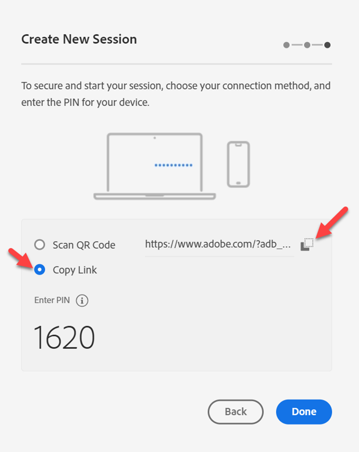
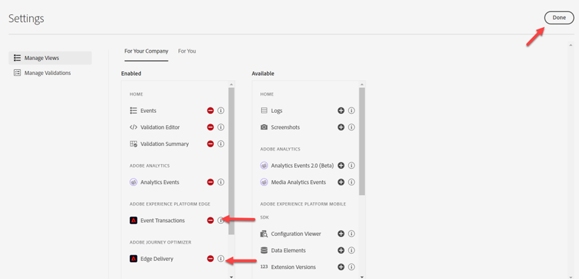
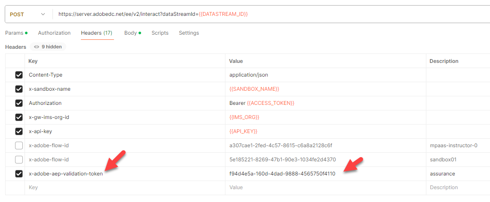
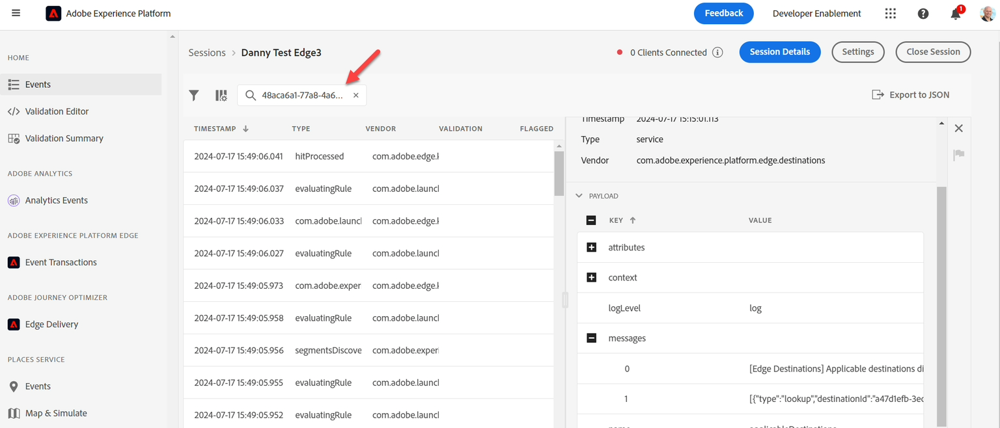

# 监控您的事件

## 导航到Assurance

[Adobe Experience Platform Assurance](https://experienceleague.adobe.com/zh-hans/docs/experience-platform/assurance/home)是Adobe Experience Cloud产品，可帮助您检查、校样、模拟和验证向Adobe Experience Platform Edge收集数据的方式。

1. 转到Adobe Experience Platform -> Assurance ->创建会话

2. 单击&#x200B;**开始**&#x200B;按钮

## 配置会话

1. 名称 — > \[Sandbox] Edge会话
1. URL —> https\：//www\.adobe.com
   - 请注意，此URL将由您客户的实际网站替代
1. 单击下一步按钮

4. 将链接复制到稍后可以引用的位置

5. 单击&#x200B;**完成**&#x200B;按钮

6. 导航到&#x200B;**设置**

7. 通过单击&#x200B;**+**&#x200B;按钮，然后单击&#x200B;**完成**&#x200B;启用&#x200B;**事件事务**&#x200B;和&#x200B;**Edge Delivery**

## 打开Postman

转到Postman ->创建Web事件Edge（无身份验证） — >标头

1. 将&#x200B;**x-adobe-aep-validation-token**&#x200B;添加到标头，标头具有从Assurance复制的上面链接。 在从Assurance复制的链接中，只获取=后面的&#x200B;**ID**&#x200B;值。 例如[https://www.adobe.com/?adb\_validation\_sessionid=](https://www.adobe.com/?adb_validation_sessionid=efa4a9ed-02d8-4647-80fa-f01a5be273d0)[`efa4a9ed-02d8-4647-80fa-f01a5be273d0`](https://www.adobe.com/?adb_validation_sessionid=efa4a9ed-02d8-4647-80fa-f01a5be273d0)
1. 我们只使用[`efa4a9ed-02d8-4647-80fa-f01a5be273d0`](https://www.adobe.com/?adb_validation_sessionid=efa4a9ed-02d8-4647-80fa-f01a5be273d0)值，而不使用完整URL

3. 在Postman中，保存并执行&#x200B;**创建Web事件Edge（无身份验证）**&#x200B;请求

## 查看Assurance日志

回到Assurance上去，你应该会看到一连串的活动正在上演。 通过将您的数据流ID放入搜索中，向下过滤到仅相关的事件类型

如果需要，可在右边栏中选择事件并打开任何消息。

要查找的事件类型：

- hitReceived（显示Edge接收的有效负载）
- evaluingRule（如果设置SSF，则显示正在评估的规则）
- reasedDestinations（此目标被发送到）
- segmentsDiscovered（它是否符合任何边缘区段的条件）
- com.adobe.experience\_platform.edge\_segmentation/response（它通过哪些区段做出响应）

探索这些内容，了解Assurance如何解释每个步骤。
