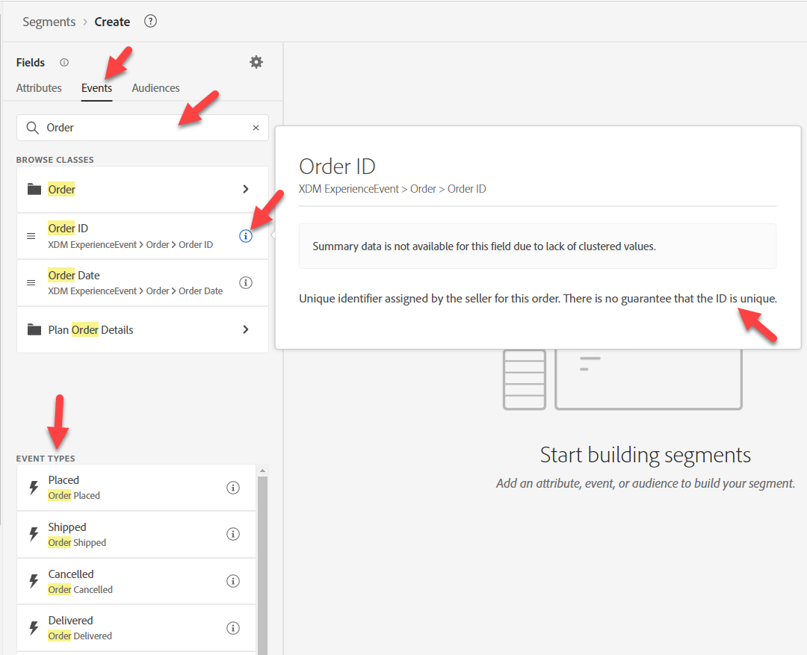
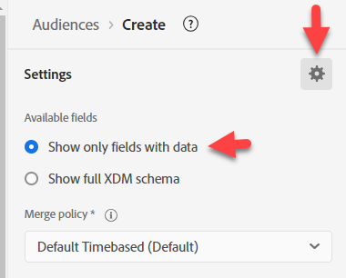
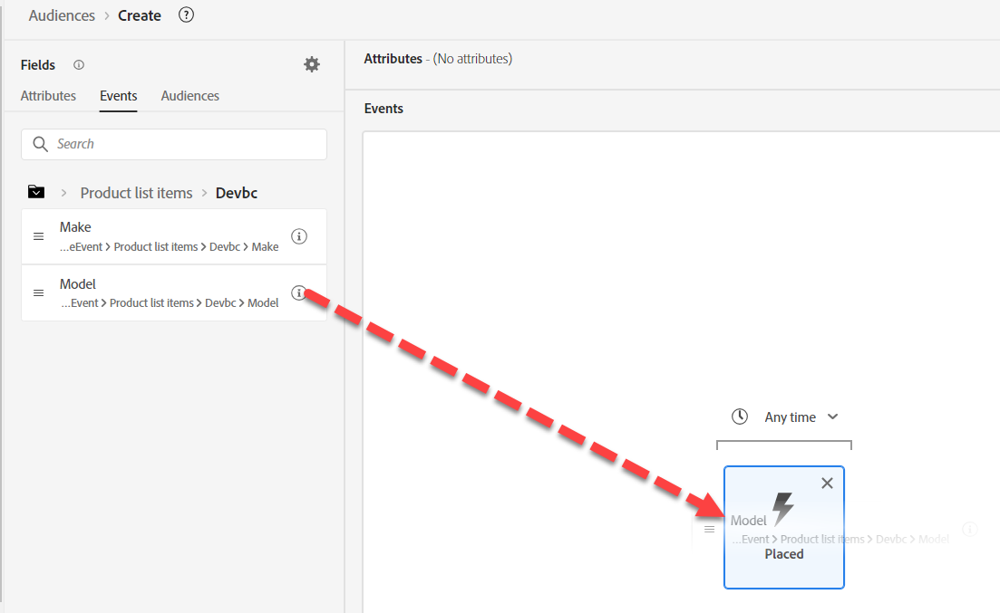

# 构建受众#1

## 实验室目标

构建一个只查找已下单iPhone 14的用户档案的受众

## 划分受众

首先创建您的第一个受众。 它由许多我们需要整合的组成部分组成。 单击左边栏中的受众，然后单击右上角的创建受众按钮。

我们将此用例分解为多个部分，并使用多个受众解决它们。 原因在于，我们正在努力让这种模式成为流媒体，而有两个因素在阻止这种趋势：

1. 排除子句“iPhone 14/Pixel 7没有订单”
1. 排除子句“无活动的iPhone 14/Pixel 7”。 我们最后会讨论一下这些事情的后果。

## 第1部分 — 发现

我们受众的第一部分内容是查找“iPhone 14不存在订单”。 假设我们是AEP的新营销人员，并且没有设计架构。 在左边栏的“事件”选项卡中搜索“订单”

您会获得许多与订单相关的对象

- 属性：例如订单ID、订单日期
- 文件夹：例如订单、计划订单详细信息
- 事件类型：例如下单、发运的订单等。

>[!NOTE]
>
>&#x200B;* 订单“文件夹”中没有“i”。 即使已填充我们的描述，但没有该描述，这可能会让您的营销人员感到困惑，因为他们可能会尝试使用该描述或想知道它是什么。
>&#x200B;* 事件卡片的“i”仅重复该类型的内容，因为事件类型是一个字段，而不是多个字段。
>&#x200B;* 仅当值存在于超过2%的合并用户档案中时，才会显示摘要数据。 在对String进行筛选时，这也会推动任何自动完成。

使用下单事件类型信息卡并将其拖动到画布上。

&#x200B;> [!TIP]
>
>**可选：**
>
>每个事件都有一个事件类型。  我们可以按事件类型进行过滤，而不使用事件类型卡片。
>
>请记住我们扩展订单架构事件类型时的情况。 我们添加了下拉列表中现在显示的值。  这些相同的值显示为事件类型卡片
>
>如果您愿意，可以使用任一方法。
>
>在新受众中，进入XDM体验事件并拖动事件类型。
>
>
>
>使用事件类型卡片进行过滤与使用事件类型字段进行过滤相同
>
>
>
>使用事件类型卡的优势：
>
>- 它会在受众中显示事件类型的名称，以便轻松快速地了解
>- 速度快，所需步骤少
>
>使用事件类型字段的好处：
>
>- 如果我们想要在一个标准中包含多种类型，则使用此选项可以选择多种事件类型(例如“Order Picked”（订单接收）或“Order Delivered”（订单交付）
>- 它支持区分大小写

>[!NOTE]
>
>对于“无订单存在”，需要考虑以下几个选项。  我们正在选择一个简单的方法，但在现实世界中，有几点需要考虑：
>
>- 已下单但已提货或已发货
>- 已下订单但已取消
>- 已下多张订单，但有一张已取消

我们的营销人员从培训中了解到，加载了多个数据源：

- 订单（由订单系统在所有渠道中捕获）
- Web（用户端跟踪用户点击的内容，包括网站上的订单）
- 电子商务（由网站上的电子商务系统捕获）

我们应该使用哪个来源？ 它们在逻辑上均表示同一事件“下单”。 但它们实际存储在不同的系统中。 我们如何知道使用哪种？ 最好的方法是查看每个模式对象和要了解的每个字段的描述。

>[!NOTE]
>
>描述应具有有助于做出这些决策的相关信息，例如：
>
>1. 数据来自何处？
>2. 它包含或不包含什么？
>3. 滞后时间是多少？
>4. 是否已将任何系统指定为“真实来源”？
>5. 我们是否需要考虑任何细微的差别？

对于我们，我们希望使用“已下订单”，但请记住，根据我们的用例，我们可能具有以下要求，这可能会影响我们从中选取的来源：

- 过去30分钟内的现场购买
- 已下达但未取消的订单
- 在就绪后1天内提货的订单

>[!TIP]
>
>假设我们今天在我们的网站上订购了一张订单（请记住，订单是由所有三个系统记录的）：
>
>1. 今天下单的订单将计入多少事件？
>2. 从客户的角度下了多少订单？
>3. 如果我们按“送货方法=隔夜”过滤（假设他们选择此选项），将计算多少个事件？
>4. 我们应如何解决此问题（受众或数据模型）？

进行一些分析后，我们将使用`Orders Event of Event Type=”order. placed”`。 我们希望确保受众在速度方面使用真实来源（在订单发送前进行一些处理期间，每次单击都会流入中的Web数据）。 此外，将来我们还可能希望排除那些通过任何渠道取消和可以完成任务的人。

## 第2部分 — 构建受众

打开显示完整架构

以您启动的内容为基础。  单击“已放置”卡片，然后&#x200B;**从左边栏上的搜索**&#x200B;中清除“已放置”并深入分析：

XDM体验事件 — >产品列表项文件夹

>[!WARNING]
>
>营销人员常见的混淆是在此处使用“设备”而非“产品”（因为我们将在iPhone上筛选）。 同样，这也是描述得好的另一个原因。

我们正在查找可以过滤的包含iPhone的内容。 请注意，我们有三个选项

- 名称
- 产品
- SKU

他们都可以是好候选人，但我们不知道。  单击“i”以了解每个报表的更多详细信息。

>[!NOTE]
>
>您可以更改任何OOTB字段的描述。 更新甚至隐藏未使用的字段，以减少用户的混淆。 在您的行业/业务中，这些OOTB描述可能没有意义。
>
>好的描述甚至可能包含示例
>
>- 名称说明=在此产品视图中向用户显示的产品显示名称。 例如：iPhone 14、Pixel 7
>- SKU描述=库存单位(SKU)，供应商定义的产品的唯一标识符。 例如：iP14、Pix7
>- 产品描述=产品本身的XDM标识符。 例如： 123， 456

打开“仅显示包含数据的字段”

>[!NOTE]
>
>**可观察的架构**
>
>只有字段中有数据。  这是基于AEP构建的应用程序的一种排除方法，可避免使用实际上毫无用处的字段。
>
>**完整XDM架构**
>
>这是合并架构中的所有字段，无论是否有数据加载到其中。

一旦打开“仅显示包含数据的字段”，您就会注意到您考虑使用“离开”的字段。

深入到XDM ExperienceEvent >产品列表项>深度>模型

模型看起来与此类似，但没有任何描述。

将其拖动到已放置的事件卡上。

添加iPhone 14

在所放置的事件上方，将“Any time”更改为“Today”

>[!NOTE]
>
>我们过滤今天，因为我们不关心一周、一个月或一年前下的订单。  此外，更长的回顾将在下一节中介绍。  在某个时间点，订单将变为“*拥有*”，我们将为此生成区段。

提供描述

将评估方法更改为&#x200B;**流**

**将受众**&#x200B;另存为“*iPhone 14*&#x200B;下订单”

单击蓝色按钮&#x200B;**将受众**&#x200B;激活到目标

选择&#x200B;**流DEP Webhook**&#x200B;目标，然后单击“下一步”

不要更改映射，单击“下一步”和“完成”

>[!NOTE]
>
>**容器**
>
>请注意，当我们根据“产品”列表中的“名称”进行筛选时，它自动添加了一些容器。 这是因为Product列表项是Array数据类型。 对数组进行筛选时，将创建一个容器（在我们的示例中称为产品列表项）。
>
>
>
>自动为产品列表项数组添加
>
>容器是引用Event变量或Array元素的一种方法。 您可以在此博客中阅读更多有关其后果的信息，但为了简单起见，这允许您指定数组中的单个元素是否同时满足这两个条件，或者条件是否可以分布到两个元素中。
>
>[https://experienceleaguecommunities.adobe.com/t5/adobe-experience-platform-blogs/how-exactly-do-containers-work-in-aep-segmentation-a-deeper-look/ba-p/458780](https://experienceleaguecommunities.adobe.com/t5/adobe-experience-platform-blogs/how-exactly-do-containers-work-in-aep-segmentation-a-deeper-look/ba-p/458780)

>[!WARNING]
>
>**时间筛选器**
>
>虽然未在要求中指定任何内容，但此受众有一个问题，我们应返回并与业务部门进行澄清。
>
>要求没有时间过滤器。 这意味着，如果某人在一年或五年前下订单，他们将符合此条件。 始终尝试合并方法，以确保您不会陷入此陷阱或必须在推出新版本时始终更新受众。
>
>如果我们更改添加的时间过滤器，那么在Edge区段成为流区段甚至批处理区段之前，可以回溯多远？

>[!CAUTION]
>
>**产品是否存储在两个位置？**
>
>请注意不同的路径命名约定和描述。 将其与上一个受众进行比较
>
>- XDM个人资料>部门>活动产品>产品ID属性>产品名称
>  - 描述：产品的名称。
>- XDM ExperienceEvent >产品列表项>部门>模型
>  - 描述：在此产品视图中向用户显示的产品显示名称。
>
>当我们出于不同原因和目的开始将相同的值存储在不同的位置时，我们需要仔细考虑这对用户的影响，以及配置文件将如何合并这些内容（如果需要，还要考虑合并策略将如何解决此冲突）。
>
>我们当前的描述让营销人员很难知道要使用哪种
