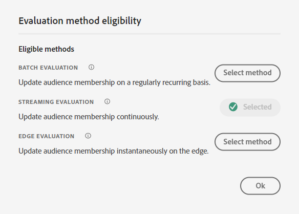

# 构建受众#2

## 实验室目标

构建一个受众，用于查找所有没有活动行（即iPhone 14）的用户档案

## 分析任务

此受众是“没有活动的iPhone 14的受众”

- 我们如何知道某个用户没有“活动的iPhone 14”？  构思：
  - 包括购买了iPhone 14的用户
  - 包括那些拥有iPhone 14的计费数据的用户
  - 包括那些拥有来自iPhone 14的任何Web数据的用户
  - 还有其他人吗？

归根结底，这取决于企业选择他们想要向谁进行营销。 在我们的案例中，公司认为这一点非常重要，因此我们构建了一个架构来定义Active Lines，因此请使用该架构。

>[!NOTE]
>
>由于Active Lines是存储在配置文件中的数组，因此这将选择帐户的所有者与设备的每个单独所有者。 确保营销团队意识到并想要这一点。 否则，您可能需要不同的方法。

## 创建新受众（拥有iPhone 14）

1. 在左边栏中的属性选项卡上，向下导航到产品名称（或搜索产品名称）。
   - XDM个人资料 — > \&lt;租户名称> —>活动产品 — >产品ID属性 — >产品名称
1. 将产品名称拖到画布上

## 保存受众

1. 键入iPhone 14（保留为批次评估）
1. 提供描述
1. 将受众另存为“拥有iPhone 14 **”
   - 对像素7执行上述相同步骤（如果您有时间）。

>[!TIP]
>
>**侧想：“我们是否不能只对事件进行筛选，而不是在个人资料存储中保留相同的内容？”**
>
>是的，我们可以，但我们必须探讨一些让受众变得复杂并带来一些挑战的业务和技术细微差别：
>
>1. 如果我们使用购买事件：
>   1. 如果他们不是向我们购买产品，而是拥有活跃的产品线，那该怎么办？
>   1. 如果他们在2年前购买了，我的规则必须回顾N年，而我们只保留1年的事件在配置文件上，该怎么办？
>1. 账单活动似乎更适合：
>   1. 但如今这些数据已发布了一个月。
>   1. 如果上一个账单事件是2年前，这可能包括非客户的人员
>   1. 如果我的数据加载失败，并且为了排除旧数据而仅回顾一个月，我的计数可能会降至零
>   1. 我们是否甚至捕获了用于计费事件的设备？ 不，因此我们必须更改数据馈送
>
>最后，我们必须为这一受众做出一些折衷。 如果您仍对将事件用于此规则感到满意，请阅读这篇博客文章： https\：//experienceleaguecommunities.adobe.com/t5/adobe-experience-platform-blogs/how-to-capture-latest-experience-event-in-adobe-experience/ba-p/430941

>[!NOTE]
>
>**正在启用Edge的合并策略**
>
>确保为Edge受众配置了合并策略。 转到合并策略并编辑\_xdm.context.profile的默认合并策略。  打开Active-On-Edge合并策略并保存。
>
>
>
>
>
>

## 重建受众

营销部门今天介入进来，要求我们提供此流服务，不幸的是，我们构建此服务的方式是批处理。 修复此问题：

1. 打开“*拥有iPhone 14*”受众并将名称更改为“*拥有iPhone 14批次*”。

>[!WARNING]
>
>现在，我们无法更改UI中的评估方法。 还必须删除引用此受众的任何受众。 在决定您在区段中使用区段的构建策略时，请牢记这一点。

2. 创建新受众。 将“拥有iPhone 14受众批次”受众添加到画布，然后单击转换为规则。

&#x200B;3. 将描述、名称和评估方法更新为右下角的流式传输，然后单击评估方法旁边的文件夹图标。 您应该会看到以下内容：

单击文件夹图标后

虽然不明显，但这是因为我们在查找架构上使用产品名称

>[!NOTE]
>
>无论何时使用查找，我们的评估方法都强制为“批处理”。
>
>如果您查看路径并且路径中任何位置都有“属性”，则可以区分这一点
>
>

&#x200B;4. 将产品名称的现有值替换为“现在来自XDM个人用户档案”架构

替换以下路径：

- XDM个人资料>部门>活动产品>产品ID属性>产品名称

添加新路径：

- XDM个人资料>部门>活动产品>模型

&#x200B;5. 将评估方法更改为流式传输，然后单击文件夹图标

&#x200B;6. 对于新的符合流式处理条件的受众，请提供描述。

- 将受众保存为&quot;*拥有iPhone 14*&quot;受众。
- 单击蓝色按钮&#x200B;**将受众**&#x200B;激活到目标

&#x200B;7. 选择&#x200B;**流DEP Webhook**&#x200B;目标，然后单击&#x200B;**下一步**

&#x200B;8. 单击&#x200B;**下一步**&#x200B;和&#x200B;**完成**

&#x200B;> [!NOTE]
>
>您想要选择批处理、流式处理或Edge的原因注意事项：
>
>最新护栏： [https://experienceleague.adobe.com/docs/experience-platform/profile/guardrails.html?lang=en](https://experienceleague.adobe.com/docs/experience-platform/profile/guardrails.html?lang=zh-Hans)

>[!TIP]
>
>**可选挑战实验室**
>
>提早完成？
>
>在一个家庭中创建“Apple设备忠诚度”受众。  计划中的所有用户都具有相同类型的设备(Apple)。
