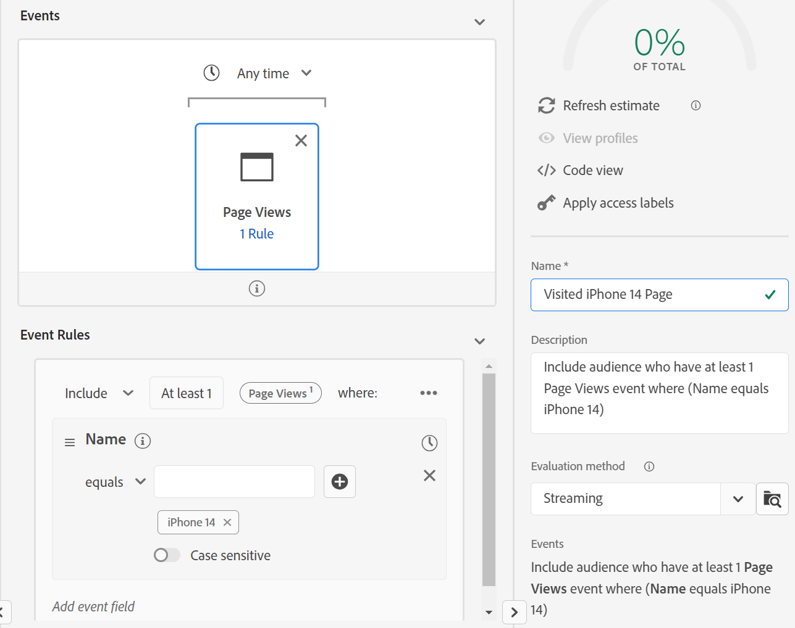

# 构建受众#3

## 实验室目标

构建访问iPhone 14产品页面的受众

## 分析任务

此受众应是直言不讳的。  我们可能具有多个产品页面，但此处没有任何棘手之处。

## 创建受众（已访问任何页面）

1. 在左边栏中“事件类型”下的“事件”选项卡上查找“页面查看”事件，并将其添加到受众

>[!NOTE]
>
>**使用事件类型**
>
>通过使用页面查看事件，我们确保受众仅在页面查看的上下文中评估页面名称。 它应该是多余的，因为“页面名称”仅存在于页面视图中，但具有两个优点：
>
>- 为用户在UI中查看提供高级可视化文档
>- 提供筛选以确保在添加新事件时，当这不是意图时，不包含这些事件
>
>因此，我们建议您在构建每个事件架构时充分考虑您使用的事件类型。 它们对于筛选和视觉指南至关重要。

2. 提供描述，并使其成为流式传输。

3. 在所放置的事件上方，将“Any time”更改为“Today”

4. 将此受众保存为“*已访问任何页面*”

5. 单击蓝色按钮&#x200B;**将受众**&#x200B;激活到目标

6. 选择&#x200B;**流DEP Webhook**&#x200B;目标，然后单击“下一步”

7. 单击“下一步”和“完成”

## 创建受众（已访问iPhone 14页面，但不拥有/订购该页面）

1. 创建新受众并添加页面查看次数事件

2. 导航到页面名称所在的位置，并将页面名称字段添加到事件，以便我们对其进行过滤。

- XDM ExperienceEvent —> Web —>网页详细信息 — >名称

3. 添加包含“iPhone 14”

> [!TIP]
>
>**正在搜索“页面”**
>
>尝试搜索“页面”，而不是导航到字段
>
>您看到未显示页面名称。 这是因为它的命名方式：
>
>- XDM ExperienceEvent > Web >网页详细信息>名称
>
>因此，您的文件夹将出现，但字段本身不会出现。 将命名惯例组合在一起时，请考虑此术语以及人们可能搜索的其他常用术语，并将这些术语合并到您的命名中。
>
>搜索不搜索描述
>
>

4. 在所放置的事件上方，将“Any time”更改为“Today”

>[!NOTE]
>
>由于我们根据今天发生的事件进行激活，因此我们仅关注今天的页面查看次数。

5. 验证是否为流式传输并提供描述。

6. 将受众另存为“*访问的iPhone 14页面*”

7. 单击蓝色按钮&#x200B;**将受众**&#x200B;激活到目标

8. 选择&#x200B;**流DEP Webhook**&#x200B;目标，然后单击“下一步”

9. 单击“下一步”和“完成”

## 创建受众受众

1. 导航到左上角的受众选项卡
1. 深入到Experience Platform
1. 拉入我们之前创建的另外三个受众
1. 将针对所有者iPhone 14的“包括”更改为“不包括”，并下单iPhone 14。

5. 提供描述。

6. 更改为流

7. 另存为“*已访问iPhone 14页面，但不拥有/订购该页面*”

8. 单击蓝色按钮&#x200B;**将受众**&#x200B;激活到目标

9. 选择&#x200B;**流DEP Webhook**&#x200B;目标，然后单击“下一步”

10. 单击“下一步”和“完成”

>[!NOTE]
>
>**时间筛选器**
>
>这些要求没有时间限制，因此如果三年前有人来访，他们就有资格。 这取决于我们的用例，不一定有效。 这值得一问。 我们添加了一个，因为我们正在根据今天访问我们网站的人进行激活。  这可能不适用于所有用例。  如果添加时间过滤器，那么在Edge受众成为流受众甚至批处理受众之前，可以走多远？

> [!NOTE]
>
>**拆分的后果**
>
>出于一些原因，我们已将简单的需求拆分为多个受众。 该要求适用于流式传输，但这两项要求将我们的受众转换为批处理。 有关流资格规则的更多详细信息，请参阅此处：
>
>[https://experienceleague.adobe.com/docs/experience-platform/segmentation/ui/streaming-segmentation.html](https://experienceleague.adobe.com/docs/experience-platform/segmentation/ui/streaming-segmentation.html)

>[!NOTE]
>
>**哪些受众正在流式传输**
>
>我们的&#x200B;*Peeking Under the Hood of Audience*&#x200B;博客（链接如下），下面会介绍一些相关内容。 它显示了如何将受众的结果存储在配置文件中。 这一点很重要，因为其中的数据流查看的是存储在配置文件上的受众的结果，因此在该时间点不会重新运行受众！ 一个简单的细微差别，但值得理解。 大多数配置文件属性会定期更新，因此这种方法比较合理。
>
>我们需要了解，在受众中使用受众时，AEP将尝试在必要时进行序列化。 在一些极端情况下，这是不可能的，例如如果使用受众受众，则每24小时进行一次配置文件取消资格。
>
>[https://experienceleaguecommunities.adobe.com/t5/adobe-experience-platform-blogs/peeking-underneath-the-hood-of-segments-in-aep-adobe-experience/ba-p/453535](https://experienceleaguecommunities.adobe.com/t5/adobe-experience-platform-blogs/peeking-underneath-the-hood-of-segments-in-aep-adobe-experience/ba-p/453535)

## 为什么要创建多个受众？

如果我们将所有这些受众构建在一个受众中，而不是四个受众，那么我们将获得批量评估方法，即使每个受众单独处于流状态。

通过划分这些受众并使用受众受众，我们得到这种行为。  将这些受众实时限定为中的数据流

- 订购的iPhone 14
- 拥有iPhone 14
- 访问了iPhone 14页

>[!WARNING]
>
>现在，受众将每日/24小时延迟取消资格

底线：我们通过将Audience分为24小时延迟的片段来换取更快的进入Audience。

>[!TIP]
>
>**可选挑战实验室**
>
>提早完成？
>
>我想用电子邮件来定位那些有旧手机的人。  创建“有旧手机”的受众。  我们如何才能锁定他们？
