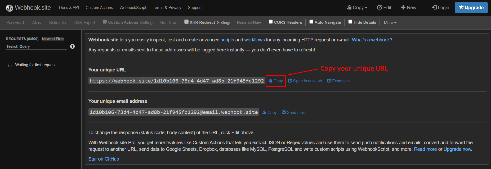
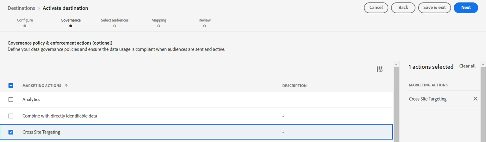

# 设置流目标

>[!NOTE]
>
>如果您已配置流目标，请跳至下一步！

## 获取webhook URL

>[!NOTE]
>
>我们将在此使用webhook，以便查看数据是否已到达我们要发送到的目标。 在现实世界中，我们会登录该目标，并使用他们的工具来查看哪些内容已到达。

1. 在浏览器的新选项卡中打开以下链接 — > [https://webhook.site](https://webhook.site/)
1. 复制您看到的唯一URL并将其保存在安全位置

## 配置HTTP API目标

>[!NOTE]
>
>我们使用流式目标作为将此数据发送至第三方（例如Facebook）的代理。 在现实场景中，您可以使用Facebook目标代替HTTP API目标将数据发送到Facebook。

在Experience Platform UI中，通过执行以下操作，导航到目标目录

1. 单击左边栏中的&#x200B;**目标**
1. 单击顶部边栏上的&#x200B;**目录**
1. 在搜索框中输入&#x200B;**http**
1. 单击&#x200B;**设置**&#x200B;按钮配置HTTP API目标

>[!NOTE]
>
>您正在使用实验室的HTTP API流目标来演示现实世界的流连接器的工作原理。

## 配置

1. 连接类型&#x200B;**无**
1. 单击&#x200B;**连接到目标**

   

   >[!NOTE]
   >
   >通常，我们将在此阶段添加任何身份验证凭据，但此webhook不需要任何凭据。

3. 按如下方式填写目标的配置详细信息：

- **名称** -> `Streaming DEP Webhook - [Your Initials]`
- **描述** -> `[your webhook endpoint you copied above]`
- **终结点** -> ` [your webhook endpoint you copied above]`
- **查询参数** -> `leave blank`
- **标头** -> `leave blank`
- 包括区段名称 — >打开
- 包括区段时间戳 — >打开

完成后，请确保您的配置与下面显示的内容相匹配。  如果一切正常，请单击右上角的&#x200B;**下一步**&#x200B;按钮继续下一步

>[!CAUTION]
>
>保存后，无法在UI中更改端点、标头和查询参数

## 定义治理

1. 从营销操作中选择&#x200B;**跨站点定位**
1. 完成后，单击&#x200B;**下一步**&#x200B;按钮以继续下一步

>[!NOTE]
>
>您可以详细了解Experience League中的治理策略
>
>[https://experienceleague.adobe.com/docs/experience-platform/data-governance/policies/overview.html?lang=en#core-actions](https://experienceleague.adobe.com/docs/experience-platform/data-governance/policies/overview.html?lang=en#core-actions)

## 选择受众

1. 选择所有受众
1. 完成后，单击&#x200B;**下一步**&#x200B;按钮以继续下一步

## 添加映射

>[!NOTE]
>
>这里，我们从用户档案添加字段。 如果该字段没有数据，我们可能会看到没有内容传递给目标。 随着时间的推移，配置文件和事件中的多次更新有时会导致目标多次触发并发送多个负载。

1. 单击&#x200B;**添加新字段**&#x200B;以将字段添加到架构
1. 在架构字段输入框中键入&#x200B;**model**，然后从显示的字段列表中选择&#x200B;**\_dep.activeProducts\[0].model**&#x200B;字段
1. 在字段名称中将&#x200B;**\[0]**&#x200B;更改为&#x200B;**\[\*]**。  您的最终字段现在应显示为&#x200B;**\_dep.activeProducts\[\*].model**
1. 完成后，单击&#x200B;**下一步**&#x200B;按钮以继续下一步

>[!NOTE]
>
>这是在配置文件上映射字段，而不是在体验事件上映射字段。 即使我们根据受众资格将用户档案发送到目标，但我们必须记住正在发生的情况。
>
>1. 事件进入
>2. 受众根据规则鉴定用户档案
>3. 资格存储在配置文件中
>4. 通知目标配置文件已符合条件
>5. 目标将发送配置文件。 这意味着当目标发送用户档案时，它不再感知触发受众评估的事件。

## 审核步骤

验证最终目标是否正常，然后单击&#x200B;**完成**&#x200B;按钮

>[!NOTE]
>
>目标现已配置完毕，并根据评估速度等待所有添加的区段的区段资格证明：
>
>- Edge
>- 流
>- 批次

>[!NOTE]
>
>在最初设置目标时，请务必牢记以下几点：
>
>- 任何回填（现有的合格配置文件）开始激活操作最多需要2小时
>- 新添加的受众需要长达20分钟才能开始激活
