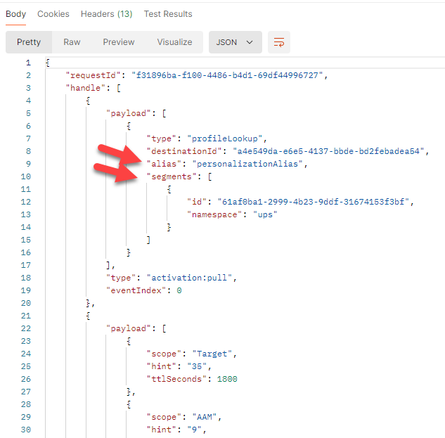
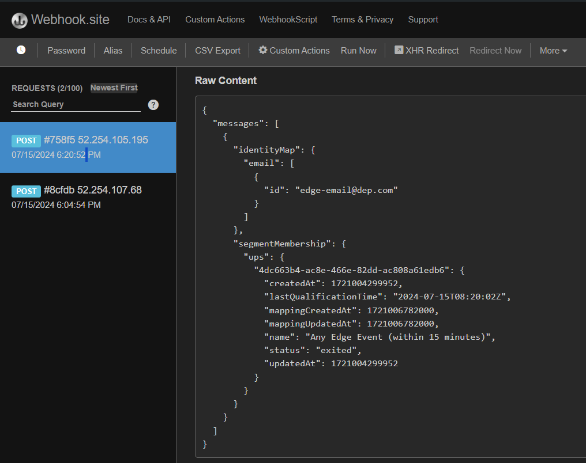

# 发送Edge活动

现在一切都已配置，请将事件发送到Edge以查看它是否正常工作。 为此，请使用Postman将Web事件发送到您创建的数据流。 这会发送一个没有OAuth令牌&#x200B;**的事件**&#x200B;来模拟从Web进入Edge的页面查看。  请确保在计算机上打开了Postman以执行本实验操作。

>[!NOTE]
>
>由于您未传入经过身份验证的令牌，因此不会返回任何属性。

## 实验室期望

1. 用于点击Edge的体验事件
1. 数据流配置以使用事件转发服务
1. 事件转发以将事件发送到webhook
1. 数据流配置以使用AEP服务
   1. 要运行的Edge Audience
   2. 将事件发送到中心
1. Postman响应以包含Edge Audience（但没有属性）
1. 用于接收事件并添加事件配置文件片段的配置文件存储
1. 用于添加关系的身份存储
1. 用于接收数据并存储在Data Lake中的数据集
1. 流式受众以评估和将结果存储在中心上的配置文件中
1. 自定义Personalization目标，用于将任何流受众“条目”发送回Edge
1. HTTP API目标，用于将任何流受众“条目”发送到webhook
1. 最终HTTP API目标将任何流受众“退出”发送到webhook
1. 最终自定义Personalization目标，以将任何流受众“退出”发送到Edge


## 导航到呼叫

1. **Postman左侧边栏** ->收藏集
1. **收藏集** -> AEP Foundation Bootcamp （实验室）
1. **文件夹** ->配置文件实验室
1. **API请求** ->创建Web事件Edge（无身份验证）


## 修改API请求

如果您已经完成此操作，则可以跳至“执行API”。

在执行API请求之前，您需要向请求添加一些其他信息。 首先，收集以下值：

## 收集数据流ID

1. 在左边栏中，单击&#x200B;**数据流**（在数据收集标题下）
1. 选择您的数据流并复制&#x200B;**数据流ID**&#x200B;值


## 更新Postman查询参数

1. 在请求中单击&#x200B;**参数**
1. 使用上一步的数据流ID更新&#x200B;**值**
1. 单击&#x200B;**保存**&#x200B;按钮保存您的更新
1. 将电子邮件更改为电子邮件


## 执行API

单击&#x200B;**发送**&#x200B;按钮执行您的请求。




您应会看到响应中返回的核心内容如下：

- 200 OK响应表示Edge Network已成功发送并接受数据
- 在有效负载响应中，您还应看到以下内容：
  - 您设置的自定义Personalization目标的destinationId
  - 目标的别名（您的别名称为customPersonalization）
  - 用户档案符合条件且存在于边缘的任何区段

>[!NOTE]
>
>任何流区段和批处理区段只有在首先在中心评估之后才会显示

>[!NOTE]
>
>如果您使用持有者令牌发送到server.adobedc.net ，您还会看到在自定义Personalization目标中配置的属性

## 您可能会遇到的错误

以下是您可能会遇到的错误示例。 这意味着边缘分段评估尚无法评估发送到边缘网络的数据。

```none
"errors": [
        {
            "type": "https://ns.adobe.com/aep/errors/EXEG-0203-502",
            "status": 502,
            "title": "The service call has failed.",
            "detail": "An error occurred while calling the 'com.adobe.experience_platform.edge_segmentation' service for this request. Try again.",
            "report": {
                "eventIndex": 0
            }
        }
    ]
```

## 验证事件转发

在webhook.site上，您应该会立即看到通过Postman请求发送的相同有效负载正文。


>[!NOTE]
>
>请注意，有效负载已添加您在设置边缘设置中使用的数据流时请求的地理查找信息

## 查找配置文件

在Adobe Experience Platform中，查找您刚刚从刚刚发送到Edge Network的事件中发送的配置文件。  导航到“配置文件” — >“浏览”，使用下列信息执行查找：

- 合并策略 — >默认基于时间
- 身份命名空间 — >电子邮件
- 身份值 — > edge-email\@dep.com


1. 单击&#x200B;**查看**&#x200B;查找配置文件
1. 单击&#x200B;**配置文件ID**&#x200B;以打开配置文件

   


3. 单击顶部导航中的&#x200B;**事件**，您就可以看到刚刚发送的事件

   


4. 通过查看顶部导航中的Audience Membership选项卡，验证配置文件是否符合受众条件。  您应会看到以下内容：

- Edge的任何事件（在最近15分钟内）
- 任何事件流（在过去一小时内）
- 在用例#1，您还应看到受众：
  - 已访问iPhone 14页面，但未拥有/订购该页面
  - 访问了iPhone 14页


## 验证流目标激活

检查webhook，查看您配置的流目标是否已激活任何区段。  它们应在\~5分钟后显示。


>[!NOTE]
>
>如果两个身份尚未链接，则流目标可能会发送另一个区段资格有效负载。

如果ECID和电子邮件尚未关联，则几分钟后，可能会显示另一个具有相同值的负载，但identityMap现在将有两个身份(email &amp; ecid)

随着时间的推移，您应该会开始从webhook接收更多负载，以查看“已退出”状态。



## 如何解释所有检查

1. 在Postman中检查200响应（有效负载格式正确）
1. 检查webhook是否具有事件（正确配置的事件转发）
1. 检查配置文件中是否包含事件（正确配置的AEP服务、中心上接收和处理的事件）
1. 检查配置文件是否具有两个身份（标识图已在中心上链接）
1. 检查配置文件是否符合受众的条件（正确定义的受众）
1. 检查webhook是否接收到流受众（正确配置的HTTP API目标）
1. 检查Postman响应是否包含区段（正确配置的自定义Personalization目标）
1. 检查Data Lake是否具有发送日志（已正确配置并已发送受众资格和流式目标）。 请参阅下文。

## 目标的数据湖“日志”

在至少60分钟后，您甚至可以检查您的数据集是否包含您发送的事件。 为此，请使用查询服务执行以下查询。

将下面的表名称更改为沙盒中的表名称。 要查找该数据集，请转到您的数据集列表并在“`dest`”上筛选，打开该数据集并在右边栏上复制表名称。

```sql
SELECT * FROM profile_export_for_destination_merge_policy_xxx
WHERE extSourceSystemAudit.LASTREFERENCEDDATE >= CURRENT_DATE
AND identitymap['email'][0].ID in ('edge-email@dep.com')
ORDER BY extSourceSystemAudit.LASTREFERENCEDDATE DESC
LIMIT 10
```
