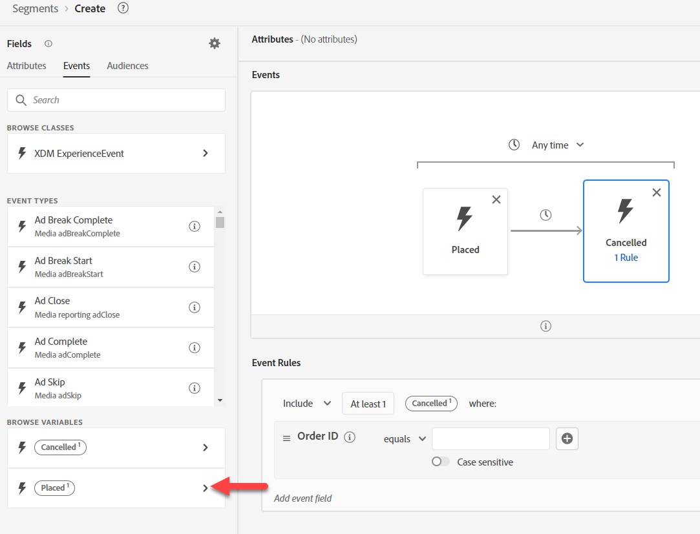

# 构建用例#3

## 创建受众

1. 创建新受众
1. 将下订单事件添加到画布
1. 将“已取消订单事件”添加到“已下订单事件”的右侧
1. 将时间更改为一周内

>[!NOTE]
>
>**事件类型字段**
>
>我们本可以使用：
>
>- 按Event Type=order.placed过滤的任何事件
>- 按事件类型=order.canceled过滤的任何事件

>[!NOTE]
>
>**时间**
>
>受众引擎仅使用时间戳来解释事件的顺序。 因此，如果事件中有多个日期时间字段，请记住，时间戳字段就是使用的字段。

## 配置已取消的事件

搜索订单ID并将字段拖至“已取消订单”事件中。

>[!NOTE]
>
>我们将为订单ID添加过滤器，以确保已下订单与已取消订单相同

清除所有搜索并单击&#x200B;**浏览变量**&#x200B;下的&#x200B;**放置的**

向下钻取到订单ID，然后拖动以添加比较操作数

>[!WARNING]
>
>**不要在变量中使用搜索**
>
>它不会保留变量的上下文

您的最终结果应该如以下所见

>[!NOTE]
>
>**容器**
>
>正在使用变量容器，以确保取消的订单与下达的订单相同
>
>以前，我们使用容器隔离数组中的元素。 在这里，我们使用容器引用另一个事件中的筛选条件中的特定事件。
>
>Order Canceled Event可确保自己的订单ID与下单的订单ID相同
>
>我们还能用这个吗？
>
>- 比较页面查看的产品SKU是购买的产品SKU
>- 比较收货方与城市与帐单方与城市不同
>- 即使事件可能来自不同的架构，比较同一数据类型的任意两个字段应该是可能的
>
>https\：//experienceleaguecommunities.adobe.com/t5/adobe-experience-platform-blogs/how-exactly-do-containers-work-in-aep-segmentation-a-deader-look/ba-p/458780

>[!NOTE]
>
>**容器名称**
>
>容器将从其上下文继承其变量名称。
>
>例如如果您使用“Any Event”（任何事件）卡，则容器名称将为Any1

## 保存受众

1. 提供描述。 将评估方法设置为“批处理”。
1. 将您的受众另存为“在一周内下了&#x200B;*个订单且取消了*&#x200B;个订单”

>[!TIP]
>
>**可选挑战实验室**
>
>提早完成？ 试试这个……
>
>我们希望为“放弃购物车”发起一场新的运动。  为放弃购物车创建受众，但确保我们不会在一个小时内开始定位人员。
>
>
>
>还有时间吗？ 试试这个……
>
>该业务通过合并，收购了两个新的业务单位：
>
>- ISP
>- 电缆
>
>您需要如何修改架构以包含这些组件？
