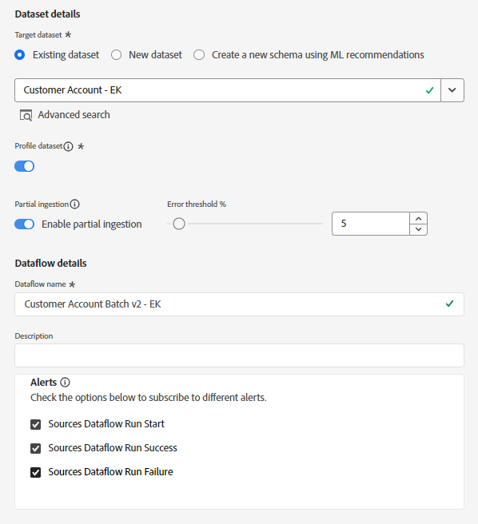

# 创建新数据流

## 导航到源

1. 在Adobe Experience Platform UI中，导航到以下位置：\
   **源** -> **目录** -> **本地系统**
1. 下一步单击&#x200B;**本地文件上传**&#x200B;卡的&#x200B;**添加数据**&#x200B;按钮

## 设置数据流

1. 在数据流详细信息屏幕中，选择&#x200B;**现有数据集**。
1. 使用您之前创建的数据集，名称为&#x200B;**客户帐户 — \&lt;您的首字母>**
1. 确保已打开&#x200B;**配置文件数据集**切换开关。
（如果不打开此功能，配置文件存储区将无法监视是否有新数据进入此数据集，因此不会将此数据摄取到配置文件中）
1. 确保已打开&#x200B;**启用部分摄取**切换开关
（如果不打开此功能，则当只有一个记录出错时，整个摄取可能会失败）
1. 将数据流名称设置为&#x200B;**客户帐户批次v2 - \&lt;您的首字母>**
1. 打开所有警报&#x200B;**源数据流启动/成功/失败**
1. 如果一切正常，请单击屏幕右上角的&#x200B;**下一步**&#x200B;按钮继续下一步。

## 上传样本文件

1. 在UI中拖放和/或上传&#x200B;**Lab\_Customer\_Account.csv**&#x200B;文件。  完成后，您的屏幕应如下所示。

## 导入映射

在映射屏幕上，您可以导入之前创建的映射，而不是再次设置所有映射。

1. 单击&#x200B;**导入映射**&#x200B;按钮
1. 选择具有您之前创建的映射的数据流

映射屏幕上的

中导入映射的数据流

>[!NOTE]
>
>导入映射是一种从其他数据流重用映射并减少您需要执行的映射工作量的简便方法
