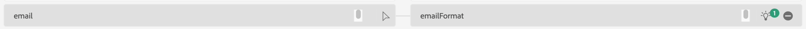
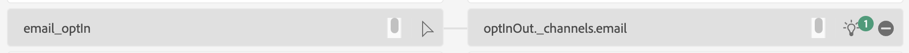

# 修复直通映射

## 删除特定映射

您需要使用计算字段处理的一些源数据。  要解决这些问题，请将它们从映射中删除，然后重新验证映射。

1. 从映射中删除以下源数据：
   - birth\_日期
   - 源
   - sms\_optIn
1. 单击validate按钮以重新验证映射

>[!NOTE]
>
>单击“验证”后，可能仍会出现错误

## 错误映射示例

虽然AI/ML推荐很有帮助，但它们有时是错误的。  如果检查推荐，您可能会发现需要修复的此类错误

>[!NOTE]
>
>以下是您可能在自己的沙盒中看到的一些无效映射示例。 您还可能会看到其他错误。

## 复制映射

在此方案中，您看到AI/ML推荐程序将两个不同的源字段映射到相同的目标字段&#x200B;**person.name.lastName**

## 错误映射

此映射正确无误，但在仔细检查时，**电子邮件**&#x200B;与&#x200B;**电子邮件格式**&#x200B;不同

**email\_optIn**&#x200B;错误地映射到错误的同意对象

## 修复直通映射

要修复错误指向错误目标字段的直通映射，请执行以下步骤。

### 示例

1. 从无效的映射开始，然后单击目标字段框。 例如，在下面的映射中，字段&#x200B;**person.name.lastName**&#x200B;未正确映射，已映射到&#x200B;**planName**
1. 在右侧打开的目标架构面板中，选择相应的目标字段并选择&#x200B;**\_devbc.plan.name**
1. 目标字段现在应在目标字段框中更新
1. 修复每个此类错误后，应按&#x200B;**验证**&#x200B;按钮，以便确保减少此类错误而不引入新错误。

>[!WARNING]
>
>在解决所有映射错误之前，请勿继续执行下一步
