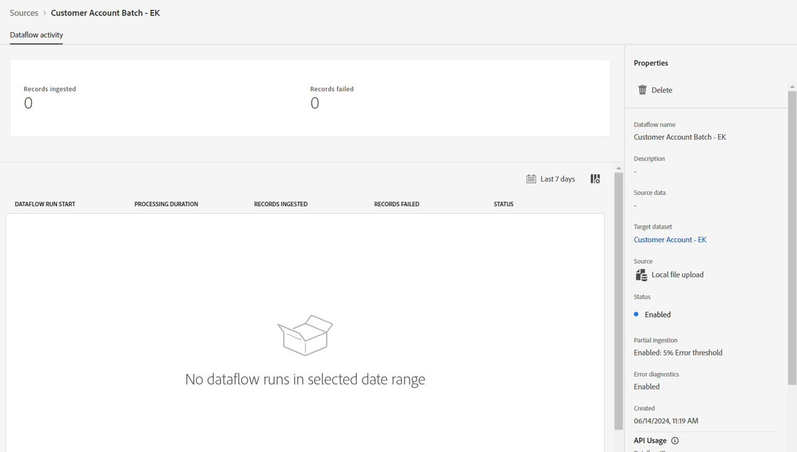

# 运行数据流

如果一切正常，请单击右上角的&#x200B;**完成**&#x200B;按钮以执行数据加载。

单击&#x200B;**完成**&#x200B;后，您将回到&#x200B;**数据流**&#x200B;屏幕。 创建数据流需要几分钟的时间。 第一次跑步应该会在几分钟后开始。

>[!NOTE]
>
>您需要持续刷新页面才能看到状态更新，因为后端不会将更新推送到UI。

>[!NOTE]
>
>如果您打开了所有警报，则当流量开始运行并成功完成或失败时，您会在浏览器右上角收到警报
