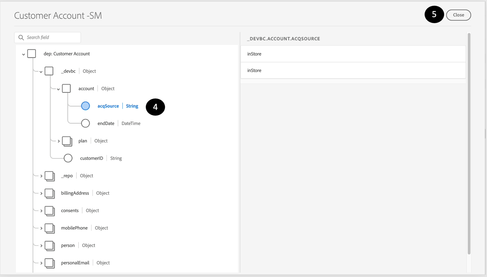

# 验证和验证

## 预览数据集

1. 单击&#x200B;**数据集**
1. **找到**&#x200B;并&#x200B;**单击**&#x200B;您创建的数据集名称。


1. 单击右上角的&#x200B;**预览数据集**


1. **通过单击显示架构层次结构的左窗格，验证**&#x200B;和&#x200B;**验证**&#x200B;您摄取的相同记录。



>[!NOTE]
>
>**预览数据集**&#x200B;显示此数据集中最近成功的批处理。 您看不到以前的批次。 此外，复杂数据（如数组和映射）现在不可查看，并且显示为空列。 不要惊慌！ 要获得更全面的视图，您需要使用SQL来浏览数据集，如下所述。


## 查询数据集

1. **关闭**&#x200B;预览
1. 在“数据集”屏幕中，单击&#x200B;**表名称**&#x200B;上的复制图标。 在下面的示例屏幕中，表名称为`customer_account_sm`

在数据集屏幕中


1. 导航到&#x200B;**查询**&#x200B;部分

1. 单击&#x200B;**创建查询**

在“查询”节中


1. 在&#x200B;**编辑器**&#x200B;中复制并粘贴以下SQL查询。 请记得使用您在步骤6中获得的值替换`<table_name>`。

```sql
SELECT * FROM <table_name>
```


1. 按&#x200B;**播放**&#x200B;按钮。

具有SQL查询和播放按钮的


1. **预览**&#x200B;结果

1. 此外，执行以下SQL查询以检索XDM架构以及数据：

```sql
SELECT to_json(shippingAddress) FROM <table_name>
```

要访问`postalCode` **节点**&#x200B;中的数据，您可以键入：

```sql
SELECT shippingAddress.postalCode FROM <table_name>
```

>[!TIP]
>
>恭喜！  您已成功摄取并创建了一组实时客户配置文件示例
