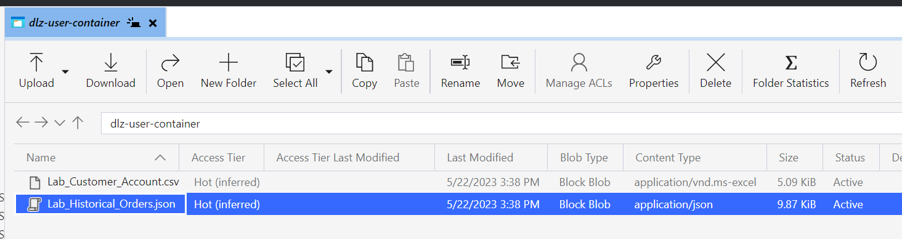

# 设置源

## 上传样本文件

您需要通过Azure Storage Explorer将示例数据文件上传到您的数据登陆区，以便您可以在实验中使用它。  为此，请执行以下操作：

1. 下载[示例文件](../../../sample-files.md)
1. 将&#x200B;**Lab\_Historical\_Orders.json**&#x200B;文件拖放和/或上传到您从上面保存的数据登录区。

上传后，屏幕应类似于下面的屏幕快照。

上载到数据登陆区域的

## 导航到源

1. 转到Adobe Experience Platform并导航到： **源** -> **目录** -> **云存储**
1. 单击数据登录区域的&#x200B;**设置** / **添加数据**

>[!NOTE]
>
>如果您已经从上一个批量摄取实验室设置了连接，则会看到&#x200B;**添加数据**&#x200B;作为默认操作

## 预览文件

1. 选择&#x200B;**Lab\_Historical\_Orders.json**&#x200B;文件并预览其内容
1. 单击屏幕右上角的&#x200B;**下一步**&#x200B;以继续下一步

## 设置数据流

1. 在数据流详细信息屏幕中，选择&#x200B;**新建数据集**
1. 将输出数据集命名为&#x200B;**订单 — YourNameHere**
1. 选择架构名称&#x200B;**dep： Orders**
1. 打开&#x200B;**配置文件数据集**&#x200B;切换框
（如果未打开此功能，则配置文件存储区将无法监视是否有新数据进入此数据集，因此不会将此数据摄取到配置文件中）
1. 打开&#x200B;**启用部分摄取**
（如果不打开此功能，则当其中一个记录出错时，摄取可能会失败）
1. 将数据流名称设置为&#x200B;**Orders - Backfill - YourNameHere**
1. 打开所有警报&#x200B;**源数据流启动/成功/失败**

为“订单”数据集配置的

>[!CAUTION]
>
>请确保为配置文件和部分摄取启用了&#x200B;**您的数据集**。

单击屏幕右上角的&#x200B;**下一步**&#x200B;以继续下一步
