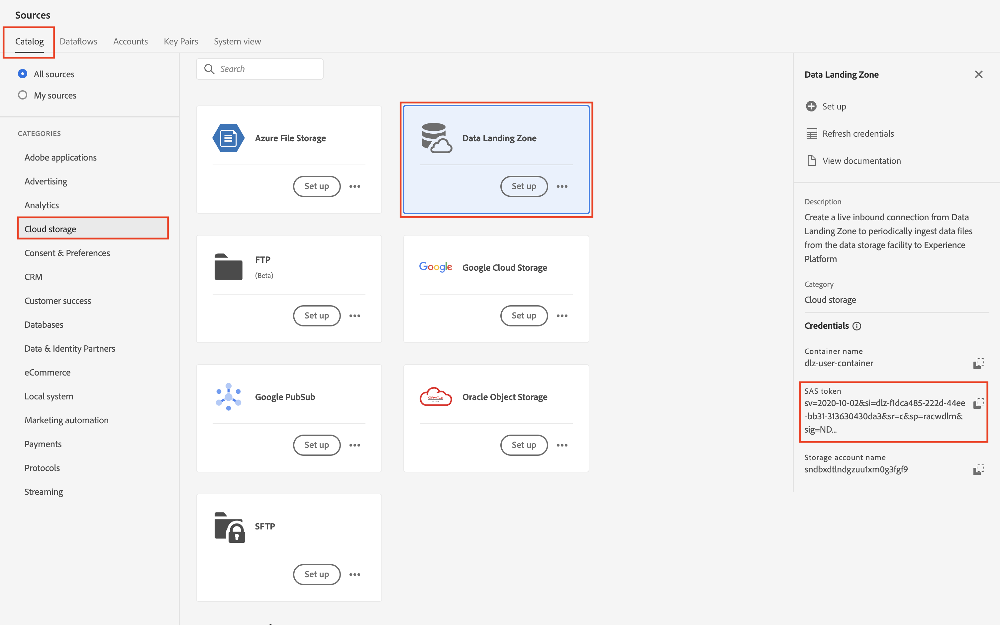

# 使用数据登陆区

## 先决条件

如果您尚未下载Azure Storage Explorer，请立即下载，因为这是本实验的一项要求。  您可以通过以下链接找到下载内容：

[下载Azure存储资源管理器](https://azure.microsoft.com/en-us/blog/microsoft-azure-data-lake-storage-adls-in-storage-explorer-public-preview/)

1. 安装应用程序
1. 首次启动时接受最终用户许可协议

Azure Storage Explorer](assets/overview-end-user-license-agreement-screen.png "最终用户许可协议屏幕中的

1. 选择&#x200B;**共享访问签名URL (SAS)**&#x200B;并单击&#x200B;**下一步**

   

1. 输入显示名称&#x200B;**数据登陆区域**

   >[!NOTE]
   >
   >在提供SAS URL之前，您无法继续此步骤。  您可以从Experience Platform中获取此代码，这会在下一步中看到。

   

1. 转到Adobe Experience Platform ，然后通过执行以下操作导航到数据登陆区：

   - 导航到&#x200B;**源 — >目录**
   - 在源下选择&#x200B;**云存储**
   - 接下来找到&#x200B;**数据登陆区**&#x200B;卡
   - 单击数据登录区卡，然后单击右边栏上的&#x200B;**查看凭据**

   

1. 从显示的模式中复制&#x200B;**SASUri**。

   导航回Azure Storage Explorer并将&#x200B;**SASUri值**&#x200B;粘贴到您在上一步中留空的&#x200B;**Blob容器或目录SAS URL**&#x200B;中

   

1. 单击&#x200B;**下一步**&#x200B;继续

   

1. 在“摘要”屏幕上，单击&#x200B;**连接**

现在，您应该会看到如下所示的屏幕

>[!TIP]
>
>恭喜！  您已成功配置Azure存储资源管理器
