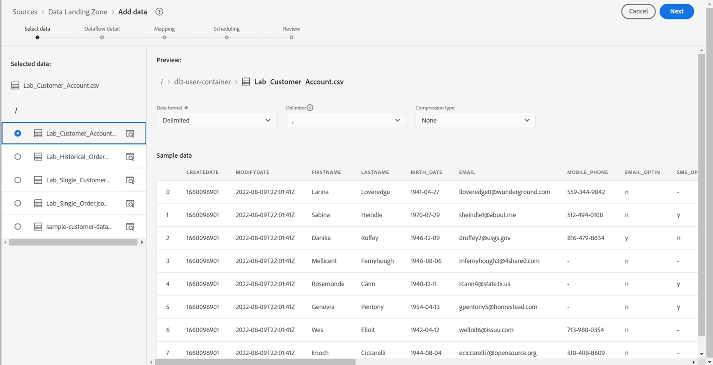
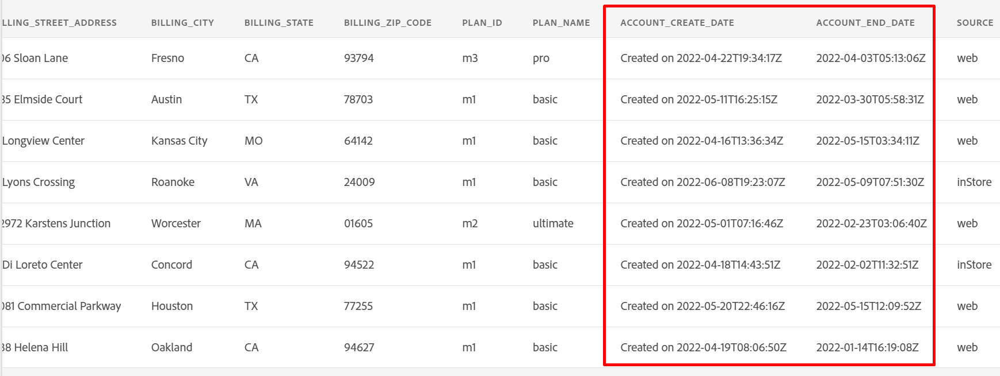
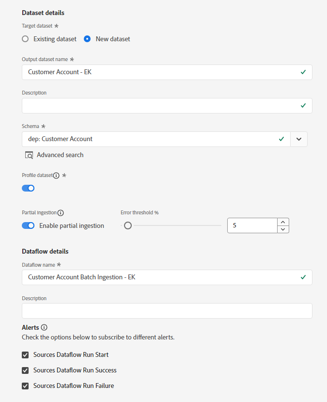

# 设置源

## 上传样本文件

您需要通过Azure Storage Explorer将示例数据文件上传到您的数据登陆区，以便您可以在实验中使用它。  为此，请执行以下操作：

1. 下载[示例文件](../../sample-files.md)
1. 将&#x200B;**Lab\_Customer\_Account.csv**&#x200B;文件拖放和/或上传到您在上一步中保存的数据登录区。

上传后，屏幕应类似于以下屏幕快照。

>[!WARNING]
>
>确保没有将文件上载到&#x200B;*项目*&#x200B;文件夹中。 它包含您无法在我们的实验室中使用的预加载数据。

## 导航到源

1. 转到Adobe Experience Platform并导航到： **源** -> **目录** -> **云存储**
1. 单击数据登录区域的&#x200B;**设置** / **添加数据**

>[!NOTE]
>
>如果该源至少存在一个连接，您会看到&#x200B;**添加数据**&#x200B;作为默认操作。 如果该源不存在连接，您会看到&#x200B;**Setup**&#x200B;作为默认操作

## 预览文件

1. 选择&#x200B;**Lab\_Customer\_Account.csv**

1. 在预览窗格中，查看以下属性并观察以下情况：

- **sms\_optIn**&#x200B;是一个同意字段，该字段具有若干缺失值（在预览中显示为 — ）
- **account\_create\_date**&#x200B;没有正确的日期格式。 它在一个字符串中包含字符串值以及日期和时间值。
- **account\_end\_date**&#x200B;具有正确的日期格式。

中显示了多个缺失值

文件预览中显示的

>[!NOTE]
>
>在本实验后面的映射步骤中，您将需要处理缺少的值、日期以及格式不正确的字段

1. 单击屏幕右上角的&#x200B;**下一步**&#x200B;以继续下一步

## 设置数据流

1. 在数据流详细信息屏幕中，选择&#x200B;**新建数据集**。
1. 将输出数据集命名为&#x200B;**客户帐户 — \&lt;您的首字母>**
1. 从下拉列表中选择&#x200B;**dep： Customer Account**&#x200B;架构。
1. 打开&#x200B;**配置文件数据集**&#x200B;切换框。
（如果未打开此功能，则配置文件存储区将无法监视是否有新数据进入此数据集，因此不会将此数据摄取到配置文件中）
1. 打开&#x200B;**启用部分摄取**。
（如果不打开此功能，则当其中一个记录出错时，摄取可能会失败）
1. 将数据流名称设置为&#x200B;**客户帐户批次摄取 — \&lt;您的首字母>**
1. 打开所有警报&#x200B;**源数据流启动/成功/失败**

>[!CAUTION]
>
> 请确保为配置文件和部分摄取启用了&#x200B;**数据集**。

单击屏幕右上角的&#x200B;**下一步**&#x200B;以继续下一步。

>[!NOTE]
>
>**启用部分摄取**&#x200B;指定错误数（**INGEST**&#x200B;和&#x200B;**DCVS**），以在整个数据流声明失败之前可以失败的记录总数的百分比表示。
