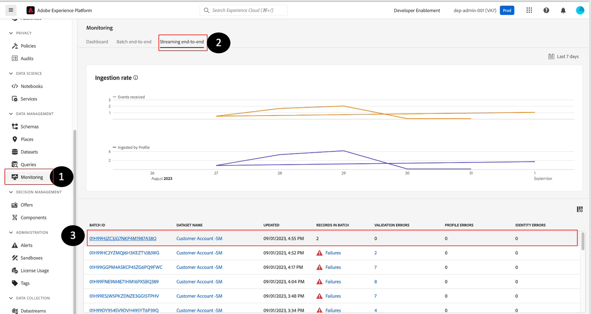

# 监控和调试错误

>[!NOTE]
>
>监控流摄取发生在数据流级别，这意味着当您在UI中查看它时，您正在查看数据湖。  这意味着您每60分钟就会看到一次批次显示（流式管道的微批次处理）。  因此，如果您在Real-Time Customer Profile中未看到数据，则必须等待最多60分钟才能诊断问题。

## 查看监视仪表板

1. 导航到&#x200B;**监控 — >流传输端到端**，并找到您的&#x200B;**数据流**：

1. 您可能需要预览&#x200B;**仪表板**&#x200B;选项卡以查看与批次摄取工作流相关的管道量度。

>[!NOTE]
>
>此监控屏幕允许您查看各种数据流运行的状态。  请注意顶部面板中可供您使用的各种量度。  这些指标对于了解Experience Platform中数据管道的运行状况可能非常有用

## 调试错误

1. 如果数据流因未遵循说明而发生错误，您会看到以下内容。

1. 如果单击“故障”，将获得以下屏幕：

>[!NOTE]
>
>成功的微批次可能需要超过15分钟，因为可能需要时间将记录写入数据湖。

1. 分析错误消息，识别&#x200B;**源/目标字段**&#x200B;并查找代码：

- **摄取XXXX** — 由于数据损坏或格式问题（即未遵循正则表达式格式），出现此严重错误。
- **DCVS XXXX** — 出现`required`字段的错误。 如果值不存在或映射不正确（不在枚举列表中），将跳过这些行。
- **映射器XXXX** — 这些是警告，没有跳过任何行。 但这些值可能已经“无效”，因此您应该检查以确保它们不会影响下游活动。

1. 若要从错误中恢复，您需要转到&#x200B;**源 — >数据流 — >数据流名称 — >更新数据流**&#x200B;并修复映射。

> [!NOTE]
>
>您需要重新上传JSON示例文件，方法是先删除该文件，然后再重新添加该文件，以便现在使用新副本刷新映射程序进行验证。

