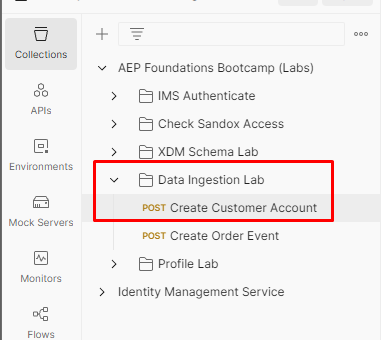
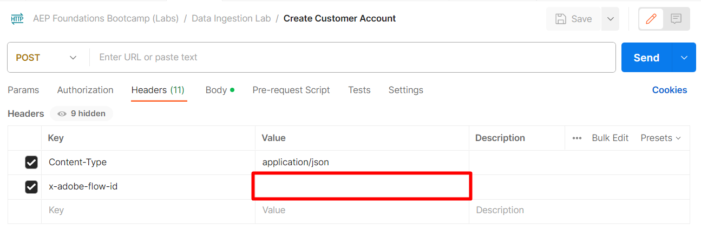

# 流式传输用户档案

## API概述

以原始形式将数据流式传输到Adobe Experience Platform中时，了解API的结构非常重要，这样您就可以轻松地重新创建它，而不管您创建了什么数据流。  以下是使用cURL调用的基本结构示例

**示例请求（原始数据）**

```curl
curl --location '' \
--header 'Content-Type: application/json' \
--header 'x-adobe-flow-id:  <dataflow-id>;' \
--header 'Authorization: Bearer XXX;' \
--data '{
    "customer_id": "202208240125",
    "firstName": "",
    "lastName": "",
    "email": "",
    "createDate": "1660096899",
    "modifyDate": "2022-08-09T22:01:40Z",
    "birth_Date": "1991-06-12",
    "mobile_phone": "888-888-8888",
    "email_optIn": "y",
    "sms_optIn": "n",
    "shipping_street_address": "1901 W Madison St",
    "shipping_city": "Chicago",
    "shipping_state": "IL",
    "shipping_zip_code": "60612",
    "billing_street_address": "1901 W Madison St",
    "billing_city": "Chicago",
    "billing_state": "IL",
    "billing_zip_code": "60612",
    "plan_id": "m1",
    "plan_name": "basic",
    "account_create_date": "Created on 2022-04-20T22:19:03Z",
    "account_end_date": "2022-01-20T13:15:32Z",
    "source": "inStore"
}'
```


上述请求中需要注意的几个重要因素：

| 关键元素 | 必填 | 描述 |
| --------------------------- | -------- | ------------------------------------------------------------------------------------------------------------------------------------------------------------------------------------------- |
| 请求URL（即位置） | - | 这是您创建的HTTP API源帐户的URL，流数据将指向该URL。 **它始终为POST类型** |
| 标头“Content-Type” | * | 将始终设置为`application/json`，因为您发送的数据采用JSON格式 |
| 标头&#39;x-adobe-flow-id&#39; | - | 设置为从源连接器创建的数据流ID |
| 标头“Authorization” | * | 可选值，但出于安全原因强烈建议使用。 这与您在[Postman设置](../../postman-setup/environment-file.md)实验室期间生成的`access_token`相同 |
| 正文内容 | - | 包含要发送到Adobe Experience Platform中的实际数据 |

>[!NOTE]
>
>正文内容应始终为JSON格式，并与数据流设计期间提供的样本有效负载匹配


## 收集所需的值

在数据流中之前，您需要收集上面列出的几个必需值（特别是流端点URL和正文内容“标头”值）。

执行以下步骤：

1. 复制&#x200B;**流式处理终结点**&#x200B;值并将其保存到本地计算机（假设您未离开上一部分的步骤）。 如果您已离开，则可以在“来源” — >“帐户”下找到它。

>[!NOTE]
>
>如果您确实离开了，则可以通过执行以下操作来访问此页面：
>
>- 单击左边栏中的&#x200B;**源**
>- 确保您位于&#x200B;**帐户**&#x200B;选项卡上，然后单击您创建的标题为&#x200B;**流式摄取 — \&lt;您的缩写>**&#x200B;的帐户

>[!NOTE]
>
>如果没有看到此值，请确保没有通过单击该行而选择数据流行。  不要单击蓝色链接


1. 通过单击数据流行上的任意位置以避免蓝色链接来选择该数据流行。 复制&#x200B;**数据流ID**&#x200B;并将其保存在安全位置


## 更新您的API请求

切换到您的Postman应用程序，使用您刚刚收集的信息更新“创建客户帐户”请求。

1. 打开Postman并导航到&#x200B;**数据摄取实验室 — >创建客户帐户** API请求并打开它




1. 将您之前保存的&#x200B;**流端点**&#x200B;值复制并粘贴到请求的URL中


1. 将您之前保存的数据流ID值复制并粘贴到&#x200B;**x-adobe-flow-id**&#x200B;标头值中




1. 在请求正文中，更新以下属性，如下所示：

- **名字** ->您的名字
- **姓氏** ->您的姓氏
- **电子邮件** ->您的电子邮件地址
- **出生日期** -> YYYY-MM-DD

**5. 保存**&#x200B;您的请求

1. 单击&#x200B;**发送**&#x200B;按钮以执行请求，以流式传输您的客户帐户配置文件


1. 您应该会收到`200 OK`响应，表明Adobe Experience Platform已成功收到该响应

200 OK响应示例

```none
{
    "inletId": "57e8b639020de08147888c2ce2046f2f4d36f622ee22b7313a565ab3a4ecee54",
    "xactionId": "1688068236344:7186:152",
    "flowId": "7d1d1a20-3df2-43fb-8bd8-2856bb3ea6a4",
    "receivedTimeMs": 1688068236344
}
```

>[!NOTE]
>
>记下响应中的&#x200B;**xactionId**。  如果您遇到未看到摄取记录的错误，应始终将此记录作为客户支持工单的一部分提供，因为它是我们的支持团队用于调试任何环境问题的跟踪项目符号

>[!TIP]
>
>恭喜！  您已成功将个人资料记录流式传输到Adobe Experience Platform
