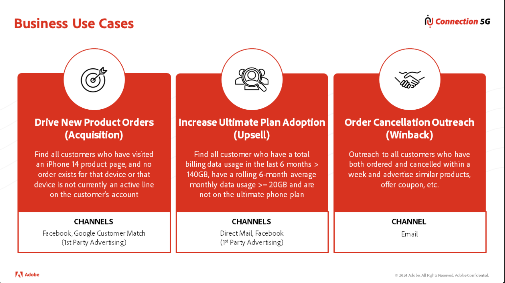

# 反规范化

## 讲座

在本视频中，您将了解将查找表和桥接表折叠回父表的三个反标准化规则，以及个性化和流式分段要求如何影响这些决策。

>[!VIDEO](https://video.tv.adobe.com/v/3459083/?quality=12&learn=on)

## 实验室详细信息

>[!NOTE]
>
>本实验仅重点介绍Connection 5G仓库ERD

## 反标准化规则：

1. 关系模型中标记为“**D**”且具有1\：M基数或标记为“**B**”的任何表都将被定义为父表上的对象数组或映射
1. 由规则#1触发，在反规范化充当数组或映射的“**D**”或“**B**”表之前，询问它们以确定如何以最佳方式将它们反规范化回其父表
1. 关系模型中标记为“**D**”且基数为M：1的任何表都将充当其父表中的对象或字段列表

## 个性化规则的非规范化：

在构建数据模型时，请始终记得查看客户用例。  请牢记以下内容：

- 流式分段在评估时无权访问查找表
- 只能访问用户档案的特征和区段成员资格来个性化内容

为个性化应用反标准化时考虑的

>[!NOTE]
>
>在本实验中，请记住引用Connection 5G培训场景.pdf！

## 第1步 — 填写个人资料表

1. 从任何相关的“**B**”或“**D**”架构写回需要反正规化的客户帐户表中的字段
1. 查看上面的用例，了解支持流式分段和/或个性化需要哪些其他字段？ 将这些字段添加到表中

## 第2步 — 填写“体验事件”表

1. 将需要反正规化的字段写入任何相关“**B**”或“**D**”表中的“帐单”和“订单”表
1. 查看上面的用例，了解支持流式分段和/或个性化需要哪些其他字段？ 将这些字段添加到表中

## 第3步 — 填写查找表

1. 将需要反正规化的字段写入任何相关“**B**”或“**D**”表的Product查找表中
1. 查看上面的用例，了解支持流式分段和/或个性化需要哪些其他字段？ 将这些字段添加到表中

## 审核

以下视频回顾了Connection 5G表如何反规格化为阵列和对象，以及客户获取和追加销售用例如何需要将其他字段重新添加到主配置文件和事件表中。

>[!VIDEO](https://video.tv.adobe.com/v/3459086/?quality=12&learn=on)
