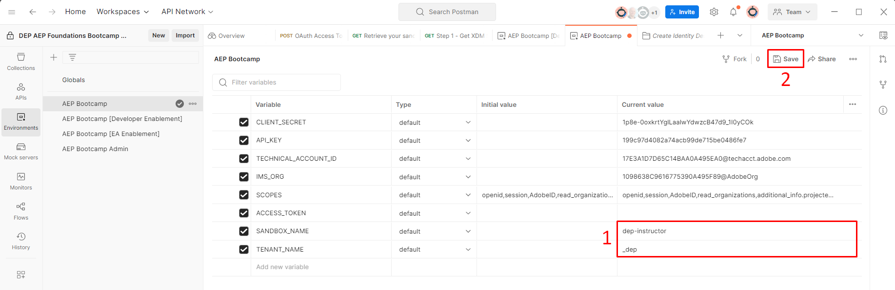

# 环境文件

## Postman环境文件

下载文件 — [AEP Bootcamp.postman_environment.json](assets/aep-bootcamp.postman_environment.json)

## 导入环境文件

1. 单击文件，在浏览器中打开上面的`Environment File`
1. 将文件的URL复制到剪贴板
1. 在本地计算机上启动Postman，然后单击工作区中的`Import`按钮
1. 将`Environment File`的URL粘贴到叠加图的导入模式文本框中。  这应该会触发自动导入

导入后，您可以通过单击左侧边栏中的`Environments`选项卡来验证环境文件是否存在。  您应该会看到类似于下面的内容。

导入后

## 环境变量

在进行任何API调用之前，您需要更新刚刚导入的环境文件中的几个变量。  这些变量在API调用中引用，请确保正确填写了这些变量。  变量分为两组：

- **开发人员项目值** ->这些是从Adobe Developer Console中创建的开发人员项目生成的默认变量
- **其他值** ->这些是自定义创建的变量，通常由用户创建，用于各种Experience Platform API

>[!NOTE]
>
>这些值来自您在[Developer Console安装程序](../sandbox-setup/developer-console-setup.md#collect-your-values)中创建的OAuth服务器到服务器凭据

### 更新开发人员项目值

1. 单击Postman左侧边栏中的`Environments`选项卡
1. 下次单击`AEP Bootcamp`环境文件
1. 为以下列出的变量更新`current values`：
   - 客户端\_密码
   - CLIENT\_ID（也称为API密钥）
   - 技术\_帐户\_ID
   - IMS组织

完成后，您的环境文件应类似于以下内容：

更新CLIENT_SECRET、CLIENT_ID、TECHNICAL_ACCOUNT_ID和IMS_ORG值后的

### 更新其他值

唯一需要更新的其他值是`SANDBOX_NAME`变量和`TENANT_NAME`变量。

- `SANDBOX_NAME` — 告知Adobe Experience Platform要针对哪个沙盒执行
- `TENANT_NAME` — 用于在特定XDM调用中预填充租户名称

>[!NOTE]
>
>如果您按照自己的步调完成这些实验室（而不是参加具有sandbox-assignment.pdf的实时培训活动），您可以在从Adobe Experience Platform UI URL登录到沙盒时找到这两个值，例如：
>
>`https://experience.adobe.com/#/@dep/sname:prod/platform/home`
>
>- `SANDBOX_NAME`是`sname:`之后的值 — 在此示例中，`prod`
>- `TENANT_NAME`是`@`符号后的值，前缀为下划线 — 在此示例中，`_dep`

1. 为以下列出的变量更新`current values`：
   - 沙盒\_名称
   - 租户\_名称
1. 单击环境工作区右上角的`Save`按钮保存您的更新

完成后，您的环境文件应该如下所示：

更新SANDBOX_NAME和TENANT_NAME值后的

>[!TIP]
>
>恭喜！ 您已完成Postman环境配置
