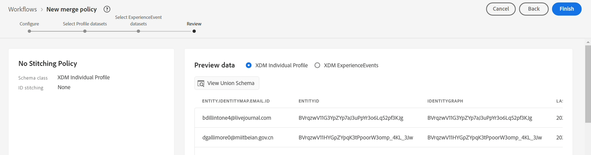
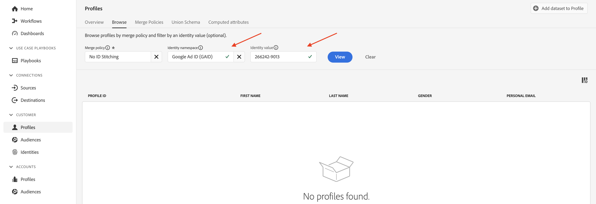

# 合并策略

## 这是什么？

每次搜索配置文件时，您都会在配置文件查看器中看到合并策略（您可能只是不知道它执行了某些操作）

合并策略执行两项操作：

1. 提供如何在配置文件存储中组合片段（即身份拼接）的说明。 有两个选项：
   - 使用身份图（即Identity Service）
   - 请勿使用身份图（即仅依赖提供的身份来查找存储类似的配置文件片段）
1. 告知配置文件服务当某个字段可能来自多个数据集（即合并方法）时，如何解决基于XDM单个配置文件类的数据集中的字段冲突。 有两个选项：
   - 时间戳优先顺序 — 将所有数据集中的最新记录用作真值集，并让所有其他记录按从最近到最旧的顺序填充空隙
   - 数据集优先级 — 选择允许用于组成用户档案的XDM个人资料数据集以及它们的组合顺序

&#x200B;> [!NOTE]
>
>当选择了“数据集优先级”的合并方法时，您可以选择允许在配置文件生成中使用哪些XDM个人配置文件和XDM体验事件数据集。
>
>时间戳优先合并方法始终利用所有数据集

>[!WARNING]
>
>每个沙盒至少需要一个标记为&#x200B;**默认**&#x200B;合并策略的合并策略才能进行分段和配置文件

>[!NOTE]
>
>我们多次进行设计，以便不需要使用使用使用数据集优先级的自定义合并策略。
>
>- 与其让多个数据集记录相同的字段，我们为它们指定唯一的名称，例如：
>  - 名字 — CRM
>  - 名字 — 忠诚度
>  - 名字 — Web窗体
>- 这允许营销人员选择要使用的数据源+字段，而不是系统根据他们可能不了解的规则集自动选择一个字段，并且可能在不了解的情况下从一个源选择用户档案的字段，从另一个源选择其他字段。
>- 对于数据模型，我们不需要解决任何字段冲突，因此不需要自定义合并策略

要最好地了解合并策略如何使用身份图，您可以创建一个不利用身份图进行ID拼接的合并策略。

## 创建无拼合合并策略

创建一个不使用ID图的合并策略，以便您能够通过配置文件形成查看其行为。

## 创建

1. 单击左边栏中的&#x200B;**配置文件**
1. 在顶部导航中单击&#x200B;**合并策略**
1. 单击屏幕最右侧附近的&#x200B;**创建合并策略**

## 配置

现在，您需要配置合并策略设置。  输入以下信息：

| 设置 | 值 |
| --------------------------- | --------------- |
| 名称 | 无ID拼接 |
| ID拼接 | 无 |
| 默认合并策略 | 已禁用 |
| Edge上的活动合并策略 | 已禁用 |

完成后，单击&#x200B;**下一步**

## 选择配置文件数据集

1. 对于合并方法，选择&#x200B;**已排序的时间戳**
1. 单击&#x200B;**下一步**

## 选择体验事件数据集

请记住，如果您选择为合并方法排序的时间戳，则您将告知配置文件服务，所有XDM单个配置文件和基于体验事件类的数据集都将参与配置文件的形成。

因此，您只需单击&#x200B;**下一步**&#x200B;即可，因为此步骤中没有任何可执行的操作。

## 审核

在最后一步中，您将看到所选设置的预览，并显示正在运行的合并策略的样本配置文件。

单击&#x200B;**完成**&#x200B;按钮以创建合并策略

## 操作中的合并方法

请记住配置文件的身份图“深度模式”，它类似于下面的屏幕截图。 要了解配置文件服务的工作方式，最好在装配过程中忽略使用此标识图。

深度模式配置文件的

## 使用电子邮件进行比较

按照以下步骤继续并打开配置文件查看器：

1. 单击左边栏中的&#x200B;**配置文件**，然后在顶部导航中选择&#x200B;**浏览**
1. 选择&#x200B;**电子邮件**&#x200B;的身份命名空间
1. 输入&#x200B;**depeche.mode\@dep.com**&#x200B;的标识值
1. 单击&#x200B;**查看**&#x200B;按钮查找配置文件
1. 单击指向配置文件的&#x200B;**链接**&#x200B;以查看配置文件的详细信息

再次搜索深度模式配置文件，但这次使用&#x200B;**无ID拼接**&#x200B;合并策略。

1. 在左边栏中右键单击&#x200B;**配置文件**，然后选择&#x200B;**在新选项卡中打开**
1. 在顶部导航中选择&#x200B;**浏览**
1. 选择&#x200B;**无ID拼接**&#x200B;的合并策略
1. 选择&#x200B;**电子邮件**&#x200B;的身份命名空间
1. 输入&#x200B;**depeche.mode\@dep.com**&#x200B;的标识值
1. 单击&#x200B;**查看**&#x200B;按钮查找配置文件
1. 单击指向配置文件的&#x200B;**链接**&#x200B;以查看配置文件的详细信息

比较这两个配置文件视图时，您应该注意到它们之间差异很大。 使用&#x200B;**无ID拼接**&#x200B;合并策略的版本中缺少某些属性和身份。

如果您查看每个配置文件的事件，您会注意到使用&#x200B;**无ID拼接**&#x200B;合并策略的配置文件只包含单个事件，而另一个版本包含所有事件。

个人资料的“无ID拼接”版本中存在单个事件，因为该事件是使用“personalEmail.address”的主要身份存储的。

>[!NOTE]
>
>请记住，当使用未使用身份图配置文件的合并方法时，将仅依赖提供的身份来查找存储类似的配置文件片段。

## 使用客户ID进行比较

您可以使用图形中的其他一些身份来查看深度模式配置文件的各种片段。  尝试使用无ID拼接合并策略再次查找同一配置文件，但这次使用下面提供的customerID命名空间和值：

| 身份命名空间 | 值 |
| ------------------ | --------- |
| 客户ID | 266242885 |

在按无ID拼接合并策略的customerID查找深度模式时，

**要问自己的问题**

问题：是否注意到任何有关属性的信息？ 根本就没有，为什么？

回答：您使用电子邮件作为主要标识来加载属性

问题：是否注意到有关事件的任何信息？

回答：唯一显示的事件是将customerID作为主标识的事件

## 使用GAID进行比较

尝试使用无ID拼接合并策略再次查找同一配置文件，但这次使用下面提供的GAID命名空间和值：

| 命名空间 | 值 |
| --------- | ----------- |
| GAID | 266242-9013 |

**要问自己的问题**

问题：未找到配置文件！ 怎么回事？ 为什么未找到配置文件？ 回答：没有使用该GAID值作为主身份存储的配置文件片段

## 个人资料+身份

快速简要说明：

- 配置文件存储区包含使用主标识存储的配置文件片段
- 身份图包含两个(2)或更多基于人员的身份之间的关系

当身份图与配置文件存储一起使用时，您可以将其视为就如何找到将身份图中的每个身份值视为主要身份的正确配置文件片段提供指导。

如果没有身份图，配置文件存储只能使用单个标识符（即主身份）检索配置文件片段

&#x200B;> [!TIP]
>
>**有额外的时间，想试一试……：**
>
>- 在您知道的UI中搜索具有两个身份的其他配置文件
>- 查看如何针对一个片段存储某些事件，而不是针对另一个片段存储这些事件
>- 了解如何针对一个片段而不是另一个片段存储某些配置文件属性
>- 转到您已查找的配置文件，并使用&#x200B;**无ID拼接**&#x200B;合并策略重新查找它。  请注意区别
