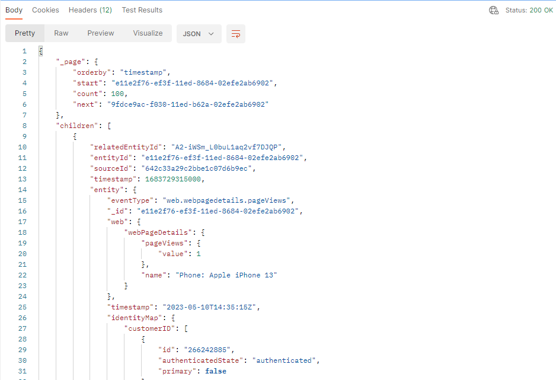
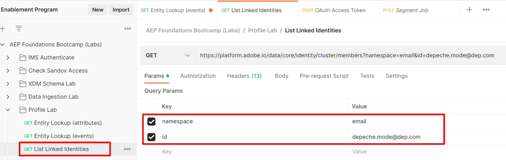

# 配置文件和标识API

## 配置文件实体API

在使用Real-time Customer Profile时，了解如何利用配置文件API至关重要。 它解锁了快速分类与调试的能力，同时还为您提供了围绕从呼叫中心到网亭的系统集成的无限可能性。

最重要的API之一是配置文件实体API。  此API允许您查找单个配置文件（就像在UI中看到的一样），但使用参数来指示您是要查看配置文件的属性还是事件。

以下是配置文件实体API的GET方法的整个规范

## API概述

以下是调用配置文件实体API所需的最低信息。

`GET https://platform.adobe.io/data/core/ups/access/entities`

### 必需的查询参数

随每个请求发送此参数。 其值取决于您是查找用户档案的属性还是其事件：

| 参数 | 类型 | 描述 | 示例 |
| ------------- | ------ | ---------------------------------------------------------------------------------------------------------------------------------------------- | ------------------------------ |
| `schema.name` | 字符串 | 要查找的实体的XDM架构类名称。 | `_xdm.context.profile` |
| `schema.name` | 字符串 | 请改用此值查找用户档案的事件。 请将其与`relatedSchema.name=_xdm.context.profile`配对，以将事件范围限定为配置文件。 | `_xdm.context.experienceevent` |

### 标识要查找的实体

大多数请求使用`entityId`和`entityIdNS`通过任何已知标识值（如电子邮件地址、CRM ID或忠诚度ID）来标识实体，而不是要求您已经知道其XID。 XID是Identity Service生成并在内部分配的base64编码标识符，用于表示身份，将其命名空间和ID值合并到单个压缩令牌中（有关详细信息，请参阅[原生XID](https://experienceleague.adobe.com/docs/experience-platform/identity/api/list-native-id.html?lang=zh-Hans)）：

| 参数 | 类型 | 描述 | 示例 |
| ------------ | ------ | ---------------------------------------------------------------------------------------------------------------------------------------------- | ---------------------- |
| `entityId` | 字符串 | 要查找的标识符值。 如果您已经知道实体的XID，请在此单独使用它并忽略`entityIdNS`。 | `depeche.mode@dep.com` |
| `entityIdNS` | 字符串 | `entityId`所属的身份命名空间代码（例如，`email`、`crmid`、`ECID`）。 当`entityId`还不是XID时需要。 | `email` |

>[!NOTE]
>
>本实验的Postman请求按其电子邮件地址(`entityIdNS=email`， `entityId=depeche.mode@dep.com`)而不是其XID查找深度模式配置文件。

### 必需的标头

每个请求还需要以下标头：

| 页眉 | 类型 | 描述 | 示例 |
| ----------------- | ------ | ---------------------------------------------- | --------------------- |
| `x-gw-ims-org-id` | 字符串 | IMS组织ID。 | `<your IMS org>` |
| `x-api-key` | 字符串 | 已注册项目/凭据的API密钥。 | `<your API key>` |
| `Authorization` | 字符串 | 请求的持有者令牌。 | `Bearer <your token>` |

>[!NOTE]
>
>有关查询参数的完整列表，请参阅[配置文件实体API引用](https://developer.adobe.com/experience-platform-apis/references/profile#tag/Entities)，这些参数包括其他身份查找选项、事件筛选(`startTime`、`endTime`、`property`、`orderby`、`limit`)、字段选择和合并策略覆盖。

>[!WARNING]
>
>请记住，所有API请求都是特定于沙盒的，因此在使用这些API时，请务必确保每个名为`x-sandbox-name`的请求中的标头参数均正确设置为相应的沙盒。
>
>对于此实验室，您的环境文件中已设置`x-sandbox-name`

## 实体查找（属性）

要了解实体查找API，请使用上一个实验室的深度模式配置文件。

1. 打开&#x200B;**Postman**&#x200B;并导航到&#x200B;**配置文件实验室**&#x200B;文件夹
1. 单击&#x200B;**实体查找（属性）**&#x200B;请求以将其打开
1. 通过单击&#x200B;**发送**&#x200B;按钮执行调用

   发送&rbrack;(assets/profile-and-identity-apis-entity-lookup-attributes-request.png "配置文件实体查找（属性） API之前，实体查找（属性）调用的!&lbrack;Postman请求窗格")

   成功的请求应使用`200 OK`进行响应，您应会看到一个包含深度模式配置文件所有属性的结果。

   

   >[!NOTE]
   >
   >默认情况下，如果未在配置文件实体请求中指定合并策略，则它在沙盒中使用默认合并策略

   使用实体API时，您可以使用许多查询参数来更改响应中返回的内容。

1. 在实体查找（属性）请求中，单击该请求的&#x200B;**参数**&#x200B;选项
1. 选中名为&#x200B;**字段**&#x200B;的&#x200B;**键**&#x200B;旁边的框
1. 单击&#x200B;**发送**&#x200B;按钮以执行请求

启用字段参数的

>[!NOTE]
>
>请注意，还有一个用于指定`mergePolicyId`的参数。  您可以使用其他API或使用UI查找ID，找到其价值。

成功的请求应使用`200 OK`响应，并且您应该只看到在刚刚启用的参数过滤器中指定的字段：“名字”、“姓氏”和“活动产品”数组。

>[!TIP]
>
>恭喜！  您已成功利用配置文件实体API查找配置文件属性

## 实体查找（事件）

要查找配置文件的事件，请使用相同的配置文件实体API。  唯一的区别是，您必须告诉配置文件服务您希望更改要在响应中使用的类类型。

1. 单击&#x200B;**实体查找（事件）**&#x200B;请求以将其打开
1. 通过单击&#x200B;**发送**&#x200B;按钮执行调用

发送前实体查找（事件）调用的

成功的请求应使用`200 OK`进行响应，您应会看到一个包含深度模式配置文件的所有事件的结果。

就像在查找配置文件属性时一样，实体API具有更多查询参数，可以利用这些参数更改响应中返回的内容。

您可以通过在Params部分中启用它们并执行请求来尝试其中的一些方法。  试试看，看看它是如何运行的！

**示例查询参数定义**

| 键 | 值 | 描述 |
| ------------- | ------------------------------- | --------------------------------------------------------------------------------------------------------------------------------------------------------- |
| mergePolicyId | \&lt;blank> | 如果提供，您可以切换用于执行查找的合并策略。 对于实验室，将其保留为空表示它将使用沙盒默认合并策略 |
| 字段 | eventType，timestamp，identityMap | 仅显示每个事件中的这些字段，无论指定的字段是否具有值 |
| 属性 | eventType=&quot;order.placed&quot; | 将配置文件事件筛选为仅包含“order.placed”类型的事件 |
| orderby | +时间戳 | 按降序排列事件 |
| limit | 5 | 在响应中仅显示五个事件 |

>[!NOTE]
>
>您可以在此处了解有关所有查询参数选项的更多信息 — > [https://developer.adobe.com/experience-platform-apis/references/profile/#tag/Entities/operation/retrieveEntity](https://developer.adobe.com/experience-platform-apis/references/profile/#tag/Entities/operation/retrieveEntity)

## Identity服务群集API

在某个时候，您可能会对身份图中的哪些身份属于特定配置文件的身份集群产生疑问。  此API允许您传递单个身份命名空间/值，作为响应，您将收到该配置文件的完整身份群集。

自己试试看：

1. 单击&#x200B;**列出链接身份**&#x200B;请求以将其打开
1. 通过单击&#x200B;**发送**&#x200B;按钮执行调用

>[!NOTE]
>
>请注意，请求中的参数是身份命名空间和ID（即值）

在发送之前为List Linked Identities调用设置

成功的响应应类似于下面的屏幕截图

>[!NOTE]
>
>您注意到响应包含配置文件深层模式的所有身份
