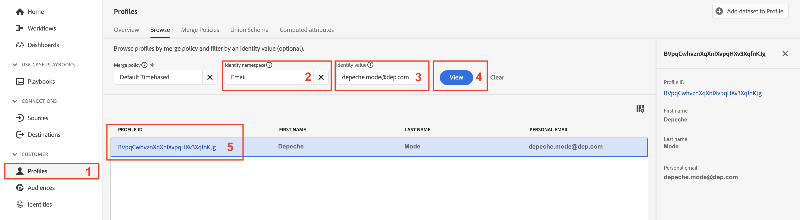

# 配置文件基础知识

## 配置文件合并架构

请记住，任何实时客户配置文件的视图都是使用您为配置文件定义和启用的架构构建的。 这是Adobe称为配置文件的合并架构。

您可以通过执行以下操作查看配置文件的合并架构：

1. 单击左边栏中的&#x200B;**配置文件**
1. 单击顶部导航中的&#x200B;**合并架构**

在配置文件顶部导航下

>[!NOTE]
>
>请记住，配置文件为每个XDM类创建一个联合视图。 您可以利用此视图来查看哪些架构对什么类、每个类中的标识以及任何关系做出了贡献。

查看XDM Individual Profile类的合并架构，并展开租户命名空间。 此处您应该看到许多项目来自您在&#x200B;**LID方法**&#x200B;和&#x200B;**XDM建模实验室**&#x200B;中定义的各种架构。

已展开的XDM个人配置文件类的

单击&#x200B;**帐户**&#x200B;对象并注意屏幕右边栏中显示的内容。 现在，您可以查看有关对象的详细信息、哪些架构和数据集促成了其形成以及其他相关信息。


>[!NOTE]
>
>合并模式是一种非常好的工具，可用于了解为什么某些元素存在于用户档案中以及它们来自何处。
>
>请记住，合并架构是可观察的，这意味着在查看实际的实时客户配置文件时，配置文件将仅显示包含数据的字段


## 配置文件查找

1. 单击左边栏中的&#x200B;**配置文件**，然后在顶部导航中选择&#x200B;**浏览**
1. 选择&#x200B;**电子邮件**&#x200B;的身份命名空间
1. 输入&#x200B;**depeche.mode\@dep.com**&#x200B;的标识值
1. 单击&#x200B;**查看**&#x200B;按钮查找配置文件
1. 单击指向配置文件的&#x200B;**链接**&#x200B;以查看配置文件的详细信息




您现在应该看到此内容！

通过电子邮件查找后

请花一分钟时间查看顶部导航中的每个选项卡，以浏览个人资料深层模式。 这些是您将使用的选项卡：

- 详细信息 — 显示自定义信息卡，这些信息卡显示给定用户档案的各个方面
- 属性 — 显示来自合并架构的给定配置文件的所有关联属性
- 事件 — 显示给定用户档案所有来自合并架构的相关事件
- 受众成员资格 — 显示个人资料当前所属的受众

## 查看属性

导航到&#x200B;**属性**&#x200B;选项卡，然后单击&#x200B;**查看JSON**


查看如何显示您添加到客户帐户架构的字段组中的字段。

- 查找标题为&#x200B;**entity**&#x200B;的父节点
- 请注意子对象&#x200B;**billingAddress** （它来自个人联系人详细信息字段组）

```json
"billingAddress": {
  "postalCode": "11355",
  "city": "New York City",
  "state": "NY",
  "street1": "108 Ruskin Terrace"
}
```

将此与配置文件合并架构具有的进行比较，您应该用灯泡指示可观察的含义😄

```json
"billingAddress": {
    "_repo": {
        "createDate": "datetime",
        "modifyDate": "datetime",
    },
    "_schema": {
        "description": "string",
        "elevation": "double",
        "latitude": "double",
        "longitude": "double"
    },
    "_id": "string",
    "city": "string",
    "country": "string",
    "countryCode": "string",
    "createdByBatchID": "string",
    "dmaID": "integer",
    "label": "string",
    "lastVerifiedDate": "date",
    "modifiedByBatchID": "string",
    "msaID": "string",
    "postOfficeBox": "string",
    "postalCode": "string",
    "primary": "boolean"
    "region": "string",
    "repositoryCreatedBy": "string",
    "repositoryLastModifiedBy": "string",
    "state": "string",
    "stateProvince": "string",
    "status": "string",
    "statusReason": "string"
    "street1": "string",
    "street2": "string",
    "street3": "string",
    "street4": "string"
}
```

>[!NOTE]
>
>可观察架构实际上是指仅显示存在数据的字段并隐藏不包含数据的字段。  与传统关系数据库大不相同！


下一个查找&#x200B;**同意**&#x200B;对象（这来自“同意和偏好设置详细信息”字段组）

```json
"consents":{
   "marketing":{
      "sms":{
         "val":"y"
      },
      "email":{
         "val":"y"
      }
   }
}
```


向下滚动到租户命名空间&#x200B;**\_devbc**，并查找&#x200B;**计划**&#x200B;对象（该对象来自名为“dep：计划详细信息”的自定义创建的字段组）

```json
"plan": {
    "planID": "m3",
    "type": "mobile",
    "name": "pro"
}
```


请注意您为追加销售用例定义的&#x200B;**聚合**&#x200B;对象。 这些字段也位于租户命名空间\_devbc下。 它们来自不同的架构（依赖：客户聚合）和自定义字段组（依赖：聚合）

```json
"aggregates":{
   "rollingSixMonthAvgMonthlyDataUsage":30,
   "rollingSixMonthTotalDataUsage":200
}
```

## 查看身份映射

你还可以看到配置文件的关联身份，因为它们存储在名为&#x200B;**identityMap.**&#x200B;的基于映射的对象中 在JSON文档底部附近查找&#x200B;**identityMap**。

这是您传入的所有标识的表示形式，无论您是使用identityMap字段还是使用标识描述符标记字段。

```json
"identityMap": {
  "ecid": [{
          "id": "34537751351243145301122536487445728054"
      },
      {
          "id": "66385443304271800137026604878870723316"
      },
      {
          "id": "34537751351243145301122536483456723542"
      }
  ],
  "email": [{
          "id": "dave.gahan@dep.com"
      },
      {
          "id": "depeche.mode@dep.com"
      }
  ],
  "customerid": [{
      "id": "266242885"
  }],
  "gaid": [{
          "id": "266242-9013"
      },
      {
          "id": "266242-9012"
      }
  ]
}
```

>[!NOTE]
>
>请注意，identityMap中没有引用“主要身份”的概念。 原因有两个：
>
>1. 您在配置文件属性中看到的identityMap是利用Identity Service的图形为每个配置文件创建的\*
>2. 身份图只关心身份之间的关系。 每个身份都受到同样的对待。 A与B相关，无论它是否通过主要身份、人员身份等实现。
>
>*\*&#x200B;如果未使用标识图，则identityMap仅由查找*中请求的标识组成

>[!NOTE]
>
>构建客户帐户架构时，您只有一个标记为身份的电子邮件字段（即personalEmail.address）。 您是否注意到identityMap有两个电子邮件地址！
>
>怎么回事？
>
>- 当数据流入其服务时，身份图会不断记录新关系和这些关系中的值
>- 配置文件的行为是在将数据摄取到其服务中时，使用新值覆盖现有字段值
>- 当您使用标识描述符标记某个字段时，它仍然是配置文件的一个字段


## 身份图

导航回顶部导航中的&#x200B;**详细信息**&#x200B;选项卡，然后单击位于&#x200B;**链接身份**&#x200B;卡片底部的&#x200B;**查看身份图形**&#x200B;链接


您现在应该会看到此屏幕。


上面的视图是Depeche Mode配置文件的身份图，该视图分为三(3)个关键区域：

**身份图形可视化工具** — 显示身份及其在配置文件身份集群中的关联关系

**身份图形详细信息** — 提供有关整个身份图形命名空间、值和数据源的特定详细信息，这些命名空间创建了身份图形可视化工具中看到的所有关系

**选定的身份详细信息** — 显示有关选定身份的详细信息，以及关系中处理该身份的最后五(5)个批次

>[!NOTE]
>
>身份图查看器会显示所有身份之间的关系，以及上次查看身份关系时和来自哪个数据集的信息


改为使用customerID身份查看深度模式的身份图。  执行以下操作：

1. 将&#x200B;**customerID**&#x200B;复制并保存到某个位置。
1. 将“身份命名空间”框中的命名空间值更改为&#x200B;**customerID**
1. 粘贴您在上一步中保存的&#x200B;**customerID**&#x200B;值
1. 单击&#x200B;**查看**&#x200B;按钮以查看使用新标识值包含此标识的标识图


>[!NOTE]
>
>请注意您是如何查看完全相同的身份图的！ 从此图表使用的任何标识将始终产生相同的结果


## 更改身份

现在返回配置文件查看器并使用customerID查找深层模式

1. 将身份命名空间更改为&#x200B;**customerID**
1. 使用您在上一部分中保存的customerID值更新标识值
1. 单击&#x200B;**查看**&#x200B;按钮


您应该会看到之前查看过的相同个人资料！


>[!NOTE]
>
>身份图可确保您在组装各种配置文件片段时使用的任何身份都会产生相同的配置文件
