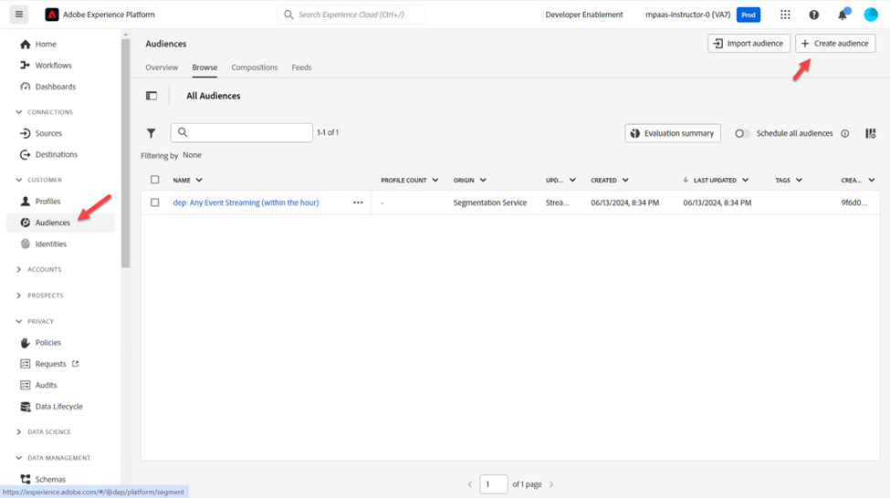

# 创建Edge受众

当有效负载（如页面查看）从客户端（如Web SDK）流入Edge时，将使用此受众来授予某人资格。

>[!NOTE]
>
>我们通常在Edge上评估受众，以便我们转向并在Personalization中使用它。 如果我们没有在Edge上执行Personalization，则只需将受众评估为网络中心上的流即可。

## 创建受众

1. 在左边栏中，单击受众
1. 然后单击屏幕右上角的创建受众
1. 然后单击“生成规则”

## 将受众转换为规则

1. 转到&#x200B;**受众**&#x200B;并单击&#x200B;**Experience Platform**&#x200B;文件夹
1. 将名为&#x200B;**dep：任何事件流（在一小时内）**&#x200B;的受众拖放到画布上

1. 单击下面显示的&#x200B;**图标**，然后单击&#x200B;**转换**，将受众转换为画布中的一组规则

画布中的

## 更新事件规则

对事件规则进行以下更改（您可能需要展开事件才能看到它）

1. 最近
1. 15
1. 分钟

## 发布区段

1. 将区段的名称更新为&#x200B;**任何事件Edge（在15分钟内）**
1. 将评估方法更新到Edge
1. 发布区段

## 创建批次评估区段

重复刚刚对创建的边区段执行的相同步骤，但改用以下信息：

>[!NOTE]
>
>我们将创建批量受众，以便您能够看到，即使将事件传递到Edge，任何保存为批量评估的受众都不会以流式方式进行评估。

事件规则：

- 最近
- 1
- 天

区段详细信息：

- 名称 — > **任何事件批次（1天内）**
- 评估方法 — >批次
