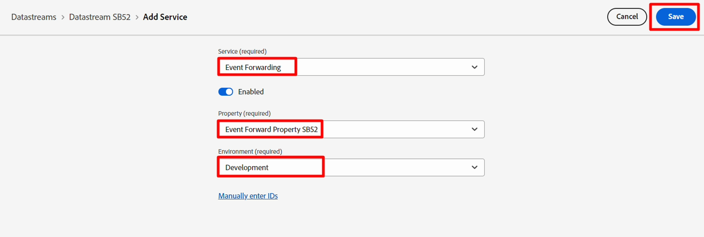

# 创建数据流

数据流定义哪些服务将利用它。

- 将数据发送到Edge时，您可以指定要使用的数据流
- 发送到这些数据流的数据随后可以根据配置的服务采取操作
  - 事件转发
  - Adobe Experience Platform

## 创建新数据流

1. 在左边栏中的&#x200B;**数据收集**&#x200B;下，单击&#x200B;**数据流**
1. 然后单击&#x200B;**新建数据流**&#x200B;以创建一个数据流

## 配置数据流

使用以下信息配置数据流：

1. 名称 — > **数据流SB + \&lt;沙盒名称> （即数据流SB01）**
1. 事件架构 — > **dep： Web**
1. 在&#x200B;**地理位置和网络查找**&#x200B;下切换&#x200B;**打开**&#x200B;所有选项
1. 完成后单击&#x200B;**保存**&#x200B;按钮

>[!WARNING]
>
>请勿单击“保存并添加映射”。  如果你不小心取消了

保存数据流后，您会看到以下屏幕：

保存新数据流后立即显示的

## 添加事件转发服务

这样，您就可以对此数据流接收的数据使用事件转发。

1. 单击&#x200B;**添加服务**

1. 配置以下项目：

- 服务 — >事件转发
- 属性 — >选择您在上一步中创建的属性。  其名称应如下所示：事件转发属性SB + \&lt;您的沙盒编号>
- 环境 — >开发

1. 完成后，单击&#x200B;**保存**

## 添加Adobe Experience Platform服务

这样，您就可以将数据发送到中心，并在此数据流接收的数据集中登陆。

1. 单击&#x200B;**添加服务**

突出显示带有“添加服务”按钮的

1. 配置以下项目：

- 服务 — >Adobe Experience Platform
- 事件数据集 — > dep： Web
- 配置文件数据集 — >依赖：客户帐户
- 选中复选框 — > Edge分段
- 选中复选框 — > Personalization目标

1. 完成后，单击&#x200B;**保存**。

1. 您的最终屏幕应如下图所示，其中提供了两项服务。 **复制**&#x200B;和&#x200B;**将**&#x200B;数据流ID **保存**&#x200B;到本地计算机（稍后在Postman中使用）

