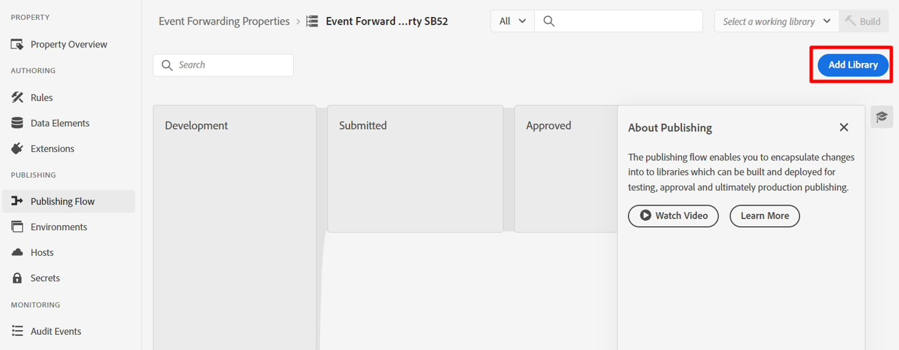
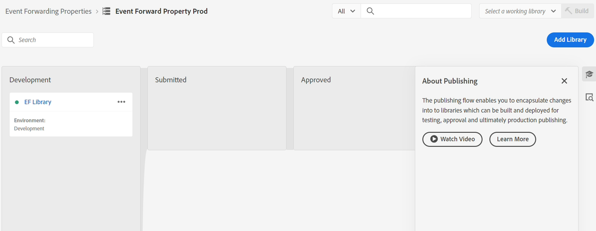

# 创建属性

我们通常希望将Experience Event转发给第三方（不过没有必要这样做）。 当在特定情况下（例如，将购买事宜通知Google、Meta或TikTok）需要实时提供事件的副本以通知第三方时，通常使用此选项。

>[!NOTE]
>
>提醒：资产包含决定转发内容以及在何处转发内容所需的所有扩展、数据元素和规则

1. 在左边栏中，单击事件转发
2. 然后单击New Property


3. 使用以下公式更新属性名称： `Event Forward Property SB + [sandbox number]`。 您的最终名称类似于：**事件转发属性SB01**

4. 完成后单击&#x200B;**保存**


## 安装扩展

1. 单击刚刚创建的事件转发属性


2. 您应该会看到如下所示的屏幕。  单击&#x200B;**扩展**。


3. 通过执行以下操作安装Adobe Cloud Connector扩展：

4. 单击顶部导航中的&#x200B;**目录**
5. 单击&#x200B;**Adobe Cloud Connector**&#x200B;卡
6. 在右边栏中，单击&#x200B;**安装**&#x200B;按钮


单击install后，您应该会在资产的Installed扩展下看到该扩展，如下所示


## 创建数据元素

>[!NOTE]
>
>数据元素引用传入事件，并且可以根据需要将其解析为多个单独的组件

1. 在左边栏中，单击&#x200B;**数据元素**


2. 单击&#x200B;**新建数据元素**&#x200B;按钮

显示“创建新数据元素”按钮的


3. 使用以下信息配置新数据元素：

| 元素类型 | 要配置的值 |
| ----------------- | ------------------ |
| 名称 | 数据对象 |
| 扩展名 | 核心 |
| 数据元素类型 | 自定义代码 |


4. 单击按钮&#x200B;**打开编辑器**&#x200B;以添加以下自定义代码：


5. 将自定义代码添加到编辑器中（如这样）并保存

```none
var xdm = arc?.event || '';
return xdm;
```


>[!NOTE]
>
>这是在获取整个xdm对象时不会对有效负载进行任何转换。  如果需要，我们可以将XDM对象中的每个单独片段（例如页面名称、购买金额）解析为每个字段一个数据元素。  这样做的原因可能是将结构转换为不同的结构


6. 单击&#x200B;**保存**&#x200B;按钮以保存数据元素。


完成后，您应该会看到以下屏幕，确认您的数据元素已添加：


## 创建规则

>[!NOTE]
>
>规则包含：
>
>1. 转发条件
>2. 可转换有效负载并定义其发送位置的操作


1. 在左边栏中，单击&#x200B;**规则**


2. 然后单击&#x200B;**创建新规则**

显示“创建新规则”按钮的


3. 使用以下公式更新规则名称： `"EF Rule SB" + [your sandbox number]` （即EF规则SB01）。 您可以在浏览器窗口的右上角找到沙盒编号，如下所示\...


4. 完成后单击&#x200B;**保存**

>[!NOTE]
>
>确保您的规则名称遵循`"EF Rule SB" + [sandbox number]`的公式模式


5. 通过单击(+)号向规则中添加操作以添加新操作


## 获取webhook URL（用于操作）

>[!NOTE]
>
>本实验在此处使用webhook，以便您查看数据是否已到达要发送到的目的地。 在现实场景中，您会登录到该目标，并使用其工具来查看哪些内容已到达。


1. 在浏览器的新选项卡中打开以下链接 — > [https://webhook.site](https://webhook.site/)
2. 复制您看到的唯一URL并将其保存在安全位置


3. 使用以下信息配置您的操作：

| 设置 | 值 |
| ----------- | ------------------------------------------------------------------------------------------------------------------------------------------------------------------- |
| 扩展名 | Adobe云连接器 |
| 操作类型 | 进行Fetch调用 |
| 方法 | 帖子 |
| URL | 使用您在设置流目标时使用的相同webhook URL。 您可以在浏览器中打开新选项卡并导航到“目标” -> “浏览”找到它 |
| 正文 | 原始 |
| 正文数据 | \{ &quot;data&quot;： \{ &quot;event&quot;： &quot;\{\{数据对象\}\}&quot; } |

>[!NOTE]
>
>此处引用的\{\{Data Object\}\}是您之前创建的数据元素。 在此，下游系统的要求是要将事件封装在带有事件对象的数据对象中。 你可以把任何格式都放在这里。
>
>如果我们已将\{\{Data Object\}\}拆分为多个字段（例如页面名称、购买等），则可以转换JSON结构并将每个字段放置在所需的位置，以便在匹配目标方面赋予我们更多控制权。


完成验证后，您的屏幕类似于下图，然后单击&#x200B;**保留更改**


4. 完成后，您应该会看到您的操作已添加到规则中。 单击&#x200B;**保存**&#x200B;以继续。


>[!WARNING]
>
>发送体验事件时，发送的是事件，而不是用户档案，也不是其任何属性，包括任何受众资格（即使它是Edge受众）。
>
>这是出于速度目的。


## 发布更改

1. 在左边栏中，单击&#x200B;**发布流**


2. 单击“添加库”按钮&#x200B;****




3. 使用以下信息配置库：

- 名称 — > **EF库**
- 环境 — > **开发**
- 单击&#x200B;**添加所有更改的资源**


完成后，您的屏幕应类似于下面的屏幕截图。  如果一切正常，请单击&#x200B;**保存并生成到开发**&#x200B;按钮


4. 然后，您应该会看到开发内部版本变为绿色，表明它已经可以使用


