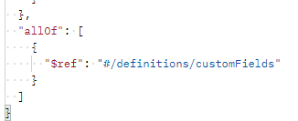
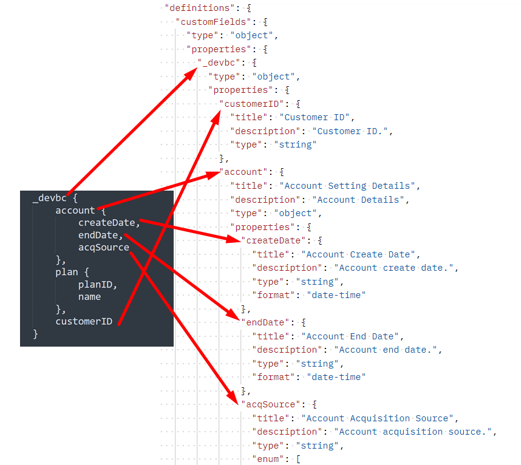

# 创建自定义字段组

## 字段组结构

字段组始终由以下字段组成。 您将在下一步的请求中看到此内容。

| 必需值 | 描述 |
| --------------------------- | ---------------------------------------------------------------------------------------------------------------------------------------------------------------------------------------------- |
| 标题 | 要在架构注册表中创建的字段组的名称。 请注意，名称必须唯一。 |
| 描述 | 有关字段组用途的简短描述 |
| type | 始终是对象 |
| meta\：intendedToExtend | 定义字段组可以使用的类。 类始终由其`$id`值引用 |
| allOf | 描述可包含在字段组中的资源。 对于自定义字段，路径始终为`#/definitions/customFields` |
| definitions.customFields... | 这是创建自定义字段组所需的默认JSON架构结构。 它必须与上面的`allOf`匹配 |
| \&lt;租户\_名称> | 租户名称（即唯一名称）在预配过程中创建。 这可确保所做的任何自定义都不会与现有或未来Adobe架构注册表更改冲突 |

## 创建客户帐户详细信息字段组

1. 单击`XDM Schema Lab -> Create Schema`文件夹中的请求`Step 2 - Create Customer Account Details Field Group` API调用

在执行之前查看请求正文。 请注意，字段组结构部分中提到的必填字段如下所示：

>[!NOTE]
>
>请注意，`allOf`右上方的图像如何引用“/definitions/customFields”的路径。  它必须匹配架构中定义的结构（左侧的图像），因为它可告知XDM系统在何处查找自定义创建的对象。
>
>

另请注意映射表中的每个特定字段如何在XDM JSON结构中实例化。

&#x200B;2. 使用以下格式更新字段组的`title`和`description`： `Customer Account Details - Sandbox <your number here>`

&#x200B;3. 通过单击`Send`按钮执行。  您应该会看到类似于以下屏幕快照的响应。

&#x200B;4. 复制新创建的客户帐户详细信息字段组的`$id`值。

创建自定义字段组后

>[!WARNING]
>
>在将`$id`保存到某个位置之前，请勿继续。  稍后需要创建客户帐户架构
>
>
