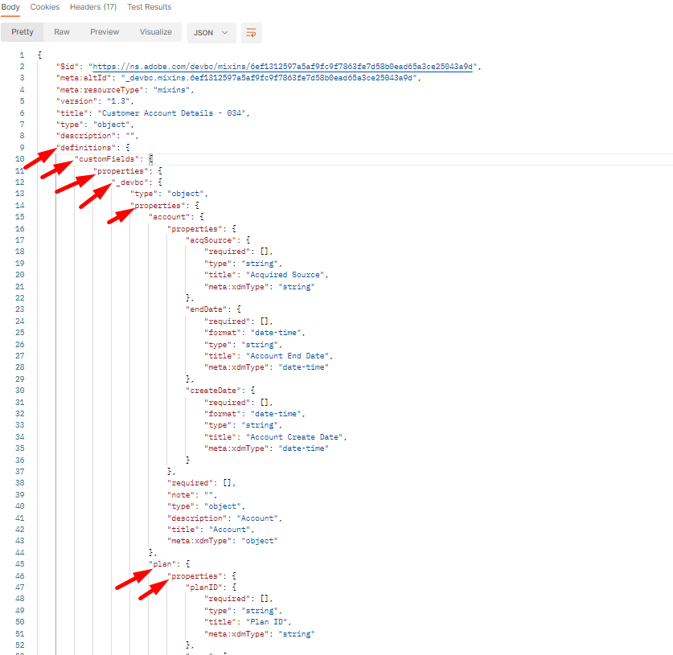

# 修改架构 — JSON修补程序

## 概述

假设在构建架构后，您需要返回并向`plan`对象（名为`planDescription`）添加一个附加字段，因为您在创建架构时忘记添加该字段，或者它是几个月后收到的请求。  要执行此任务，您只需执行`PATCH`操作即可使用新字段更新架构。

您可以通过以下链接了解有关JSON PATCH的更多信息，但在本实验中，假设您对这种做法的原理有一些概念😄

- [https://jsonpatch.com/](https://jsonpatch.com/)
- [Experience League API基础知识](https://experienceleague.adobe.com/docs/experience-platform/landing/platform-apis/api-fundamentals.html?lang=zh-Hans#json-patch)


>[!NOTE]
>
>请记住以下几点：
>
>- 架构由一(1)个类和一(1)个或多个字段组组成
>- 如果不先添加到字段组，则无法将新字段直接添加到架构。 这确保在使用该字段组的任何架构中字段的重用性。


要向架构添加新字段，您需要按顺序执行以下操作。  这是您在以下实验步骤中所执行的操作。

- 确定要在其中添加新资产的字段组
- 构造JSON PATCH调用以更新字段组
- 执行JSON PATCH调用以更新字段组（架构将继承该字段组）


## 查找并标识要更新的字段组

1. 选择位于`XDM Schema Lab -> Customize Schema`文件夹中的`Step 1 - Get Tenant Field groups` API调用
1. 单击`Send`按钮执行请求


>[!NOTE]
>
>请记住，您在自定义字段组中创建了`plan`对象。 在XDM架构注册表中创建的自定义对象称为“租户”，因此使用`/schemaregistry/tenant/mixins/`路径的API调用也是如此。


1. 在响应中搜索您之前创建的标题为`Customer Account Details - Sandbox <your number here> `的自定义字段组的架构ID

1. 复制`$meta:altId`并将其保存在安全的位置，因为下一步需要它


>[!CAUTION]
>
>请确保您选择了要复制的正确字段组！  有一个名称与`dep: Customer Account Details`类似，您应该&#x200B;**不应**&#x200B;使用的名称

>[!WARNING]
>
>在将`$meta:altId `保存到某个位置之前，请勿继续。  在以后的实验步骤中需要它


## 按$meta\：altId查找字段组

1. 在`XDM Schema Lab -> Customize Schema`文件夹中选择`Step 2 - Fetch path for the object to be modified` API调用
1. 在请求的URL中，将`<replace me>`替换为您从上一节步骤保存到调用末尾的`$meta:altId`，如下所示
1. 保存您对请求所做的编辑
1. 单击`Send`按钮执行请求


查看响应并注意&#x200B;**计划**&#x200B;对象的JSON指针路径是使用下面高亮显示的每个属性构建的。




完整撰写的路径与下面显示的内容类似。  复制此路径并保存到某个位置以供参考

```none
/definitions/customFields/properties/_devbc/properties/plan/properties
```

>[!NOTE]
>
>请记住使用您自己的名称更新上面的租户名称(\_devbc)


## PATCH字段组

### JSON PATCH API正文示例

```none
[
    {
        "op": "",
        "path": "",
        "value": {
            "title": "",
            "type": "",
            "description": ""
        }
    }
]
```

- **op （操作）** ->这提供了PATCH应执行哪些操作的说明
- **路径** ->这是您要创建、更新或删除的路径（即指向新字段位置的JSON指针）
- **值** ->这是可选字段，仅在创建或替换现有字段时使用


### 执行API请求

1. 单击`XDM Schema Lab -> Customize Schema`文件夹中的`Step 3 - Modify Tenant Field group` API调用


&#x200B;2. 使用以下信息更新请求正文

- **op** ->` add`
- **路径** -> `path from previous step +`&#x200B;` the new field name`
- **值** ->
  - **标题** -> `Plan Description`
  - **类型** -> `string`
  - **描述** -> `High-level details about the plan`

完成后，您的API请求应当如下所示


>[!WARNING]
>
>确保在您的路径中包含新字段名&#x200B;**planDescription，**


&#x200B;3. 如果一切正常，请`Save`您的呼叫

&#x200B;4. `Execute`执行PATCH的调用

您应会看到`200 OK `响应，现在应会看到字段组中的`planDescription`字段，如下所示：

使用planDescription成功修补字段组后

>[!TIP]
>
>恭喜！ 您已成功使用JSON PATCH更新字段组/架构


## 在UI中查看更改

通过UI浏览您的架构并查看新添加的字段。  很酷吧？

在Experience Platform UI中使用JSON修补程序后，架构中会显示
