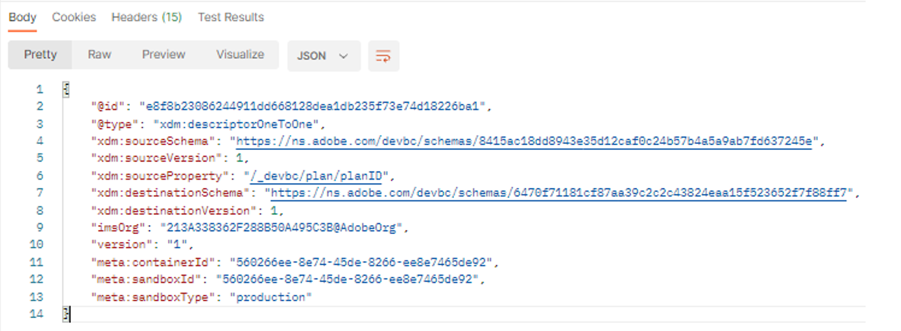

# 创建架构关系

1. 单击`XDM Schema Lab -> Create Relationship Descriptors`文件夹中的`Step 2 - Relationship Descriptor Customer Account To Plan` API请求

>[!CAUTION]
>
>尚未执行请求


&#x200B;2. 在API调用的正文中更新以下属性。

- 将`xdm:sourceSchema`属性的值设置为您从[创建架构](../build-schema/create-schema.md)实验室步骤中保存的客户帐户架构的`$id`
- 将`xdm:sourceProperty`的值设置为客户帐户架构中`planID`字段的路径。
- 将`xdm:destinationSchema`属性的值设置为您在第1步中保存的`dep: Lookup Plan`架构的`$id`

>[!NOTE]
>
>使用客户帐户架构中planId字段的点表示法值并将`.`替换为`/`
>
>
>不要忘记前导`/` 😄

仅示例

```json
{
  "@type": "xdm:descriptorOneToOne",
  "xdm:sourceSchema": "https://ns.adobe.com/devbc/schemas/8415ac18dd8943e35d12caf0c24b57b4a5a9ab7fd637245e",
  "xdm:sourceVersion": 1,
  "xdm:sourceProperty": "/_devbc/plan/planID",
  "xdm:destinationSchema": "https://ns.adobe.com/devbc/schemas/6470f71181cf87aa39c2c2c43824eaa15f523652f7f88ff7"
,
  "xdm:destinationVersion": 1
}
```

>[!NOTE]
>
>请记住使用您自己的名称更新上面的租户名称(\_devbc)


&#x200B;3. 继续使用`Save`按钮之前保存您的请求

&#x200B;4. 通过单击`Send`按钮执行API

您现在应会看到如下的`201 Created`响应



>[!NOTE]
>
>请记住，实时客户配置文件（以及所有Experience Platform）仅支持我们从XDM个人配置文件或XDM体验事件架构中称为&#x200B;**一(1)跳加入**(即，您只能创建一(1)级查找关系)

>[!NOTE]
>
>您是否注意到关系描述符`@type`被设置为值`OneToOne`？ 纸上XDM ERD中的客户帐户与计划表之间的关系不是1\：N？  怎么回事？
>
>
>实时客户配置文件旨在描述个人的特征和行为。  因此，从个人镜头中，查找表是&#x200B;**仅** **永远**，在分段期间被定义为1:1关系。
>
>如果你的大脑受伤了……
