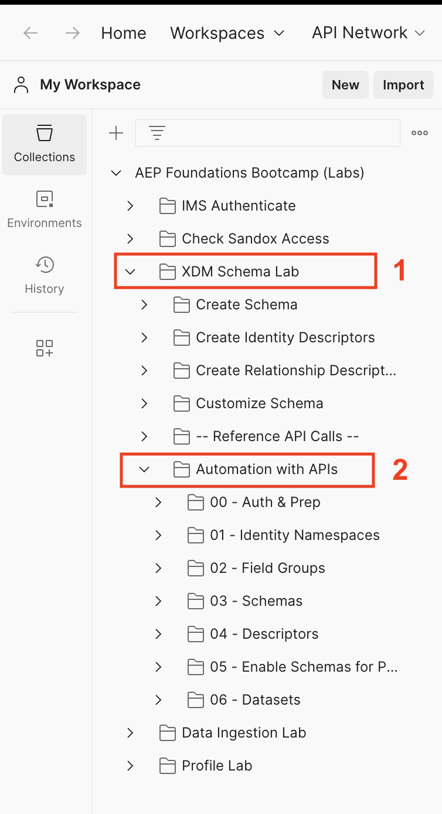

# 使用API实现自动化

## 简介

要了解如何使用API自动部署，请执行API的文件夹以创建以下对象：

- 客户帐户和计划\[Lookup]架构
- 构成上述模式的字段组
- 配置文件所需的身份描述符
- 创建客户帐户与计划之间的关系所需的关系和参考描述符\[Lookup]
- 两个数据集与创建的每个架构匹配

## 执行文件夹

1. 在Postman中，导航到&#x200B;**XDM架构实验室**&#x200B;文件夹中的&#x200B;**使用API自动化**&#x200B;文件夹

   在Postman的XDM架构实验室文件夹内

1. 单击“**API自动化**”文件夹，然后在工作区中单击“**运行**”按钮

   >[!NOTE]
   >
   >运行按钮位于Postman工作区的右上角

   

1. 此时将显示一个新窗口，其中显示了文件夹中的所有API调用。 将&#x200B;**延迟**&#x200B;设置为&#x200B;**500毫秒**，然后单击&#x200B;**运行**&#x200B;按钮。

   在单击“运行”之前，“执行自动化”对话框的延迟设置为500毫秒

1. 您可以看到API调用开始按顺序执行，完成后，您会看到32个通过的测试。

   

1. 转到Experience Platform UI，您会看到为前缀为&#x200B;**postman：**&#x200B;的配置文件创建和启用的两个架构和两个数据集

>[!SUCCESS]
>
>恭喜！  您可以自动部署身份命名空间、字段组、架构、身份/关系描述符，为用户档案启用了架构，并利用该架构生成了一个数据集
