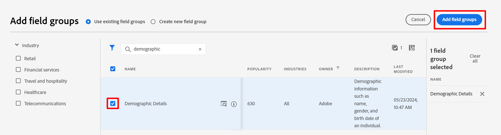

# 为标准对象建模

## 导航到架构

1. 单击左边栏中的&#x200B;**架构**&#x200B;选项卡

   左边栏导航中的

1. 在顶部导航中，您可以看到用于浏览现有架构以及查看当前位于XDM注册表中的字段组和数据类型的选项。

>[!NOTE]
>
>您注意到在您的沙盒中已经预先创建了架构。 这些架构包括在此bootcamp中预创建的架构（它们带有`dep`前缀），以及系统为Adobe Real-Time CDP和Adobe Journey Optimizer生成的架构。

## 创建单个配置文件架构

1. 单击&#x200B;**创建架构**&#x200B;开始

   

1. 选择&#x200B;**手动**

   

1. 选择&#x200B;**个人资料**

## 命名您的架构

基于XDM Individual Profile类的架构允许您收集有关已拼合到配置文件的个人的属性。 类本身包含不可编辑的字段，如&#x200B;*modifiedByBatchID*、*PersonID*&#x200B;等。

1. 为您的架构提供名称和描述。
   - **架构显示名称** —> *客户帐户 — \[您的首字母]*
   - **描述** —>此架构收集个人的身份、计划信息、人口统计详细信息和联系人详细信息。
1. 使用右上角的&#x200B;**完成**&#x200B;按钮保存您的架构。

## 添加人口统计详细信息字段组

Adobe Experience Platform中有许多字段组作为标准XDM存在，可供您添加到架构中并对其进行自定义。

1. 单击字段组部分的左边栏上的&#x200B;**+ （添加）**。

   

1. 搜索&#x200B;**人口统计详细信息**，或通过浏览列表找到它。

   - 找到字段组后，单击字段组右侧的放大镜以查看其结构。  此步骤是一种预览要添加到架构中的内容而不进行添加的有效方法。
   - 完成审阅时关闭预览

   

   

1. **选中**&#x200B;字段组旁边的复选框，然后单击&#x200B;**添加字段组**&#x200B;按钮

## 添加其他标准字段组

您需要向架构添加其他标准字段组。 重复上述步骤将两个额外的字段组添加到您的架构中：

- 个人联系人详细信息
- 同意和偏好设置详细信息

完成后，您的架构将与下图类似。 确保单击&#x200B;**保存**&#x200B;按钮并保存您所做的工作！

在添加人口统计详细信息、个人联系人详细信息以及同意和偏好设置详细信息字段组后后的最终架构

>[!NOTE]
>
>请注意，您选择并添加的字段组现在显示在您的架构中，并显示在左边栏中。 请注意，您添加的每个字段组中并非所有字段都必需。  下一步将删除无关字段。

>[!WARNING]
>
>请确保保存您的架构后再继续！

## 自定义标准字段组

### 人口统计详细信息字段组

人口统计详细信息字段组带来了许多字段，但根据来自LID方法的架构设计，您只需要以下字段：

- person.name.firstname
- person.name.lastName
- person.birthDayAndMonth
- person.birthYear

要从任何Adobe标准字段组中删除字段，请使用&#x200B;**管理相关字段**&#x200B;选项。 管理相关字段允许您从架构中删除标准字段，因此仅保留所需的字段。

1. 选择架构中的&#x200B;**人员**&#x200B;对象
1. 单击右边栏中的&#x200B;**管理相关字段**

   

1. 单击人员左侧的V形标记可展开人员对象，单击姓名对象左侧的V形标记可展开全名对象。 仅保留以下字段：

   - person.name.firstname
   - person.name.lastName
   - person.birthDayAndMonth
   - person.birthYear

   完成后，单击右上角的&#x200B;**确认**&#x200B;按钮。

   

   >[!NOTE]
   >
   >您可以单击&#x200B;**人口统计详细信息**&#x200B;的最顶部复选框以自动取消选择所有子对象，然后仅重新选择所需的子对象！

1. 完成后，您应该会在架构中看到人员对象，如下所示。 要保存架构，请单击&#x200B;**保存**&#x200B;按钮（如果一切正常）。

### 同意和偏好设置字段组

执行与之前相同的步骤集，但这次要对“同意和首选项”字段组执行相同的步骤。

1. 单击左边栏中的&#x200B;**同意和偏好设置**&#x200B;字段组名称，以突出显示架构中的字段。
1. 选择&#x200B;**同意**&#x200B;对象，然后使用&#x200B;**管理相关字段**&#x200B;进程从同意对象中删除不需要的字段。 仅保留以下字段：

- consents.marketing.email.val
- consents.marketing.sms.val

>[!NOTE]
>
>请确保已关闭架构工作区右上角&#x200B;**显示字段**&#x200B;的显示名称的切换
>
>

完成后，您的最终架构现在将类似于此。 请确保单击&#x200B;**保存**&#x200B;再继续。

>[!SUCCESS]
>
>您现在已完成将标准组件添加到架构的过程。 做得好！ 接下来，为架构构建一些自定义属性。
