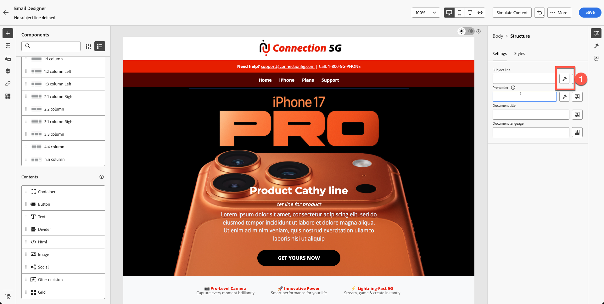

# AI助手和内容个性化

**用途：**&#x200B;了解如何使用Adobe Journey Optimizer的AI Assistant直接在电子邮件设计工具中生成主题行、优化电子邮件文本、调整色调和创建品牌内Firefly图像。

## 学习目标

在本模块结束时，您将能够：

1. 使用AI Assistant生成主题行和预标题。
1. 优化主页文本、描述、语调和消息。
1. 应用AI驱动的改写、摘要和色调调整。
1. 使用具有引用样式和品牌设置的Adobe Firefly生成图像。
1. 将占位符替换为电子邮件设计内生成的图像。

## 简介

AJO中的AI助手可帮助您构建更智能的品牌内内容。
它可以：

- 生成主题行
- 改进现有文本
- 调整语调和清晰度
- 使用Firefly创建品牌图像
- 确保一切符合“连接5G”准则

在本练习中，您将改进使用AI助手创建的电子邮件。

> [!NOTE]
>
>AI Assistant是&#x200B;**非确定性的**，这意味着它每次使用时可能会生成稍有不同的内容。 您在练习过程中看到的内容可能与本指南中的屏幕截图或示例不完全相符。 没关系 — 专注于学习过程和概念，而不是期望得到相同的结果。

## 使用AI助手创建电子邮件主题行

1. 通过单击“返回”按钮返回至Campaign，或编辑您在上一模块中创建的电子邮件。 在上一步中，您可以单击右侧的&#x200B;**设置**&#x200B;选项卡。
2. 单击电子邮件容器>单击编辑电子邮件按钮。
3. 单击内容选项卡，然后单击电子邮件正文
4. 选择&#x200B;**主题行**&#x200B;字段。
5. 单击&#x200B;**AI助手图标**。 （见下文）

主题行字段工具栏中的

6. 您注意到默认情况下会选中“品牌指南”。
7. 输入提示：

>我们将推出iPhone 17，并希望主题行朗朗朗上口

8. 按&#x200B;**生成**。
9. 查看生成的四个变体。
10. 选择具有最佳对齐分数的变体，然后单击&#x200B;**选择**。

> [!NOTE]
>
>您的结果可能与实验指南完全不同，因此您无需担心。 选择您认为正确的标题，然后继续进行实验。

## 改进主页标题和描述

1. 通过单击“编辑电子邮件正文”按钮打开电子邮件。

2. 单击&#x200B;**产品捕捉行**&#x200B;标题。
3. 通过单击&#x200B;**生成并选择文本**&#x200B;打开AI助手

4. 从下拉列表中选择&#x200B;**Connection 5G Brand Guidelines**。

在AI助手下拉列表](assets/ai-assistant-and-content-personalization-brand-guidelines-dropdown.png)中选择了

7. 单击&#x200B;**生成**&#x200B;按钮
8. 查看并选择最佳版本，
9. 如果文本较长，则使用滑块指向&#x200B;**“较短文本”**&#x200B;并重新生成文本。

10. 对文本感到满意后，单击&#x200B;**选择**

## 描述提示

这一次，您将测试AI如何帮助发现问题。

1. 选择下面是模板化文本且没有意义的文本。

2. 单击评估按钮，如下所示。

3. 系统会自动为您的品牌选择原始内容，如下面的步骤1和2所示。 单击&#x200B;**评估**&#x200B;按钮继续。

4. 正如预期的那样，您会注意到许多违反品牌准则的错误。 虽然这些可以通过人工智能进行更正，但在这种情况下，您无需修订现有材料。 相反，您可以原样保留它们，并从头开始创建完全符合品牌标准的新内容。

5. 使用带有以下提示的、使用AI为您生成的新段落。 您可以使用以下提示对描述文本使用相同的方法。

提示：

>*为新的iPhone 17编写引人注目的产品说明。 重点介绍其最令人印象深刻的功能，例如高级摄像头、电池续航时间和性能。 基调应该是优质、激动人心且易于让广大受众理解的。 将其保留在3个句子以下。*

为了节省时间，已为您创建了文本。 复制并粘贴以下内容以获取您的文本。

>了解iPhone 17™ — 它配备先进的摄像头，可提供令人惊叹的照片、可让您持续工作的电池续航时间，以及让您保持领先地位的超快性能。 不要错过这种创新的体验。

您的电子邮件与以下示例类似。

添加新的AI生成的描述文本后

## 添加Firefly生成的图像

到目前为止，我们已在主题行和文本上对AI助手进行了测试。 图像呢？

在深入探讨AI图像生成之前，请查看您可以构建的体验类型。

我们知道我们有侧写出生年份。 我们可以执行的体验之一是创建具有不同变体的块。 有了Adobe Journey Optimizer，这是可能的，也是以Adobe Experience Platform为基础的最大优势之一。 我们将在下一模块中介绍实验，但首先要准备下面的块。

1. 将&#x200B;**Image**&#x200B;组件拖动到iphone 17系列块下方的左侧列。

2. 单击外部，然后选择图像占位符。 （确保单击图像，否则您将看不到Firefly选项。）

3. 在&#x200B;**Firefly**&#x200B;下，单击&#x200B;**生成并选择图像**。

## 上传参考图像

1. 打开&#x200B;**引用样式**。
2. 在品牌选择上选择&#x200B;**连接5G品牌指南**

3. 单击上传图像

Firefly引用样式面板中的

4. 从工具包文件夹中选择reference.jpg

5. 添加图像提示
   `Portrait-oriented image of a confident man in his early to mid-40s, standing alone at night in a neon-lit urban street, focused on his smartphone. Cinematic cyberpunk-inspired city atmosphere with colorful LED signs, cool blue and warm orange lighting, shallow depth of field, soft bokeh lights in the background. Modern lifestyle, tech-savvy mood, realistic skin tones, high contrast, photorealistic, professional lighting, ultra-detailed`.

## 选择图像设置

选择您的&#x200B;**图像设置**：

1. 选择以下设置：
   - **比率：**&#x200B;横向(4:3)
   - **内容类型：**&#x200B;照片
   - **颜色和色调：**&#x200B;冷色调
   - **照明：**&#x200B;戏剧性的照明
1. 按&#x200B;**生成**&#x200B;按钮

## 选择并插入生成的图像

1. 通过检查生成的所有图像来查看Firefly结果。

2. 单击所需所选图像的&#x200B;**选择**。

3. 如果出现上载模式提示，请单击&#x200B;**下一步**。

4. 然后单击&#x200B;**导入**。

## 最终确定块设计

如果您有时间，可应用10的圆角边框半径，使其看起来更现代。

经过几次迭代和变体后，您便拥有了最终设计。 最终布局与示例类似。

此时，您应该对使用AI加快和提升内容创建速度充满信心。

## 回顾

您已成功使用AI助手执行以下操作：

- 生成主题行
- 优化主页文本
- 改写段落
- 更改消息传送的语调
- 使用引用样式创建品牌Firefly图像
- 将生成的图像插入电子邮件

您现在已准备好学习下一模块 — **Personalization和内容实验**，将在其中构建配置文件驱动的变体和测试。
