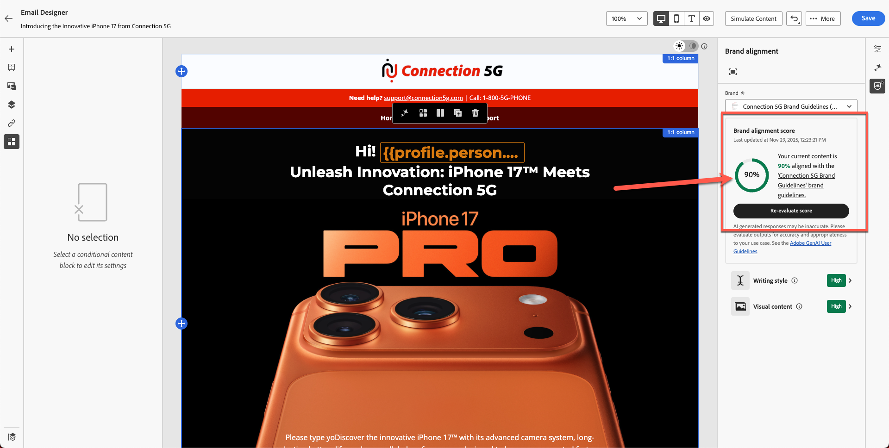

# 品牌一致性

**用途：**&#x200B;了解如何使用Adobe Journey Optimizer的“品牌协调”功能来评估电子邮件内容、识别准则违规并应用AI支持的推荐以提高品牌合规性。

## 学习目标

在本模块结束时，您将能够：

1. 访问和解释“品牌一致性”面板。
1. 根据品牌准则评估电子邮件内容。
1. 识别AI标记的问题。
1. 应用建议以提高品牌一致性。
1. 重新评估分数以跟踪改进情况。

## 简介

Adobe Journey Optimizer包含&#x200B;**AI驱动的Brand Alignment分数**，该分数根据&#x200B;**Connection 5G**&#x200B;的已发布品牌指南检查您的内容。

这样可以确保：

- 语调、风格和消息与您的品牌相匹配
- 符合法律要求
- 图像遵循可视规则
- 内容创建者在规模上保持一致

此模块教您使用AI运行评估、解释结果并改进内容。

## 打开品牌对齐面板

1. 打开在前面的模块中创建的电子邮件。
2. 在右边栏中找到&#x200B;**品牌对齐方式**&#x200B;选项卡，或在侧栏中找到&#x200B;**%图标**。
3. 单击以打开面板。

侧栏中的

4. 确保应用正确的品牌：
   - **连接5G** （默认）。
5. 单击&#x200B;**评估得分**。

**解释品牌得分和反馈：**&#x200B;稍后您将看到内容的品牌合规性得分。 此得分可以显示为评级（例如高、Medium或低）或百分比，以及颜色指示器（绿色、黄色、红色）和评估时间。 高分数表示您的内容与品牌指南高度一致，而中或低分数表示中度或不良一致。

查看面板中针对每个准则类别提供的详细反馈。

反馈通常按准则类别（如音调、风格、图像等）组织，显示传递的规则和可能需要注意的规则。

请注意任何特定的信息或高光 — 例如，面板可能会说某些字词或短语与规定的色调不匹配，或图像不符合视觉标准。 这是你改进工作的线索。

>[!NOTE]
>
>请注意，您的得分与以下屏幕不同。 您的目标是使用品牌准则和AI提高得分。

## 查看一致性分数

评估后，AJO会显示：

- 品牌一致性分数
- 评级（高/Medium/低）
- 颜色指示器（绿色/黄色/红色）
- 时间戳
- 准则类别（色调、样式、图像等）

解释结果以了解您的电子邮件与Connection 5G准则的匹配程度。

## 检查详细反馈

1. 滚动浏览准则类别。
1. 查找警告或红色指示器。
1. 单击每个标记的准则以打开详细的AI反馈。
1. 查看建议，例如：
   - 音调不匹配
   - 措辞不正确
   - 禁止使用的字词
   - 缺少商标使用
   - 图像样式违规

## 应用AI推荐

1. 单击进入电子邮件中标记的文本块或图像。
2. 使用您在上一个练习中粘贴的段落，如下所示。

3. 使用人工智能提供的建议修改。 单击图标，如下所示。

用于应用建议修改的

4. 单击“使用AI修复”****&#x200B;按钮，如下所示。

针对已标记的准则

5. 您会看到以绿色突出显示的建议更改，并删除了以红色显示的带删除线的文本，如下图所示。 您还会注意到分数已更新（在本例中为80%）。 单击“**应用**”按钮以使更改生效。

6. 更改会应用为新文本。
7. 查看所有突出显示的区域并进行必要的更新以更正内容，既可使用人工智能，也可手动编辑。 在继续之前，请确保已完成所有必需的更改。
8. 保存更改。

## 重新评估品牌得分

1. 更改所有位置以使用人工智能或手动修复内容。
2. 返回到“品牌对齐方式”面板。
3. 单击&#x200B;**重新评估得分**。
4. 将新分数与上一个分数进行比较。

例如：

- 原始得分：**56%**
- 更新分数： **90%**

这表示您的更新已成功使电子邮件与品牌标准保持一致。

5. 单击&#x200B;**保存**&#x200B;以完成电子邮件。

## 回顾

在本模块中，您已学习：

- 使用品牌一致性得分评估电子邮件
- 解释类别级别的反馈
- 识别书写、音调和布局问题
- 应用AI建议的更正
- 提高沟通中的品牌一致性

您的内容现已验证并准备好在下一个模块中进行测试 — **测试电子邮件**。
