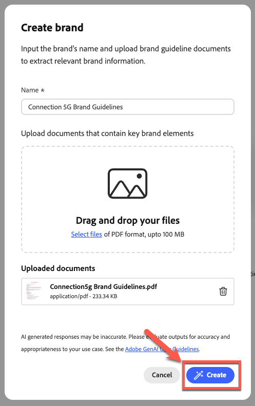
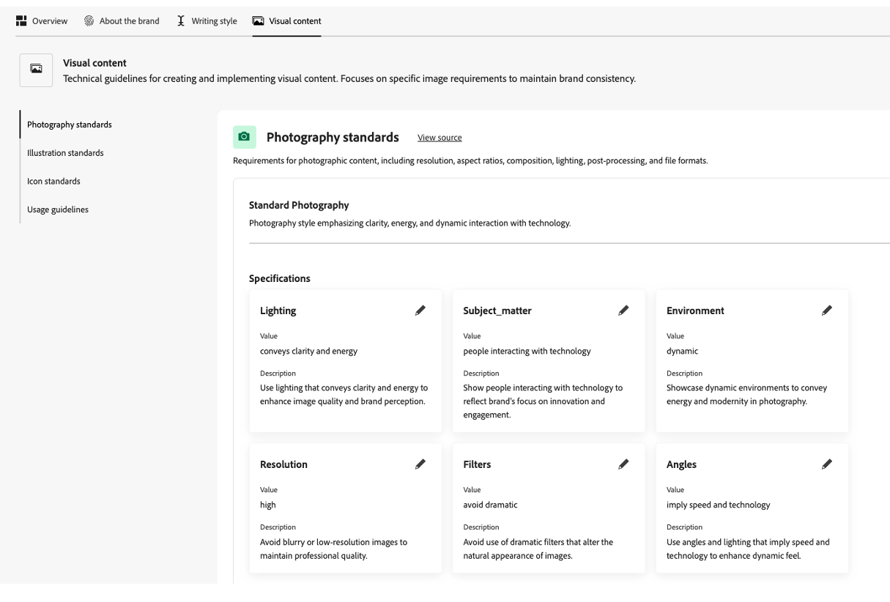
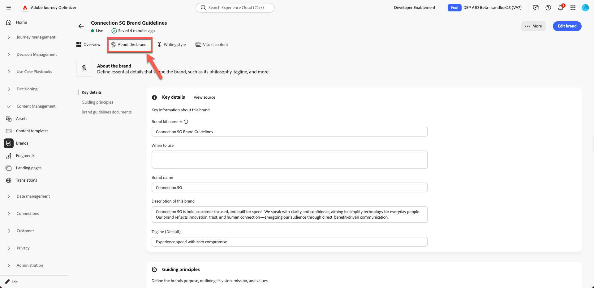
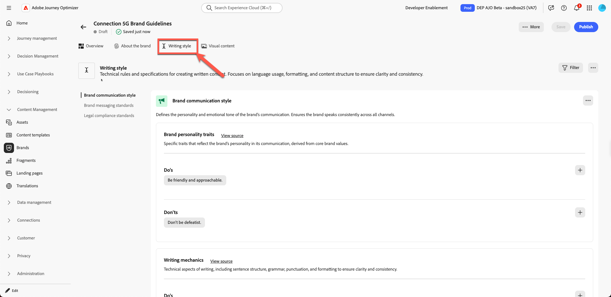

# 品牌管理

**用途：**&#x200B;在Adobe Journey Optimizer (AJO)中配置、优化和发布Connection 5G Brand Guidelines，以便所有内容和AI功能都与Brand保持一致。

## 学习目标

在本模块结束时，您将能够：

- 在Adobe Journey Optimizer中创建新品牌。
- 从PDF上传并提取品牌准则信息。
- 在“关于品牌”、“书写样式”和“可视内容”选项卡中查看和优化品牌详细信息。
- 添加排除规则以避免电子邮件按钮过度复制。
- 发布品牌，使其可用于模板、片段、AI助手和品牌协调。

下载文件 — [toolkit.zip](assets/toolkit.zip)

>[!NOTE]
>
>在开始动手实验之前，请确保下载工具包文件（请参见下面的toolkit.zip）。 解压缩文件以访问练习所需的图像和支持文件。 将这些资产保存在易于访问的位置，因为您将在整个实验中引用它们。

## 简介

在本模块中，您将使用准备好的品牌指南PDF在AJO中构建&#x200B;**Connection 5G**&#x200B;品牌。

Adobe Journey Optimizer的&#x200B;**品牌**&#x200B;功能可帮助您在所有营销工作中定义和维护一致的标识。 从徽标和颜色到语音和消息传递风格的语调，创建品牌可以确保每封电子邮件、营销活动和内容都反映一个统一的性格。

本实验将使用讲座中的模式1（仅限AJO）。 请注意，使用&#x200B;**Assets Essentials**&#x200B;存储资源。

您将从Connection 5G品牌指南文档开始，将其上传，让AJO提取关键信息，然后优化并发布结果。

## 准备品牌指南

1. 从Toolkit文件夹中打开&#x200B;**Connection 5G Brand Guidelines** PDF（确保先解压缩）。

2. 请查看文档以了解用于Connection 5G的内容：
   - 语调
   - 颜色和视觉样式
   - 编写样式和消息传送示例
   - 图像指导
   - 法律和合规性说明

## 在AJO中创建新品牌

1. 在Adobe Journey Optimizer中，转到左侧导航并单击&#x200B;**品牌**。
2. 单击&#x200B;**创建品牌**。

“品牌”部分中的

3. 在&#x200B;**名称**&#x200B;字段中，输入`Connection 5G Brand Guidelines`
4. 在上传区域中，拖放&#x200B;**Connection5g Brand Guidelines.pdf**&#x200B;文件（或单击&#x200B;**选择文件**&#x200B;并从您的计算机中选择它）。

5. 单击&#x200B;**创建品牌**&#x200B;开始提取。

AJO分析文件时会显示进度屏幕。 这可能需要几分钟的时间，具体取决于文档的大小。

AJO分析品牌指南文件时显示的

6. 提取完成后：
   - 顶部将显示一个绿色的确认栏。
   - 系统会自动将您重定向到品牌配置屏幕。
   - 内容和可视化创建标准现在会根据上传的品牌指南文件自动填充。

提取完成后填充了

7. 单击&#x200B;**发布**&#x200B;按钮发布品牌指南。

品牌指南的

8. 按“发布”按钮进行确认。

页面底部会显示一个绿色的确认栏，指示您的品牌已成功发布。

9. 再次单击主品牌页面，此时您会看到您的品牌已上线（用绿色圆点显示，标签为&#x200B;**&quot;Live&quot;**）。

## 查看品牌选项卡

您现在将查看并了解已为Connection 5G填充的三个关键选项卡。

### 关于品牌

此选项卡从较高层面定义品牌标识。 它通常包括：

- 品牌名称
- 核心值
- 指导原则
- 品牌目标和承诺
- 品牌想要创造的感觉

系统中的其他所有内容都基于此基础构建，因此此选项卡反映Connection 5G的真实DNA非常重要。

花些时间浏览提取的字段并检查它们是否与原始PDF匹配。

### 写作风格

**书写样式**&#x200B;选项卡定义品牌如何通信。 它包括：

- 色调指南
- 做和不做
- 短语和关键消息示例
- 标语和口号
- 法律规则，例如何时包括商标

您可以添加和优化自然语言的规则，甚至可以仅将它们应用于特定渠道，例如电子邮件或短信。 这使您能够灵活而精确地控制AI Assistant和内容作者的编写方式。

### 视觉内容

**可视内容**&#x200B;选项卡概述了品牌的外观。 它涵盖：

- 摄影标准
- 插图样式
- 肖像规则
- 可视Dos和Don

这可以确保从图像到图标的所有内容都感觉一致，并与Connection 5G的核心价值保持一致。

## 添加缺少的愿景和市场定位

在提取的内容中，某些指导原则可能不完整。 现在使用PDF的官方措辞填写这些内容。

1. 单击您刚刚创建的品牌

2. 单击&#x200B;**编辑品牌**。 出现确认选项卡；再次单击&#x200B;**编辑品牌**&#x200B;以进行确认。

3. 转到&#x200B;**关于Brand**&#x200B;选项卡。

4. 找到&#x200B;**指导原则**、**愿景**&#x200B;或类似高级说明的部分。

关于品牌选项卡

5. 添加以下文本：

**愿景：**

>为每个人提供即时、可靠的连接，从而增强生活、工作和娱乐，无论他们身在何处。

**市场定位：**

>Connection 5G提供专为数字生活方式而设计的高速移动服务，具有无与伦比的可靠性、简洁性和面向未来的创新。

6. 单击&#x200B;**保存**。 （如果您没有看到&#x200B;**保存**&#x200B;按钮，请先单击&#x200B;**概述**&#x200B;选项卡，然后单击&#x200B;**保存**。）

>[!TIP]
>
>现在，您已确保在AJO中清楚地表示该品牌的目的、愿景和市场定位。

## 添加电子邮件按钮排除规则

接下来，通过添加规则来增强品牌，确保电子邮件按钮的编写绝不会过于急促。

1. 转到&#x200B;**写入样式**&#x200B;选项卡。

2. 确保您位于&#x200B;**品牌通信样式**&#x200B;部分。

“写入样式”选项卡中的

3. 在&#x200B;**不要**&#x200B;区域下，单击&#x200B;**加号**&#x200B;图标以添加新规则。

在“不使用”区域下添加

4. 按如下方式配置规则：
   - **排除项：** `Be pushy`

>[!NOTE]
>
>此内容添加为“不要”规则，这意味着品牌不想要严格的CTA

**渠道：**&#x200B;电子邮件

**元素：**&#x200B;按钮

5. 单击&#x200B;**添加**。

Be pushy排除规则的

6. 确认新的Do not规则在列表中显示为`Be pushy`。

强调不要确认规则

7. 单击&#x200B;**保存**。

此规则适用于AI助手或作者处理电子邮件按钮复制的任何位置，可使CTA与Connection 5G色调保持一致。

>[!NOTE]
>
>您可能会看到列出的其他“不”规则与屏幕快照不完全匹配。 忽略此项，因为它属于预期行为。

## 发布品牌指南

对配置感到满意后：

1. 返回&#x200B;**概述**&#x200B;选项卡。 单击&#x200B;**保存**。
2. 单击右上角的&#x200B;**发布**。

右上角的

3. 将显示一个确认对话框，说明您将要发布Connection 5G的更新品牌指南。 再次单击&#x200B;**发布**&#x200B;以确认。

4. 等待绿色确认栏出现。
5. 单击&#x200B;**上一步**&#x200B;以返回品牌列表。
6. 验证&#x200B;**Connection 5G Brand Guidelines**&#x200B;的新信息卡是否显示，并且状态显示为“实时”且可用。

您的品牌现已上线，并准备好在整个Adobe Journey Optimizer中使用。

## 回顾

在本模块中，您可以：

- 已查看Connection 5G品牌指南PDF。
- 在Adobe Journey Optimizer中为Connection 5G创建了一个新品牌。
- 已上传品牌指南文件，并允许AJO提取关键信息。
- 审核并完善了关于品牌、书写风格和可视内容选项卡。
- 添加了特定的排除规则，使电子邮件按钮绝不会过于刺眼。
- 已发布品牌，以便能够支持AI助手、品牌协调、模板和片段。

您现在已完全配置和发布了&#x200B;**Connection 5G**&#x200B;品牌配置文件，该配置文件将在本实验的其余部分用于使所有内容保持品牌化。
