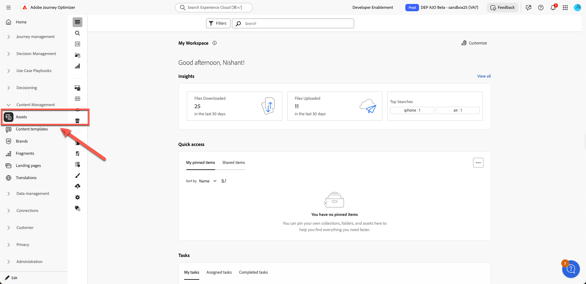
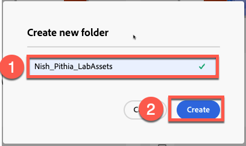
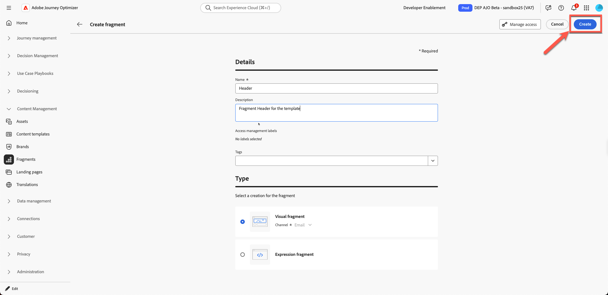
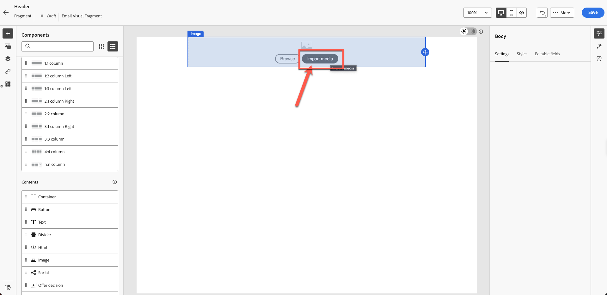
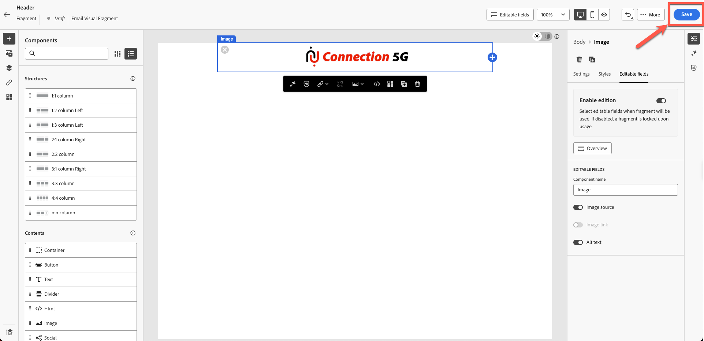
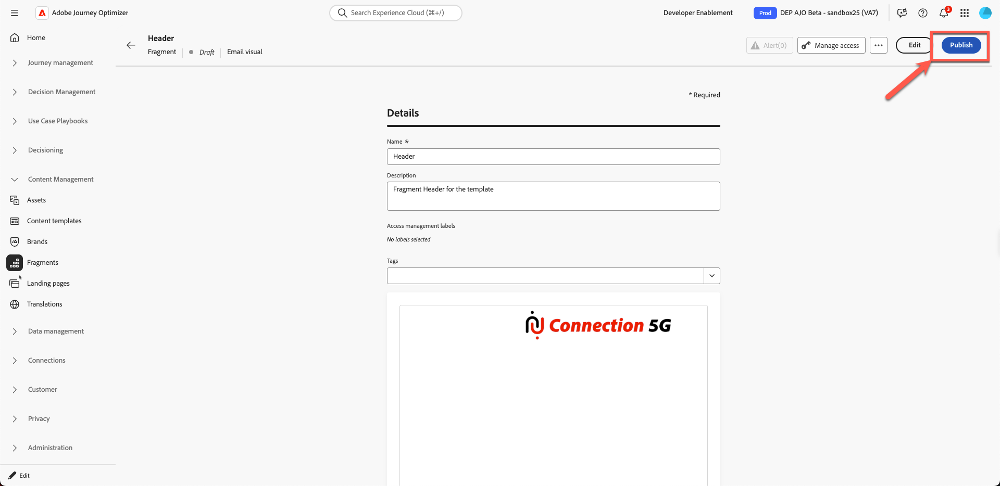

# 构建内容片段

## 使用模板和片段创建内容

**用途：**&#x200B;了解如何在Adobe Journey Optimizer中创建可重用片段，然后在历程中的真实电子邮件中应用这些片段。

## 学习目标

在本模块结束时，您将能够：

1. 将电子邮件设计划分为可重用的片段。
1. 创建页眉、页脚、横幅、正文和CTA片段。

## 为什么片段很重要

片段允许您创建一致的品牌对齐内容，这些内容可在电子邮件、营销活动和历程中重复使用。

### 片段

可重复使用的构建基块，例如：

- 标头
- 页脚
- CTA
- 横幅
- 法律声明

每当更新片段时，所有使用该片段的电子邮件都会自动更新。

## 这如何适应电子邮件创建

- **为很少更改的元素创建片段**。
- **生成使用这些片段的模板**。
- **在营销活动电子邮件中使用模板**&#x200B;并自定义其内容。

以下是您将从此实验创建的最后一封电子邮件。

但设计团队通常会为您提供如下模板：

## 步骤1：创建内容片段

以下模板是一个通用的设计模板，我们的目标是将其划分为可重复的内容块。 在Adobe journey optimizer中，这称为&#x200B;**片段**。

第一步是确定我们需要创建多少个片段。 在此模板中，使用5个片段是可行的，如下所示。

我们已确定模板需要5个片段，如下所示。

- 页眉
- 横幅
- CTA
- 正文
- 页脚

>[!NOTE]
>
>在本练习中，您将只创建一个标头片段以节省时间。

创建开始使用的标头片段。 但是，在创建片段之前，请设置资源文件夹，因为资源环境已共享。 为此，请先创建您自己的文件夹。

1. 从左侧导航中，找到&#x200B;**内容管理**&#x200B;部分，然后单击&#x200B;**Assets**。

左侧导航中包含Assets选项的

&#x200B;2. 单击“Assets管理”部分下的&#x200B;**Assets**。

Assets管理部分下的

&#x200B;3. 通过单击&#x200B;**“创建文件夹”**&#x200B;按钮创建文件夹。

在Assets区域中

&#x200B;4. 提供您的名字和姓氏之类的姓名。 例如 Nish\_Pithia\_LabAssets（您可以记住的某个内容）

&#x200B;5. **创建新片段：**&#x200B;在“内容管理”下，单击&#x200B;**片段**&#x200B;并创建新片段。

   内容管理下的

   提供一个友好名称，如下所示。 按如下方式添加所有详细信息：

   **名称：**&#x200B;标头

   **描述：**&#x200B;模板的片段标头

   **类型：**&#x200B;选择可视化片段

   

&#x200B;6. 单击右上方的&#x200B;**创建按钮**。

新片段对话框右上角的

这将打开一个空白片段创建者屏幕。

&#x200B;7. 单击“结构”下的1:1列，然后拖到画布上，如下所示。 （请单击下面的图像查看动画图形）

&#x200B;8. 接下来，将“**image**”拖动到刚刚添加的1:1行上

&#x200B;9. 上传您提供的徽标图像。 单击&#x200B;**“导入媒体”按钮**

&#x200B;10. **上传徽标：**&#x200B;从图像的Toolkit文件夹上传徽标(*C5G-Logo.png*)，然后单击“下一步”。

&#x200B;11. 选择您已创建的&#x200B;**资产文件夹**，然后单击&#x200B;**导入**。 该文件将保存在您的文件夹中。

&#x200B;12. 徽标放置正确，但太大，需要调整大小。 要调整徽标的大小，请更新其属性。 单击&#x200B;**样式选项卡**&#x200B;并通过拖动滑块将宽度设置为40%，如下所示。

>[!NOTE]
>
>请注意，打开切换按钮时，40数字表示%，而不是像素。 如果您希望得到一个绝对的像素完美值，请将按钮切换为px。

&#x200B;13. 单击&#x200B;**“保存”**&#x200B;并保存您的片段。 在确认时，您会收到绿色条通知。

保存片段后

&#x200B;14. 保存的片段处于草稿模式。 在使用它之前，您需要先发布它。 单击“**上一步**”按钮。

&#x200B;15. 单击“**发布**”按钮。 您会看到消息“正在发布片段，这可能需要一些时间。 我们会在完成后通知。” 确认时。 您的片段已准备好用于创建模板。

您看到状态更改为&#x200B;**“实时”**。 此时，您已完成构建标题片段，该片段将在下一步中使用。

>[!NOTE]
>
>请注意，在本练习中，您只创建了一个片段。 在实践中，架构师可以选择创建多个片段，如页眉、页脚或其他可重用组件。

## 回顾

在本模块中，您已成功：

- 将电子邮件细分为可重用的标头片段
- 已创建标题内容块

您现在已准备好进入下一个模块 — **生成内容模板**，您将在该模块中使用创建的片段来生成新模板。
