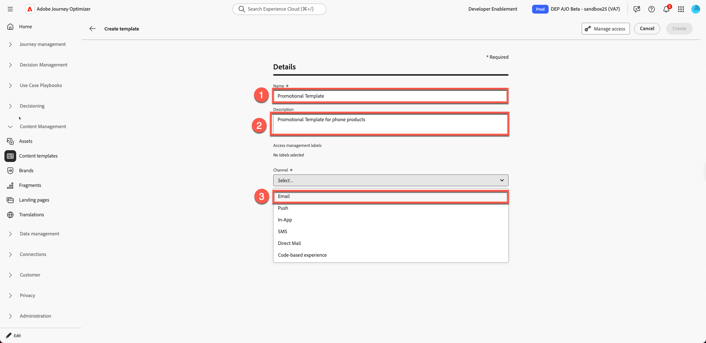
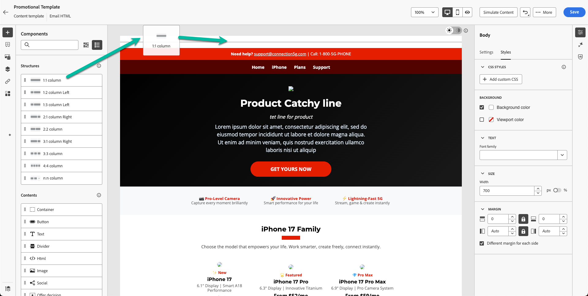
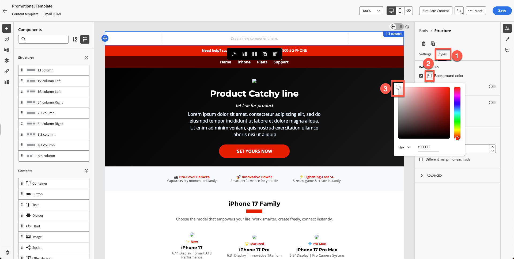
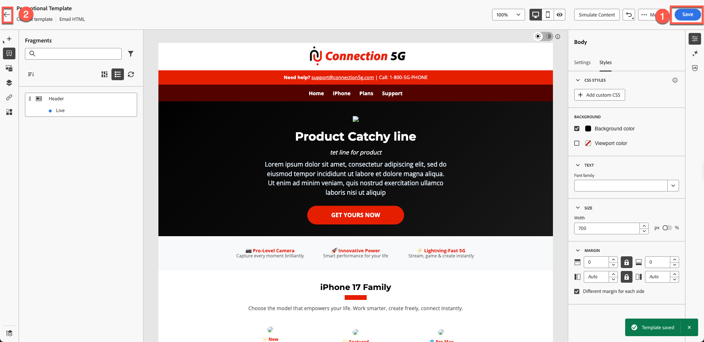

# 构建内容模板

## 使用模板和片段创建内容

**用途：**&#x200B;了解如何在Adobe Journey Optimizer中创建可重用的模板

## 学习目标

在本模块结束时，您将能够：

1. 使用导入的HTML和片段构建完整的电子邮件模板。

## 模板为什么重要

利用模板，可创建可在电子邮件、营销活动和历程中重复使用的一致性品牌协调内容。

### 模板

该结构的Blueprint：

- 标题投放位置
- 正文内容区域
- 页脚区域
- 标准布局样式

模板可确保跨团队的品牌一致性，并节省大量创建时间。

## 使用片段创建新模板

模板可帮助用户重新使用营销活动中的完整布局。 Adobe Journey Optimizer中的内容模板是功能强大的工具，旨在简化和简化为营销活动和历程创建可重用内容的方式。 无论您是制作电子邮件、短信还是推送通知，模板都通过提供预先设计的结构帮助您节省时间，这种结构可以轻松地在项目之间自定义和共享。

为了加快并改进设计过程，请创建独立模板以在Journey Optimizer促销活动和历程中轻松重用自定义内容。

此功能允许面向内容的用户处理营销活动或历程之外的模板。 然后，营销用户可以在自己的历程或营销策划中重用和调整这些独立内容模板。

## 创建模板

1. 转到&#x200B;**内容管理→内容模板**。

&#x200B;2. 单击&#x200B;**创建模板**，然后填写以下内容：
   - **名称：** `Promotional Template`
   - **描述：** `Promotional Template for phone products`
   - **频道：** `Email`

&#x200B;3. 单击&#x200B;**创建**。

## 添加主题行并打开电子邮件设计器

1. 添加主题行： `Promotional Template`并单击电子邮件正文&#x200B;**上的**&#x200B;以打开它进行编辑

&#x200B;2. 您会看到三个选项：
   1. 从头开始设计
   2. 自己编写代码
   3. 导入HTML

选择第三个选项。 单击&#x200B;**导入HTML**

## 导入提供的HTML模板

1. 从工具包文件夹`promotional-template-final.html`上载模板html文件

&#x200B;2. 单击“导入”按钮以&#x200B;**导入**&#x200B;模板。

&#x200B;3. 等待渲染布局。 您会注意到图像链接断开和品牌缺失等问题。 （这是具有占位符资产的预期行为）

## 浏览模板结构

### 左侧面板

Adobe Journey Optimizer (AJO)中的“**结构**”和“**内容**”组件是设计电子邮件、登陆页面和内容片段时使用的基本元素。 结构定义了布局框架，而内容提供了置于这些布局中的实际构建块。

Adobe Journey Optimizer中的正文部分是电子邮件或页面内容的主容器。 它用作可视设计空间的根，其中所有结构组件（列、布局）和内容组件（文本、图像、按钮等） 嵌套。

### 右侧面板

Adobe Journey Optimizer正文部分下方的“**设置**”和“**样式**”选项允许您定义电子邮件或页面的基本外观和布局。 这些控件会影响整个设计，因为主体是所有组件的父项。

在左边栏上，您可以找到以下部分：

- 片段
- 文件
- 主体结构
- 跟踪的URL

您会看到在上一个练习中创建的标题片段显示在此处，如下所示。 确保标题片段以蓝点显示为实时，而不是以草稿模式。 花点时间检查其余的部分。

&#x200B;> [!NOTE]
>
>如果您在此处看不到您的片段，则意味着您未正确保存该片段，需要重新上传它。

## 插入标题片段

现在改进模板。 您已创建页眉和页脚。

1. 将&#x200B;**1:1列**&#x200B;拖动到现有内容上方。

你看到这样的东西。

在内容上方添加新列后的

&#x200B;2. 您的背景使用模板背景颜色，当前为黑色。 将其&#x200B;**背景颜色设置为白色。 单击右边栏上“样式”选项卡中的**，并使用拾色器中的白色。

&#x200B;3. 打开&#x200B;**片段**&#x200B;并拖入您的&#x200B;**标头**&#x200B;片段。

&#x200B;4. 请注意，标题片段与您的模板整齐对齐，如下所示。

&#x200B;5. 单击“保存”**&#x200B;**&#x200B;按钮保存模板，然后单击“上一步”**&#x200B;**。

>[!NOTE]
>
>请注意，您可能会看到一些损坏的图像。 我们稍后会解决这个问题。

## 回顾

在本模块中，您已成功：

- 已导入HTML以构建完整的促销模板

您现在已准备好继续下一模块 — **创建电子邮件**
