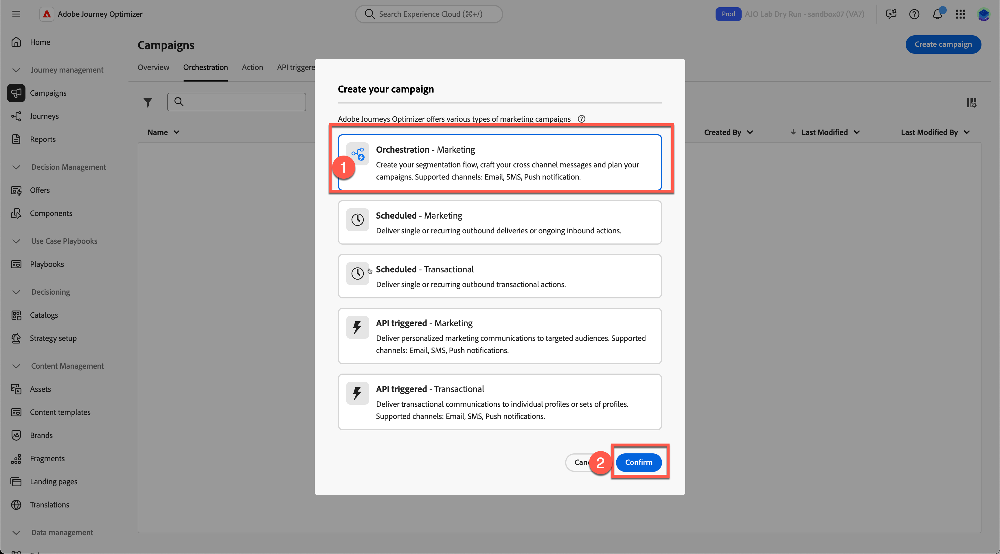
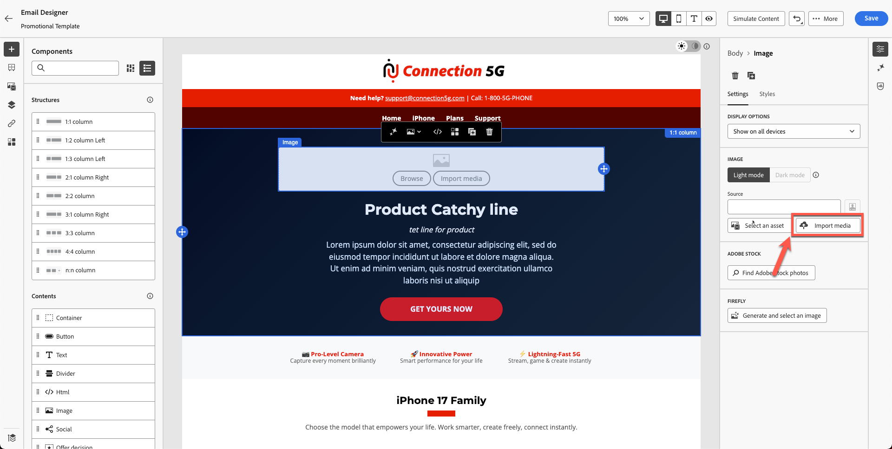

# 创建电子邮件

## 使用模板创建内容

**用途：**&#x200B;了解如何在Adobe Journey Optimizer中创建可重复使用的模板，然后在营销活动中的实际电子邮件中应用这些模板。

## 学习目标

在本模块结束时，您将能够：

1. 创建新的营销活动并使用新的品牌模板。
1. 更新主页图像、产品图像、按钮和布局样式。

## 在营销活动中创建和更新电子邮件

### 目标

在本练习中，我们将了解如何将您创建的模板应用于历程中的电子邮件。 在理想情况下，您可以使用任何现有历程或营销活动，并使用标准化模板替换其电子邮件内容，以确保品牌一致性和加快执行。

此步骤演示如何跨历程重用模板，使团队能够更新设计，而无需从头开始重建电子邮件。

## 创建新的电子邮件营销活动

1. 返回主屏幕，然后单击&#x200B;**历程管理→促销活动**。
2. 单击&#x200B;**创建营销活动**

   历程管理中的

3. 选择“**业务流程 — 营销**”并单击&#x200B;**确认**

   

4. 命名您的营销活动`Flagship Phone Launch Branded`。 按&#x200B;**保存**&#x200B;按钮。

   

5. 单击&#x200B;**+符号**&#x200B;并选择&#x200B;**读取受众**&#x200B;活动

   

6. 下一步是选择&#x200B;**“读取受众”**&#x200B;框并单击&#x200B;**受众文件夹图标**

   

7. 选择&#x200B;**dep：对iPhone 17**&#x200B;受众感兴趣，然后单击“**添加受众**”按钮

   

8. 选择实体 — **dep-rel：客户帐户 — customer\_id** （或任何与此部分无关的实体）
9. 通过单击&#x200B;**+符号**&#x200B;添加&#x200B;**电子邮件活动**，然后从渠道活动中选择&#x200B;**电子邮件**。

   

10. 单击&#x200B;**编辑电子邮件**。

11. 单击&#x200B;**操作选项卡**&#x200B;并选择&#x200B;**您的**&#x200B;电子邮件配置。 您的沙盒可能会将此内容显示为关系电子邮件。 （选择任意）

选择电子邮件配置的

12. 单击&#x200B;**内容选项卡**

电子邮件编辑器中的

13. 单击&#x200B;**应用内容模板**

在电子邮件编辑器中

14. 选择您创建的模板&#x200B;**“促销模板”**，然后单击&#x200B;**确认**

15. 单击&#x200B;**编辑电子邮件正文**

应用模板后

16. 确认新页眉、主页、页脚和内容块显示正确。

## 替换主页图像和产品图像

更改主页和手机图像。 您需要将内容从toolkit文件夹上传到资源。 当前，您的产品主页横幅图像是占位符。

1. 单击损坏的主页横幅图像。

   

2. 删除临时源URL。

   

3. 单击&#x200B;**导入媒体**

   主页图像的

4. 从您的工具包上传`hero.png`。 （您可以拖动文件）

   

5. 单击&#x200B;**下一步，**&#x200B;选择&#x200B;**您的资产文件夹**，然后按&#x200B;**导入**

   

6. 您的电子邮件模板即将正常显示。 它如下所示。 单击&#x200B;**“保存”**&#x200B;以保存您所做的工作。

## 可选练习

### 替换产品图像

继续更新所有产品图像（在Toolkit文件夹中提供的图像），并为您的喜好添加圆边框。 您的电子邮件看起来更好，没有任何损坏的链接，如下所示。 对所有产品卡重复此过程。

## 回顾

在本模块中，您已成功：

- 使用您的品牌模板通过电子邮件创建了新营销活动
- 更新了主页和产品图像
- 增强的样式

您现在已准备好进入下一个模块 — **AI助手和内容个性化**，在该模块中，您将使用AI优化文本并自动生成图像。
