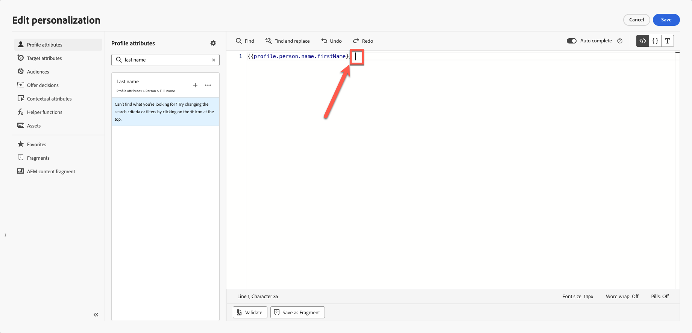
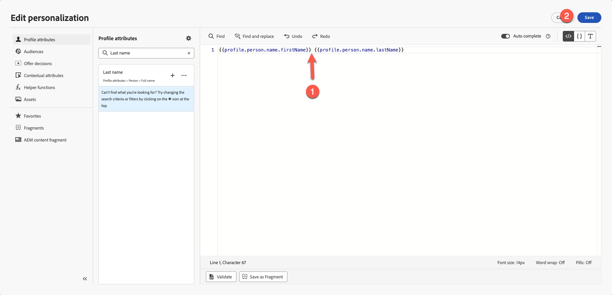
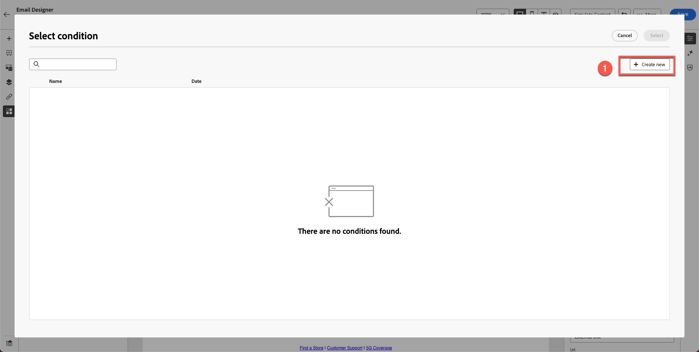

# Personalization和内容试验

**用途：**&#x200B;了解如何在Adobe Journey Optimizer中使用配置文件属性个性化电子邮件内容、构建动态内容变体并应用条件逻辑。

## 学习目标

在本模块结束时，您将能够：

1. 使用用户档案属性添加个性化字段。
1. 使用个性化编辑器和Handlebars语法。
1. 基于用户档案逻辑构建动态内容变体。
1. 为个性化内容块创建条件规则。
1. 根据出生年份等属性测试变体切换。

## 简介

Adobe Journey Optimizer中的个性化实现了大规模的一对一体验。
在本模块中，您将执行以下操作：

- 插入个性化文本（名字和姓氏）
- 构建基于年龄的内容变量
- 使用配置文件属性应用条件逻辑
- 在模块7中准备用于模拟的内容

Adobe Journey Optimizer中的Personalization允许您根据个人资料、行为和上下文数据动态自定义内容，从而打造量身定制的、有影响力的客户体验。 无论您是在创建个性化的电子邮件、通知还是优惠，所提供的工具和技术都可以让您轻松地在正确的时间将正确的消息与正确的人员关联起来。 了解Personalization编辑器、Handlebars语法和Adobe Experience Platform数据如何协作以将您的想法变为现实，探索包含表达式片段的可重用内容块，并探索高级帮助程序函数以解锁更深层的可能性。 每个主题都可逐步构建您的技能，确保您随时可以放心地设计个性化历程。

## 添加基本个性化

此练习的这一部分简化了个性化操作。 根据用户档案将名字和姓氏添加到电子邮件中。 Personalization基于由您定义的XDM Individual Profile架构管理的配置文件数据。 XDM Individual Profile架构是唯一可用于在Journey Optimizer中对内容进行个性化的架构。

1. 打开在之前的模块中创建的电子邮件。
2. 在主图标题上方添加一个文本块，内容为： **您好，**
3. 单击&#x200B;**个性化**&#x200B;图标。

电子邮件文本工具栏中的

&#x200B;4. 搜索&#x200B;**第一个名称**&#x200B;**1&rbrace;。**

&#x200B;5. 单击&#x200B;**+**&#x200B;将其添加到表达式区域。
&#x200B;6. 在&#x200B;**名字**&#x200B;字段后添加&#x200B;**空格**。

&#x200B;7. 重复上述过程，但这次搜索并添加&#x200B;**姓氏**。

最终语法显示名字和姓氏变量之间的明确分隔。

&#x200B;8. 验证片段。 请注意，有一个选项可将内容另存为片段。 如果您使用全名来创建其他电子邮件内容，那么这是一个很好的机会。 跳过此步骤并转到下一步。
&#x200B;9. 单击&#x200B;**保存**

您的视图如下所示。 大括号由变量组成，每位用户都会收到一封包含其名称的电子邮件。

此时，您已了解如何为个人用户档案添加个性化设置。

## 动态内容简介

Adobe Journey Optimizer中的动态内容使您能够创建无缝适应受众的个性化消息。 通过使用条件规则，您可以根据用户档案属性、受众成员资格或实时事件定制电子邮件、短信和推送通知。 无论您是为不符合特定标准的情况制作回退消息，还是保存可重用规则以保持一致性，个性化编辑器和电子邮件Designer都提供了直观的工具，帮助您实现想法。

这是一个向电子邮件添加一些条件性内容并根据用户年龄对其进行个性化的完美用例。

回顾您的架构：您有&#x200B;**&quot;person.birthYear&quot;**&#x200B;作为出生年份。 此属性可能会派上用场。 根据年龄定位和设置营销活动。

在本练习中，您将根据年龄创建两个变体。 一种变体针对40岁以上的用户，另一种变体针对40岁以下用户（可能在20多岁和30多岁之间）。 1986年以前出生的人被认为超过40岁，而1986年或以后出生的人被认为低于40岁。

**时期逻辑**

您将使用配置文件属性`person.birthYear`。

| 目标组 | 条件 |
| ------------ | ----------------- |
| 40以上 | birthYear \&lt; 1986 |
| 40以下 | birthYear >= 1986 |

## 创建两个图像变体

是否记得我们在上一个模块中创建的此块？ 你的形象跟我的不一样。

为40岁以下的人创建另一个图像（请记住，您创建了一个45岁左右的Firefly图像），并将其用于此练习。

1. 选择现有图像块。 （单击图像）并单击&#x200B;**条件块**。
2. 单击&#x200B;**添加变体**。

&#x200B;3. 将第一个变体重命名为&#x200B;**年龄大于40**。

&#x200B;4. 通过单击&#x200B;**“添加变体”**&#x200B;按钮创建新变体并将其重命名为&#x200B;**年龄小于40岁。**

&#x200B;5. 您可以使用Firefly通过提示（如“20岁左右”）创建图像。 但是，为了节省时间，我们在工具包中已有一个名为“**variant-age-below-40.jpg**”的图像。
&#x200B;6. 单击图像并导入介质。

&#x200B;7. 选择&#x200B;**variant-age-below-40.jpg**&#x200B;图像。 通过单击&#x200B;**下一步**&#x200B;导入它，最后再按文件夹中的&#x200B;**导入**（默认情况下，您应该已在文件夹中）。

&#x200B;8. 尝试在变体之间切换，您会看到应用了其他图像。

到目前为止，您已构建设计，但尚未应用逻辑。 下一步应用逻辑。

## 将条件逻辑应用于变量

两个变体均已准备就绪，但您尚未应用条件逻辑。

## “40岁以上”的逻辑

1. 选择并将&#x200B;**年龄悬停在40**&#x200B;变量上方。
2. 单击&#x200B;**条件逻辑**&#x200B;图标。

40岁以上变体的

&#x200B;3. 创建新条件。

&#x200B;4. 在属性列表中搜索&#x200B;**年**。
&#x200B;5. 将&#x200B;**出生年份**&#x200B;拖到画布中。
&#x200B;6. 将条件设置为：
   - **birthYear \&lt; 1986**

&#x200B;7. 将条件命名为： **年龄大于40**
&#x200B;8. 添加描述 — &quot;**40**&#x200B;以上人员的图像变体&quot;
&#x200B;9. 单击&#x200B;**添加→选择**。

## “40岁以下”的逻辑

1. 选择并悬停&#x200B;**低于40**&#x200B;分区的年龄。
2. 重复这些步骤，但将逻辑更改为：
   - **birthYear >= 1986**

&#x200B;3. 将条件命名为： **年龄小于40**
&#x200B;4. 添加描述。 “**适用于40**&#x200B;以下人员的图像变量”
&#x200B;5. 单击&#x200B;**添加→选择**。

## 验证变量切换

在两个变体之间切换以确保：

- 显示正确的图像
- 正确应用逻辑
- 无变体显示为“未应用条件”

变体： **年龄超过40**

变体： **年龄低于40**

单击“**保存**”按钮保存电子邮件。

## 回顾

在本模块中，您已成功地学习了如何：

- 为一对一消息添加个性化字段
- 构建动态图像变量
- 根据年龄应用条件规则

您现在已准备好下一模块 — **内容模拟**，以测试这两个变体。
