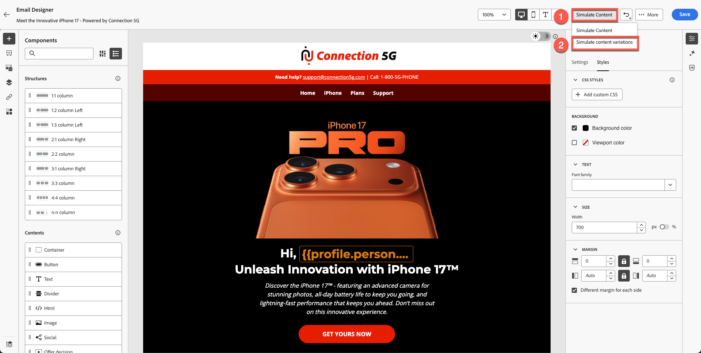
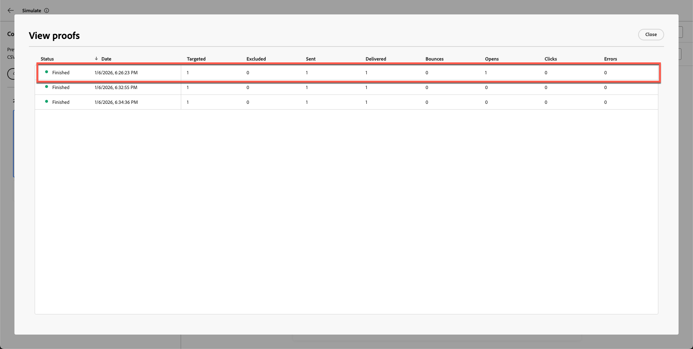

# 测试电子邮件

## 学习目标

在本模块结束时，您将能够：

- 从Adobe Journey Optimizer电子邮件编辑器发送验证电子邮件。
- 使用验证电子邮件验证个性化内容和条件变体。
- 验证收件箱中的验证电子邮件投放，包括处理垃圾邮件和剪切的消息。
- 查看Adobe Journey Optimizer中的验证投放日志、时间戳和变体。
- 确认电子邮件内容准确、个性化并可供激活。

## 发送验证电子邮件（可选，但推荐）

此时，您已了解我们不仅可以将配置文件属性个性化，还可以使用属性创建条件逻辑以确定要显示的内容。 Adobe Journey Optimizer功能非常强大，为营销人员提供了极大的灵活性。

1. 单击&#x200B;**模拟内容**。
2. 选择&#x200B;**模拟内容变体**。

此时将打开模拟面板。

3. 单击&#x200B;**发送校样**。

模拟面板中的

4. 添加您自己的个人电子邮件地址。

>[!NOTE]
>
>请注意，有时，您的公司电子邮件会阻止来自沙盒的电子邮件。 我建议您使用个人电子邮件。

5. 选择两个变体。
6. 添加主题行前缀
   1. 变体1:40以上
   2. 变体2:40以下
7. 单击&#x200B;**发送校样**。 您收到绿色确认消息“**验证已成功发送**”

验证两封电子邮件均已抵达您的收件箱。

>[!NOTE]
>
>验证电子邮件可能会进入&#x200B;**垃圾邮件**，具体取决于过滤器。

您可能会遇到消息被剪辑的情况，不过没关系，因为某些页脚链接不是真实的。 如果单击链接，您将看到两封包含变体的电子邮件均已完成。

### 在AJO中验证验证投放

最后，您还可以在Adobe Journey Optimizer中看到验证投放。

1. 返回到电子邮件编辑器。
2. 返回电子邮件创建屏幕，然后单击&#x200B;**查看校对**。
3. 查看投放日志、时间戳和已发送变体。

电子邮件创建屏幕上的

您注意到您的验证电子邮件详细信息。

## 回顾

在本模块中，您已成功：

- 在AJO中发送和验证的验证电子邮件

您现在已完成完整的Connection 5G AJO实验室历程，并验证您的电子邮件是准确的、个性化的，且可随时激活。
