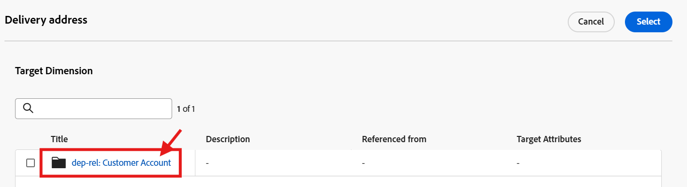
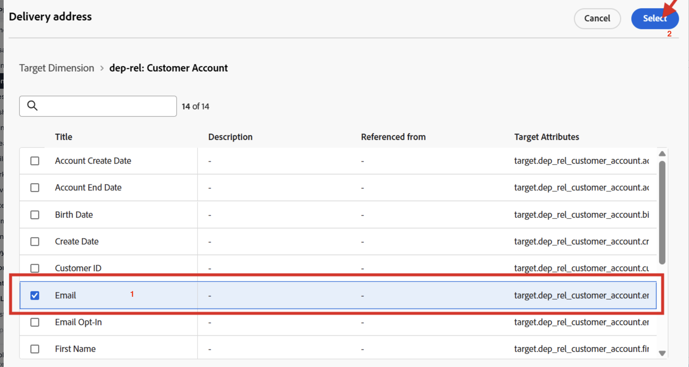

# 为关系配置

## 目标

在接下来的步骤中，使用关系架构`dep-rel: Customer Account`中的`email`属性，创建一个仅用于编排营销活动的电子邮件渠道配置

## 创建渠道配置

1. 导航到菜单&#x200B;**管理→渠道→常规设置**&#x200B;下找到的&#x200B;**渠道配置**
2. 单击&#x200B;**创建配置**&#x200B;按钮

   

3. 在创建向导中设置以下值：
   - **名称：** `Relational-Email`
   - **频道：** `Email`
   - **营销操作：** `Email Targeting`

>[!NOTE]
>
>选择电子邮件作为渠道时，将显示一个新部分电子邮件设置。

## 配置电子邮件类型

将&#x200B;**电子邮件类型**&#x200B;设置为&#x200B;**营销**

## 配置子域

从&#x200B;**子域**&#x200B;下拉列表中，选择&#x200B;**email.dep-labs.com**

>[!NOTE]
>
>如果您是自控进度的，并且没有预配置的子域，请在此处选择您自己的委派给Adobe的子域，而不是`email.dep-labs.com`。 请参阅[设置](../../setup.md)以了解如何委派一个。

## 配置IP池详细信息

从&#x200B;**IP池**&#x200B;下拉列表中，选择&#x200B;**营销**

## 配置列表取消订阅

1. 确保为列表取消订阅启用&#x200B;**切换**
1. 在“列出取消订阅”首选项区域下，确保所有复选框都已&#x200B;**选中**
1. 在链接管理下，确保选中&#x200B;**Adobe managed**
1. 对于同意级别，请确保将此级别设置为&#x200B;**渠道**

## 配置标头参数

1. 按以下方式设置以下字段：
   - **发件人姓名：** `DEP Labs`
   - **来自电子邮件前缀：** `dep`
   - **回复姓名：** `DEP Labs Support`
   - **回复电子邮件：**`reply@email.dep-labs.com`
   - **错误电子邮件前缀：** `error`

## 配置密件抄送电子邮件

将“密件抄送电子邮件”字段留空

>[!NOTE]
>
>要保留已发送电子邮件的副本，请将其发送到密件抄送收件箱。 输入您选择的电子邮件地址，以便发送的每封电子邮件也发送到此密件抄送地址。 请注意，密件抄送地址域必须不同于委派给 Adobe 的任何子域。 此功能为可选项。 *如何对电子邮件使用密件抄送*

## 配置电子邮件重试参数

保留默认设置&#x200B;**小时**&#x200B;设置为&#x200B;**84**

## 配置URL跟踪参数

保留默认设置

## 执行详细信息

1. 在“编排的营销活动”选项卡中，并&#x200B;**选中**&#x200B;启用复选框。

   

2. 在执行维下，配置以下内容：
   - **为每**&#x200B;发送一封邮件`Target Dimension `
   - **配置文件目标Dimension：** `dep-rel: Customer Account - customer_id`

   

3. 在执行地址下，配置以下内容：
   - **Source：** `Target Dimension`
   - **交货地址：** `click on the Edit button`

   

4. 在弹出窗口中，单击文件夹&#x200B;**dep-rel：客户帐户**

   

5. 选择&#x200B;**电子邮件**&#x200B;并单击&#x200B;**选择**&#x200B;按钮

   

6. 完成后，您的最终执行详细信息类似于下面的屏幕快照

>[!NOTE]
>
>对于编排的营销活动，您可以通过电子邮件定位客户帐户，因此您只需为每个Target Dimension发送一条消息。  您使用的执行地址来自Target Dimension本身（即&#x200B;**dep-rel： Customer Account**&#x200B;表中存储的&#x200B;**电子邮件**&#x200B;地址的内容）

## 查看并保存

1. 再次查看所有详细信息以确保它们相匹配。
1. 向上滚动并单击&#x200B;**提交**。
1. 完成后，您会看到两个电子邮件渠道配置，两者可能都处于“正在处理”状态。

>[!WARNING]
>
>据观察，处理电子邮件渠道配置最多需要2小时！

## 回顾

现在，您已了解如何创建电子邮件渠道配置以将“关系”架构属性用于编排的营销活动。
