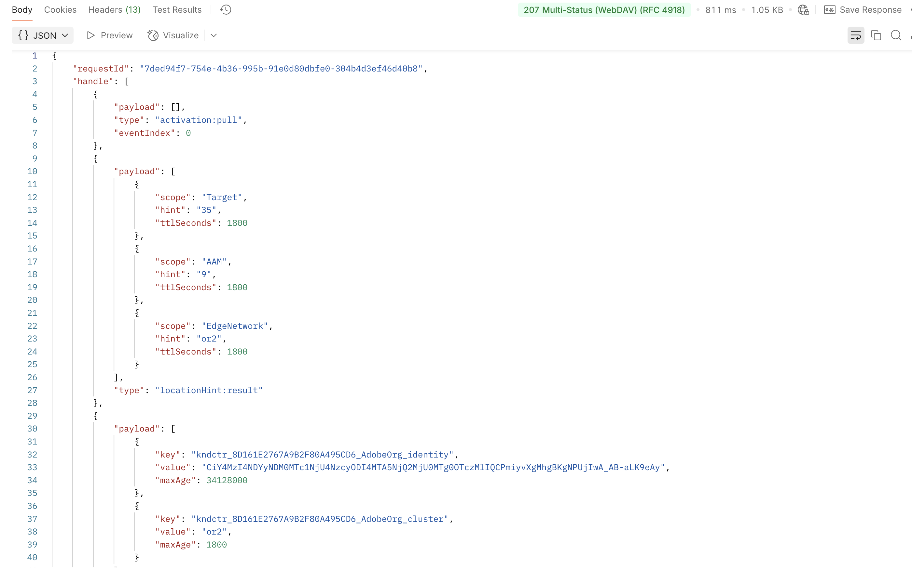

# 发送Edge Web事件

## 学习目标

使用API将模拟Web事件发送到Adobe Edge Network。

要模拟加载并发送到AEP Edge的网页，您需要将Postman调用发送到您创建的数据流。

该操作将在没有OAuth令牌的事件中发送。  请确保在计算机上打开了Postman以执行本实验操作。

>[!NOTE]
>
>由于您未传入经过身份验证的令牌，因此不会返回任何属性。

## 实验室期望

1. 用于点击Edge的体验事件
1. 数据流配置
1. 数据流配置以使用AEP服务
   1. 要运行的Edge Audience
   2. 将事件发送到中心
1. Postman响应以包含Edge Audience（但没有属性）
1. 用于接收事件并添加事件配置文件片段的配置文件存储
1. 用于添加关系的身份存储
1. 用于接收数据并存储在Data Lake中的数据集

## 更新Postman环境变量

在执行API请求之前，您需要先将数据流ID添加到Postman变量环境。 首先，收集以下值：

### 收集数据流ID

1. 您应该已经有&#x200B;**数据流ID**

>[!NOTE]
>
>**如果您丢失了数据流ID**
>
>1. 在左边栏中，单击&#x200B;**数据流**（在数据收集标题下）
>2. 选择您的数据流并复制&#x200B;**数据流ID**&#x200B;值
>
>

### 导航到呼叫

1. **Postman左侧边栏** -> `Collections`
1. **收藏集** -> `AJO Bootcamp (Labs)`
1. **文件夹** -> `Profile & Journey Labs`
1. **API请求** -> `Create Web Event`

### 更新DATASTREAM\CONFIG变量

1. 单击右上角请求&#x200B;**中的**&#x200B;变量

Postman工具栏中的

&#x200B;2. 从页面上的第一步使用&#x200B;**数据流ID**&#x200B;更新&#x200B;**DATASTREAM_CONFIG** **值**。

使用数据流ID 更新了DATASTREAM_CONFIG变量

&#x200B;3. **保存**&#x200B;您的更新（ctrl+s或command+s）
&#x200B;4. 单击环境侧栏右上角的“**X**”以关闭该侧栏

&#x200B;5. **创建Web事件**&#x200B;请求现已准备就绪，可以发送，因为所有变量现在均为蓝色且在环境中具有值。

## 执行API

单击&#x200B;**发送**&#x200B;按钮执行您的请求。

响应如下所示：

您在响应中看到的是这些核心内容：

- 200 OK响应表示Edge Network已成功发送并接受数据

## 回顾

事件已成功发送到，并被Edge Network接受
