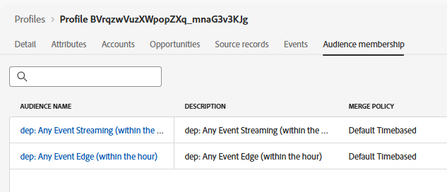

# 验证中心上的配置文件

## 学习目标

验证该事件是否导致中心上实时配置文件中的配置文件更新和区段鉴别。

## 在中心上查找配置文件

在Adobe Experience Platform中，查找您刚刚从刚刚发送到Edge Network的事件中发送的配置文件。

1. 导航到&#x200B;**客户** -> **配置文件** -> **浏览**&#x200B;以使用下列信息执行查找：
   - **合并策略** -> `Default Timebased`
   - **身份命名空间** -> `Email`
   - **标识值** -> `henry.creel@emailsim.io`
1. 单击&#x200B;**查看**&#x200B;查找配置文件


## 检查中心配置文件

1. 单击&#x200B;**配置文件ID**&#x200B;以打开配置文件
1. 首先单击&#x200B;**属性**&#x200B;选项卡，然后单击&#x200B;**中心**&#x200B;单选按钮以查看&#x200B;**中心配置文件**

在“属性”选项卡上显示


## 验证事件

1. 单击顶部导航中的&#x200B;**事件**，您就可以看到刚刚发送的事件


## 验证区段

### 通过JSON

1. 单击&#x200B;**属性**&#x200B;标题并查看&#x200B;**JSON**


&#x200B;2. 查找&#x200B;**segmentMembership**。  它应如下所示（您的ID将不同）

```json
  "segmentMembership": {
    "ups": {
      "ce0b8386-ef2a-4244-8ad0-1a72d6494181": {
        "status": "realized",
        "lastQualificationTime": "2025-12-15T23:11:49Z"
      },
      "8ce516fe-920a-4f9d-b92b-0403890a8491": {
        "status": "realized",
        "lastQualificationTime": "2025-12-12T15:01:01Z"
      }
    }
```

>[!NOTE]
>
>**如何读取segmentMembership？**
>
>[https://experienceleague.adobe.com/zh-hans/docs/experience-platform/xdm/field-groups/profile/segmentation](https://experienceleague.adobe.com/zh-hans/docs/experience-platform/xdm/field-groups/profile/segmentation)
>
>**ups：**&#x200B;这是AEP支持的各种受众的映射键。  ups键包含规则生成器创建的受众。  其他受众将包含在其他键中（例如AAM）。
>
>**lastQualificationTime**&#x200B;此配置文件上次符合区段资格的时间戳
>
>**状态**
>
>*已实现*：配置文件符合区段的条件。
>*退出*：配置文件正在退出当前请求中的区段。
>
>

### 通过UI

1. 验证配置文件符合受众条件的更简单方法是查看&#x200B;**受众成员资格**&#x200B;选项卡（您应至少看到以下内容）：
   - dep：任何事件流（一小时内）
   - dep：任何事件Edge（一小时内）



>[!NOTE]
>
>**为什么没有批次受众？**
>
>您应该不会看到&#x200B;**dep：任何符合条件的事件批次（一天内）**，因为我们在数据中进行流式处理，每天进行一次批次评估。

## 回顾

该中心上存在配置文件，该配置文件符合预期受众的条件。
