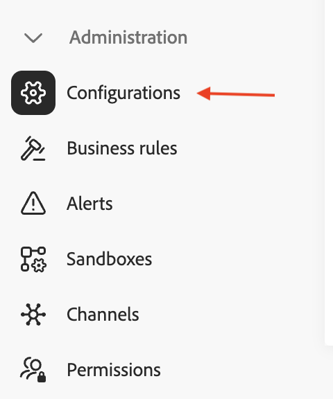

# 配置文件Target Dimension

## 目标

在接下来的步骤中，您将导航UI以查看架构并设置身份。 接下来，您设置配置文件定位Dimension，这是营销活动定位并与AEP配置文件进行协调以进行投放的实体类型。

## 为什么此配置很重要

配置文件Target Dimension用于告知Adobe Journey Optimizer如何连接实时客户配置文件和关系存储之间的数据。 此配置的组件如下：

- 关系架构
- 关系架构中的单个字段
- 与该字段关联的身份命名空间

>[!CAUTION]
>
>在您可以读取或共享受众，或者从编排的营销活动发送消息之前，必须完成此配置

## 为身份添加标签

1. 单击&#x200B;**应用程序**&#x200B;图标并选择&#x200B;**Journey Optimizer**

   已选择Journey Optimizer的

2. 单击“数据管理”菜单下的&#x200B;**架构**，并确保已选择&#x200B;**浏览**&#x200B;选项卡。
3. 搜索名为`dep-rel: Customer Account`的架构

   

4. 单击架构名称以将其打开，然后单击字段&#x200B;**customer\_id**

   已选择customer_id的

5. 在右边栏中，找到名为&#x200B;**Identity**&#x200B;的复选框，**选中复选框**&#x200B;并选择名为&#x200B;**customerID**&#x200B;的标识命名空间

   已选中customerID命名空间的

6. 单击&#x200B;**保存**&#x200B;按钮以保存您的架构。 将显示一条确认消息
7. 单击左侧边栏中的&#x200B;**取消**&#x200B;按钮或&#x200B;**架构**&#x200B;退出架构UI

>[!CAUTION]
>
>如果在添加身份标签后未保存架构，则下一组配置步骤不起作用

>[!NOTE]
>
>保存后，它需要几分钟（5分钟以内），然后才能在下一步中显示在配置文件定位Dimension下拉列表中。

## 创建配置文件Target Dimension

1. 单击&#x200B;**管理**&#x200B;下的&#x200B;**配置**

   

2. 选择&#x200B;**配置文件目标Dimension**&#x200B;并单击&#x200B;**管理**

   使用“管理”选项

3. 配置文件目标Dimension窗格打开，单击&#x200B;**创建**

   使用“创建”按钮

4. 从下拉列表中选择架构`dep-rel: Customer Account`。

   >[!NOTE]
   >
   >标记身份后，架构可能需要几分钟才能显示在此屏幕中。 刷新页面并重复前两个步骤，直到出现方案。

   

5. 对于&#x200B;**标识值**，选择`/customer_id`

   

   >[!NOTE]
   >
   >关系架构可以有许多标记为身份的字段，因此这是一个列表框。

6. 单击&#x200B;**保存**&#x200B;按钮以创建配置文件目标Dimension。 然后您会看到该记录。

>[!NOTE]
>
>创建的记录的名称是架构名称&#x200B;*（dep-rel：客户帐户）*&#x200B;和标记为标识&#x200B;*(customer\_id)*&#x200B;的字段的串联

>[!SUCCESS]
>
>恭喜！ 本实验中的配置文件Target Dimension创建步骤到此结束。

## 回顾

现在，您已看到在架构中导航、将属性标记为身份和创建Profile Target Dimension有多么简单。

如有需要，您可以在[此处](https://experienceleague.adobe.com/en/docs/journey-optimizer/using/campaigns/orchestrated-campaigns/data-configuration/target-dimension)阅读更多内容。
