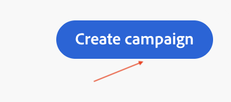
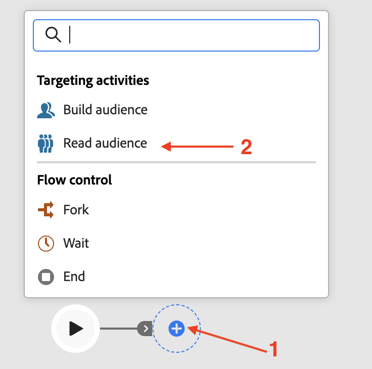
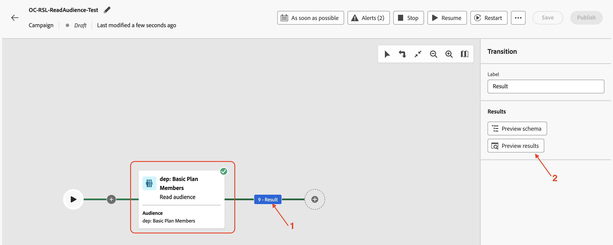

# 读取受众

## 目标

在接下来的几步中，您将创建一个营销活动以从AEP读取受众，并将其与之前创建的Profile Target Dimension结合使用。 使用拆分活动根据条件拆分数据。 最后，测试营销活动以了解这些受众在与关系架构一起使用时的工作方式。

## 读取受众

本实验涵盖将读取受众活动与关系架构结合使用以进行扩充。

Orchestrated Campaign对所有活动使用关系架构。 使用读取受众活动（从AEP读取受众）时，应配置相应的实体(Target Dimension)以将受众与Campaign Target Dimension相协调。

## 创建营销活动

1. 在左边栏中，单击&#x200B;**营销活动**

&#x200B;2. 单击&#x200B;**创建营销活动**

&#x200B;3. 选择&#x200B;**业务流程 — 营销**，然后单击&#x200B;**确认**

&#x200B;4. 按如下方式提供促销活动详细信息，然后单击&#x200B;**保存按钮**
   - 名称： **OC-RSL-ReadAudience-Test**
   - 描述： **RSL读取的受众测试**

&#x200B;5. 等待确认消息

保存营销活动设置后显示

## 添加读取受众活动

1. 单击画布中的&#x200B;**+**&#x200B;以打开选项菜单，然后从&#x200B;**定位活动**&#x200B;中选择&#x200B;**读取受众**

&#x200B;2. 在&#x200B;**读取受众**&#x200B;详细信息窗格中，单击&#x200B;**受众**&#x200B;的“搜索”图标

&#x200B;3. 选择配置文件计数为&#x200B;**9**&#x200B;的&#x200B;**dep：基本计划成员**&#x200B;受众，然后单击&#x200B;**添加受众**

&#x200B;4. 接下来，单击&#x200B;**实体**&#x200B;的下拉列表，然后选择`dep-rel: Customer Account - customer_id`营销活动目标Dimension

>[!NOTE]
>
>还可以从AEP配置文件提取其他属性，以使用&#x200B;**添加属性**&#x200B;按钮在画布中使用。 但本实验不需要额外的属性，因此将跳过该步骤。

## 测试活动

1. 已填写&#x200B;**读取受众**&#x200B;活动的设置。 单击&#x200B;**开始**&#x200B;以在&#x200B;**测试模式**&#x200B;下运行营销活动

>[!NOTE]
>
>此过程需要几分钟才能运行。
>
>测试模式允许执行营销活动以验证和监控其行为以及每个活动的结果。 活动会按顺序执行，一直到画布的结尾。

&#x200B;2. 测试执行开始，并在完成后显示结果。 单击&#x200B;**结果**&#x200B;节点，然后单击“预览结果”以查看执行结果

&#x200B;3. 请注意，来自&#x200B;**读取受众**&#x200B;的&#x200B;**2**（共9个）配置文件没有来自关系架构的相应匹配&#x200B;**目标维度**（即，它们存在于配置文件存储中，但不存在于关系存储中）。 由于编排的营销活动在关系架构下运行，因此从&#x200B;**读取受众**&#x200B;中删除了不匹配的`customer_id` (**2**)，并且只有&#x200B;*匹配的*&#x200B;受众（本例中为&#x200B;**7**）可用于在营销活动中利用&#x200B;**关系数据**&#x200B;的后续活动

>[!NOTE]
>
>以下步骤使用关系数据确认删除了上述不匹配的`customer_id`语句。

&#x200B;4. 单击&#x200B;**停止**&#x200B;以停止营销活动的&#x200B;**测试模式**

&#x200B;5. 单击流程末尾的&#x200B;**+**，然后从&#x200B;**定位活动**&#x200B;添加&#x200B;**Split**

&#x200B;6. 在&#x200B;**拆分**&#x200B;活动的详细信息窗格中，展开名为&#x200B;**子集**&#x200B;的第一个拆分

&#x200B;7. 将其重命名为“**In Store**”，然后单击&#x200B;**创建筛选器**&#x200B;以设置筛选器条件

&#x200B;8. 在&#x200B;**创建过滤器** r窗格中，单击&#x200B;**添加条件**

&#x200B;9. 由于没有从AEP配置文件中提取其他属性，因此此处唯一可用的AEP配置文件属性为`Customer ID`。 但是，与匹配的Target维度对应的关系存储中的列可用于设置筛选条件。 通过单击&#x200B;**>**&#x200B;展开&#x200B;**定向维度**

&#x200B;10. 从列表中选择`Source`并单击&#x200B;**确认**

从定向维度列中选择了

&#x200B;11. Source列的不同值在下拉菜单中可用。 对于&#x200B;**自定义条件**，从下拉列表中选择&#x200B;**“商店中”**，然后单击&#x200B;**确认**&#x200B;退出

&#x200B;12. 返回&#x200B;**拆分**&#x200B;活动的详细信息窗格，第一次拆分的设置已完成。 单击&#x200B;**将区段**&#x200B;添加到第二次拆分

已创建名为&#x200B;**结果**&#x200B;的新区段

&#x200B;13. 将“**Result**”重命名为“**Not In Store**”，然后单击&#x200B;**创建筛选器**&#x200B;以设置筛选器条件

使用筛选器选项将区段重命名为“不在存储区中”

&#x200B;14. 在&#x200B;**创建筛选器**&#x200B;窗格中，单击&#x200B;**添加条件**。 按照与上述相同的方法，通过单击&#x200B;**>**&#x200B;展开&#x200B;**定向维度**，然后从列表中选择`Source`并单击&#x200B;**确认**

从定向维度列中选择了

&#x200B;15. 对于&#x200B;**自定义条件**，请从下拉列表中选择&#x200B;**“商店中”**，对于运算符，请选择“**不等于**”。 单击&#x200B;**确认**&#x200B;退出

&#x200B;16. 返回&#x200B;**拆分**&#x200B;活动的详细信息窗格，两个拆分的设置已完成。 单击&#x200B;**开始**&#x200B;以在&#x200B;**测试模式**&#x200B;下运行营销活动

&#x200B;17. 测试执行开始，并在完成时显示结果。 由于在关系架构中只找到&#x200B;**7**&#x200B;个匹配的目标维度，因此在拆分操作（**7**&#x200B;和&#x200B;**0**）后也观察到相同的计数

计数

&#x200B;18. 单击每个结果框并&#x200B;**预览结果**&#x200B;以查看结果

&#x200B;19. 单击&#x200B;**停止**&#x200B;以停止营销活动的&#x200B;**测试模式**

>[!NOTE]
>
>“读取”受众显示&#x200B;**9**&#x200B;配置文件。 由于我们在Source上构建了一个过滤器，并且Source字段存在于关系存储中，因此我们必须从配置文件存储加入关系存储才能检查它。 当它通过Campaign Target Dimension与关系架构连接时，只匹配了&#x200B;**7**&#x200B;个配置文件。 这些&#x200B;**7**&#x200B;匹配的客户ID可用于以下尝试使用关系数据的活动。 所有&#x200B;**7**&#x200B;客户ID的`Source`均设置为&#x200B;**“商店中”**，这可以通过拆分流来证实。
>
>因此，在使用AEP配置文件及其关系对应项进行扩充时，保持数据一致性至关重要。

>[!TIP]
>
>恭喜，本实验完成了将读取受众活动与关系架构结合使用。

## 回顾

您现在已经了解了创建营销活动、执行读取受众活动以及使用Profile Target Dimension来利用关系架构有多么简单。 您使用了拆分活动根据条件拆分受众。 最后，该测试模式有助于理解，配置文件和关系模式之间的数据一致性很重要。

如有需要，您可以在[此处](https://experienceleague.adobe.com/zh-hans/docs/journey-optimizer/using/campaigns/orchestrated-campaigns/design-campaigns/read-audience)阅读更多内容。
