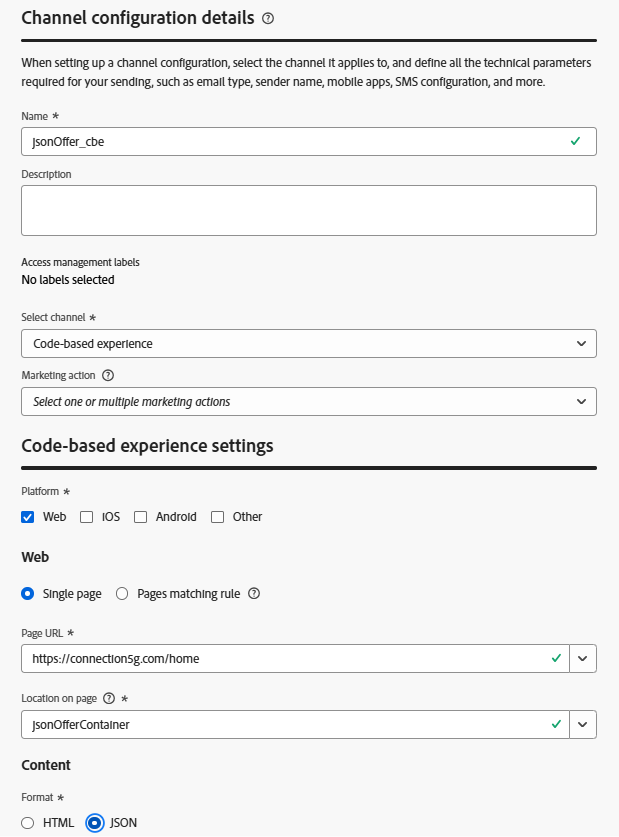

# 创建基于代码的体验渠道

## 目标

请记住，业务要求是Connection 5G的任何系统都应能够返回适当的选件。 无论是客户代理的计算机、店内信息亭、移动应用程序还是网站，客户都应获得相同的选件体验。 唯一可以实现这一点的AJO渠道是基于代码的体验(CBE)，它是入站AJO渠道之一。 虽然CBE可以返回HTML，但其主要功能是返回有关应该向接收系统提供什么优惠的信息，同时该系统知道如何处理该优惠信息。 与Web渠道不同，CBE不会自动呈现或报告。 虽然客户需要更多手动操作，但它们提供了很大的灵活性，因为它们可以配置为返回JSON，任何移动设备、Web或物联网系统都可以使用它来执行决策。

1. 如有必要，请展开左边栏中的&#x200B;**管理**&#x200B;菜单项（您可能需要向下滚动），然后单击&#x200B;**渠道**。 您登录到“渠道配置”页面。
2. 单击蓝色的&#x200B;**创建渠道配置**&#x200B;按钮
3. 在“渠道配置详细信息”页面上，将渠道命名为&#x200B;**jsonOffer\_cbe**

>[!NOTE]
>
>由于CBE可由跨&#x200B;*N*&#x200B;个平台的任意数量的客户端调用，因此我们将为此CBE命名一些对位置通用的名称，具体取决于它是否以JSON格式返回选件。

4. 将&#x200B;**选择渠道**&#x200B;下拉列表设置为&#x200B;**基于代码的体验。**

>[!WARNING]
>
>我们不会在本实验中设置营销操作，因为它会增加演示不必要的复杂性，但由于CBE可以由任意数量的系统访问，在实际用例中，您应该为此渠道设置所有可能的营销操作，以便实施DULE标签。

5. 在“基于代码的体验设置”区域中勾选&#x200B;**Web**&#x200B;框，并保持选中&#x200B;**单页面**&#x200B;选项。
6. 在&#x200B;**页面URL**&#x200B;文本框中，输入文本`https://connection5g.com/home`
7. 在&#x200B;**页面**&#x200B;上的位置文本框中，输入文本&#x200B;**jsonOfferContainer**

>[!NOTE]
>
>并非每个发送到Edge的Experience Event都会触发个性化优惠请求。 您将在下一部分创建一个历程，其中将使用您刚刚配置的选择策略来配置此CBE。 “页面上的位置”设置是在Experience Events中传递的参数的名称，该参数告知Experience Edge返回分配给该CBE的任何选件。 它通常也称为表面。 无论是移动设备应用程序、网页还是其他物联网设备，如果jsonOfferContainer值通过体验事件与正确的eventType一起传递到Edge，则Edge将执行迄今为止在实验室中配置的逻辑并返回相应的选件。

8. 单击“格式”部分中的&#x200B;**JSON**&#x200B;单选按钮。 完成后，您的CBE渠道配置应如下所示：

9. 一切看起来正确后，单击右上角的蓝色&#x200B;**提交**&#x200B;按钮。

>[!TIP]
>
>保存后，您将返回到渠道配置页面，此时您会看到新创建的CBE。

## 回顾

在此页面中，您配置了基于代码的体验(CBE)渠道，并设置了新的入站渠道，该渠道可以以JSON格式返回优惠决策，以便外部系统（如网页、应用程序或信息亭）可以根据您之前构建的选择策略请求和接收相应的优惠。
