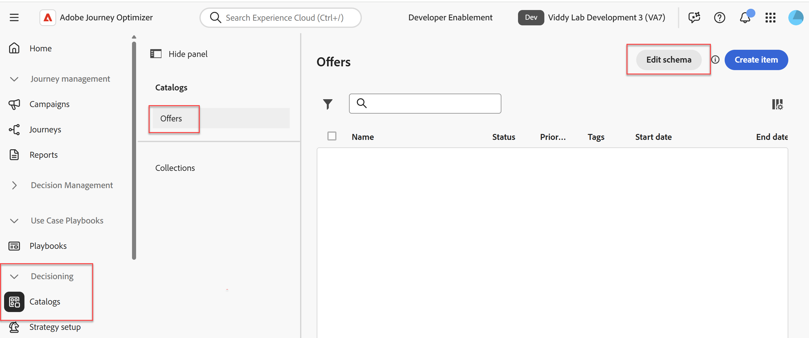
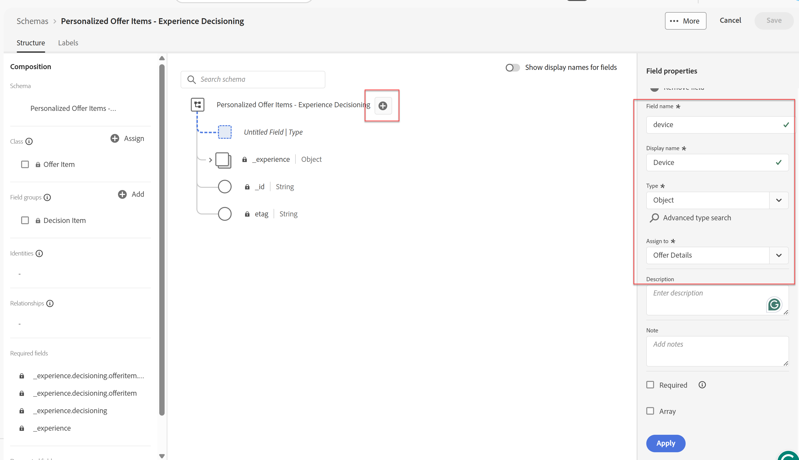

# 创建优惠属性

## 目标

在此部分中，您会将自定义XDM字段添加到标准选件XDM架构。 这些自定义字段可用于排名、排序和资格标准。 它们也可以是返回给请求设备的数据。

## 创建自定义设备父对象

1. 如有必要，在左边栏中展开&#x200B;**决策**&#x200B;菜单项，然后单击&#x200B;**目录。**
2. 默认情况下，会显示“选件”页面。 单击右上角的&#x200B;**编辑架构**&#x200B;按钮。

优惠目录页面上的

>[!TIP]
>
>生成的页面是标准XDM架构编辑器。 正如使用XDM定义数据集的数据结构一样，此处也使用XDM定义选件的属性。

>[!NOTE]
>
>“个性化优惠项目 — Experience Decisioning”架构是一个系统生成的标准架构，适用于所有优惠。 但是，您可以添加到此架构以满足独特的业务需求，这正是您在本节中要做的。
>
>此外，浏览选件页面是访问此架构的快捷方式。 您还可以通过左边栏中的架构菜单导航到该架构。

3. 单击架构根级别右侧的&#x200B;**+**&#x200B;图标，然后在右边栏中使用现在可见的“字段属性”菜单，使用提供的值填写以下字段：
   - 字段名：**设备**
   - 显示名称： **设备**
   - 类型下拉列表：**对象**
   - 分配给字段组（键入此值）： **选件详细信息**

>[!NOTE]
>
>分配给字段组显示为下拉列表，但它也接受直接文本输入；因此，输入文本“选件详细信息”。 键入时，您也会看到“选件详细信息（新）”项目。 任何新属性都必须分配给字段组，因此在此步骤中，您实际上是创建一个名为选件详细信息的新字段组。

4. 请确保所有属性均已填写，如以下屏幕快照所示：

新设备对象的

5. 验证所有字段均正确后，单击“字段属性”菜单（右边栏）底部的蓝色&#x200B;**应用**&#x200B;按钮，查看应用于架构的更改：

>[!TIP]
>
>与普通XDM一样，自定义属性也会分组到IMS组织特定的命名空间下，即此例中的imsorg租户ID或“dep”。 您还会看到新的“选件详细信息”字段组现在列在架构左侧的“撰写”窗格中。

>[!WARNING]
>
>请注意，这些更改不会保存。 它们只是“应用”。 如果您要离开页面而不保存，则将丢失您的工作。 导航离开之前，请完成此部分中的步骤。

## 创建自定义设备属性

现在，设备XDM对象已创建，您可以继续创建特定于设备的字段。

1. 单击刚刚创建的新&#x200B;**设备**&#x200B;对象右侧的&#x200B;**+**&#x200B;图标，然后使用右边栏中的“字段属性”菜单，使用提供的值填写以下字段：
   - 字段名：**make**
   - 显示名称： **Make**
   - 类型下拉列表：**字符串**
   - 分配给字段组：**选件详细信息**（应已选择）
   - 验证所有字段均正确后，单击蓝色的&#x200B;**应用**&#x200B;按钮查看应用到架构的更改
2. 重复上述步骤以为&#x200B;**模型**&#x200B;和&#x200B;**层**&#x200B;添加两个其他属性。 使用相同的命名模式、类型和字段组。 完成后，架构应如下所示：

3. 创建了所有新的XDM字段/属性后，单击右上角的&#x200B;**保存**，您将在屏幕底部收到绿色的“架构已成功保存”消息。 您现在已完成此部分中的步骤。

>[!WARNING]
>
>您刚刚更新的架构适用于所有选件，包括所有未来的选件。 向此架构添加属性时应格外谨慎。 在我们的销售手机的电信公司示例用例中，设备制造商、型号和层属性可能会广泛用于许多选件和未来几年，因此添加它们很有意义。 考虑哪些属性是优惠的必要属性时，请避免添加特定于特定营销活动的属性。 几个月或几年后，此架构可能会变得臃肿，并在创建选件时导致问题。 您将在将在创建选件的部分中看到此规则的应用方式。

## 回顾

您已成功使用可重用的自定义字段更新了标准选件架构，这些字段将在实验室的稍后部分创建和评估选件时使用。
