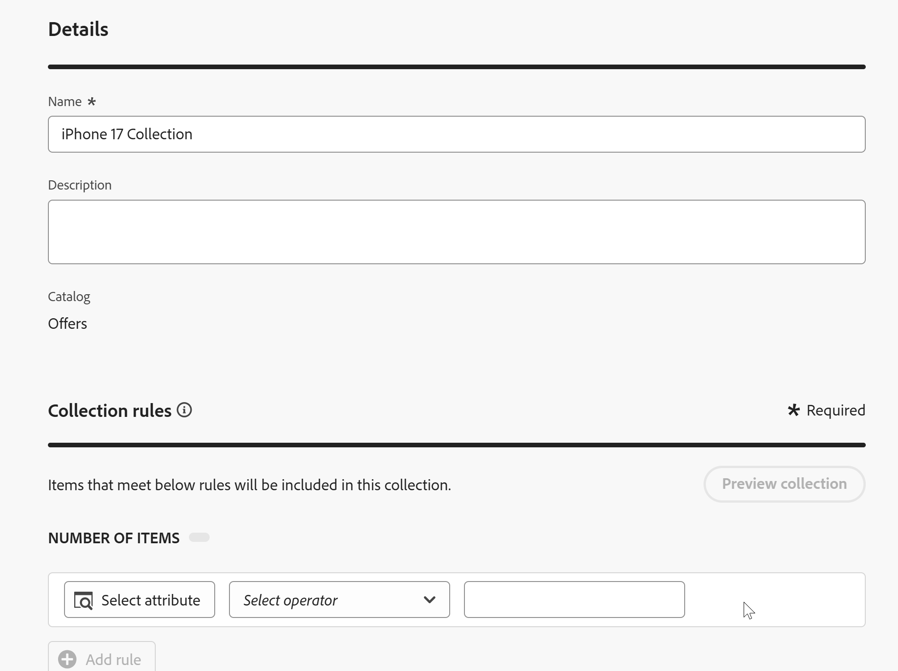

# 创建优惠收藏集

## 目标

现在，您的优惠已创建，需要将它们组织到收藏集中。 收藏集具有一个或多个选件项目，并且选件项目可以位于多个收藏集中。

## 创建iPhone选件收藏集

1. 如有必要，请在左边栏中展开&#x200B;**决策**，然后单击&#x200B;**目录**。 您会看到在上一节中创建的四个选件。
2. 单击优惠名称左边的&#x200B;**收藏集**

目录页面上的

&#x200B;3. 单击蓝色的&#x200B;**创建集合**&#x200B;以创建新集合。
&#x200B;4. 将收藏集命名为&#x200B;**iPhone 17收藏集**
&#x200B;5. 在“收藏集规则”部分中，单击包含文本的文本框&#x200B;**_单击以创建决策项_**。 单击后，将显示用于创建规则的选项。

打开

&#x200B;6. 单击&#x200B;**选择属性**&#x200B;按钮，然后单击&#x200B;**设备>制作**&#x200B;浏览选件项架构。 单击&#x200B;**保存，**，您会看到“Make”属性现在位于决策规则中。

已将

>[!NOTE]
>
>请注意，您可用的选项与在创建优惠项目时使用的可配置字段相同。 由于收藏集是优惠项目的分组，因此将它们分组的规则取决于其属性是有意义的。

&#x200B;7. 保留“等于”运算符并在值字段中输入文本&#x200B;**iPhone**，此时，您会看到项目数更改为4，这表示您的所有优惠项目都符合该条件

>[!NOTE]
>
>您还可以单击&#x200B;**预览收藏集**&#x200B;按钮并查看符合条件的选件项。

&#x200B;8. 选择所有四个选件项后，单击蓝色的&#x200B;**创建**&#x200B;按钮。 这会将您引导至显示新创建收藏集的页面。

>[!NOTE]
>
>收藏不仅仅是一种组织方式。 在前面的步骤中，您会看到在Decisioning中，我们将选择逻辑应用于优惠集合。 在考虑企业规模的实施时，不难看出随着多年的使用，将会创建多少选件。 为了确定哪些优惠应应用选择策略，请揭示适当的收藏集管理的重要性。
>
>在这种情况下，仅将“iPhone”作为标准的收藏集将在iPhone发布几年后引入过多选件。 我们可以使用诸如“使等于17”之类的其他条件或使用AEP标记来标记特定促销活动的选件。 为了简单起见，我们用这个简单的逻辑来创建一个集合。

## 回顾

您现在已创建了一个优惠收藏集，该收藏集将您之前构建的优惠项目组合在一起。 您已将所有iPhone 17选件添加到一个收藏集中，并根据选件属性（如device make）定义了一个规则，以便只有相关的选件属于此收藏集。
